# Azure Databricks Jobs & Scheduling


⬅️ [Back to Orchestration and Scheduling](README.md)

---

# 📚 Table of Contents

- Overview
- Learning Objectives
- Workflow Architecture
- Why Databricks Jobs?
- Jobs & Scheduling Overview
- Workflow Components
- Job Structure
- Workflow Execution Flow
- Creating Databricks Jobs
- Creating Notebook Tasks
- Configuring Task Dependencies
- Building the Dimension Workflow
- Verifying Dimension Job Execution
- Building the Fact Workflow
- Creating the Master Orchestration Job
- Configuring Daily Job Schedule
- Monitoring Scheduled Job Execution
- Serverless Compute
- Retry Policies & Error Handling
- Job Monitoring & Run History
- Notifications & Alerts
- Best Practices
- Troubleshooting
- Verification Checklist
- Key Takeaways

---

# 📖 Overview

Modern enterprise data platforms process data through multiple ETL stages every day. Instead of manually executing notebooks, Azure Databricks **Jobs & Workflows** provides a centralized orchestration engine that automates notebook execution, manages task dependencies, schedules recurring jobs, and monitors execution status.

In this project, Azure Databricks Workflows orchestrate the complete Medallion Architecture pipeline. Independent jobs are created for the **Dimension Pipeline** and **Fact Pipeline**, while a master orchestration job coordinates both workflows in the correct execution order.

The scheduling capability ensures that the pipeline executes automatically every day without manual intervention, providing a reliable and production-ready data engineering solution.

---

# 🎯 Learning Objectives

After completing this guide, you will be able to:

* Create Azure Databricks Jobs
* Configure notebook tasks
* Execute notebooks using Serverless Compute
* Build multi-task workflows
* Configure task dependencies
* Chain multiple jobs together
* Schedule automated pipeline execution
* Monitor workflow execution
* Verify successful job runs
* Troubleshoot failed executions

---

# 🏗 Project Architecture

<p align="center">
    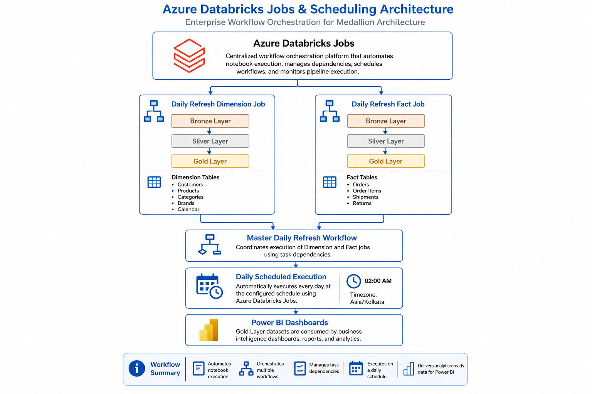
</p>

The workflow architecture consists of three independent orchestration layers.

```
                Azure Databricks Jobs

                        │
        ┌───────────────┼───────────────┐
        │                               │
        ▼                               ▼

Daily Refresh Dimension        Daily Refresh Fact

        │                               │
        ▼                               ▼

 Bronze → Silver → Gold      Bronze → Silver → Gold

        └───────────────┬───────────────┘
                        │
                        ▼

          Master Daily Refresh Workflow

                        │
                        ▼

             Daily Scheduled Execution

                        │
                        ▼

             Power BI Dashboards
```

---

# 📂 Workflow Components

| Workflow                 | Purpose                                     |
| ------------------------ | ------------------------------------------- |
| **daily_refresh_dim**    | Loads and transforms all dimension tables   |
| **daily_refresh_fact**   | Processes transactional fact datasets       |
| **daily_refresh_master** | Executes Dimension Job followed by Fact Job |
| **Daily Schedule**       | Automatically executes workflows every day  |

---

# 🚀 Why Use Databricks Jobs?

Without orchestration, engineers must manually execute every notebook in the correct sequence. This approach becomes difficult to maintain as the number of notebooks increases.

Azure Databricks Jobs solves this problem by providing:

* Automated notebook execution
* Dependency management
* Built-in scheduling
* Retry mechanisms
* Failure notifications
* Centralized monitoring
* Execution history
* Serverless execution
* Production-grade orchestration

---

# ⚙️ Workflow Execution

The complete execution flow implemented in this project is shown below.

```
Create Job

        │
        ▼

Create Notebook Task

        │
        ▼

Configure Notebook

        │
        ▼

Create Workflow

        │
        ▼

Configure Dependencies

        │
        ▼

Create Master Workflow

        │
        ▼

Configure Schedule

        │
        ▼

Automatic Daily Execution

        │
        ▼

Monitor Job Runs
```

---

# 📘 Step 1 — Create a Databricks Job

<p align="center">
    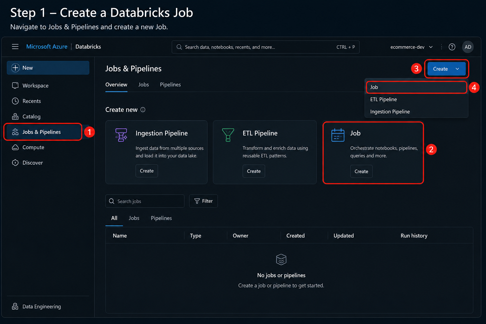
</p>

## Description

The first step is to create a new Azure Databricks Job that will orchestrate the execution of notebooks within the data pipeline.

The **Jobs & Pipelines** workspace serves as the central location for creating and managing scheduled workflows.

---

## What You Should See

The interface displays:

* Jobs & Pipelines
* Create menu
* Job option
* ETL Pipeline option
* Ingestion Pipeline option

The **Job** option is selected to begin creating a notebook workflow.

---

## Actions Performed

1. Open Azure Databricks Workspace.
2. Navigate to **Jobs & Pipelines**.
3. Click **Create**.
4. Select **Job**.
5. Create a new workflow.

---

## Expected Result

A new empty Databricks Job is created and ready to accept notebook tasks.

---

## Best Practice

✔ Use meaningful names instead of generic job names.

Example:

```
daily_refresh_dim
```

instead of

```
Job1
```

---

# 📘 Step 2 — Create the First Notebook Task

<p align="center">
    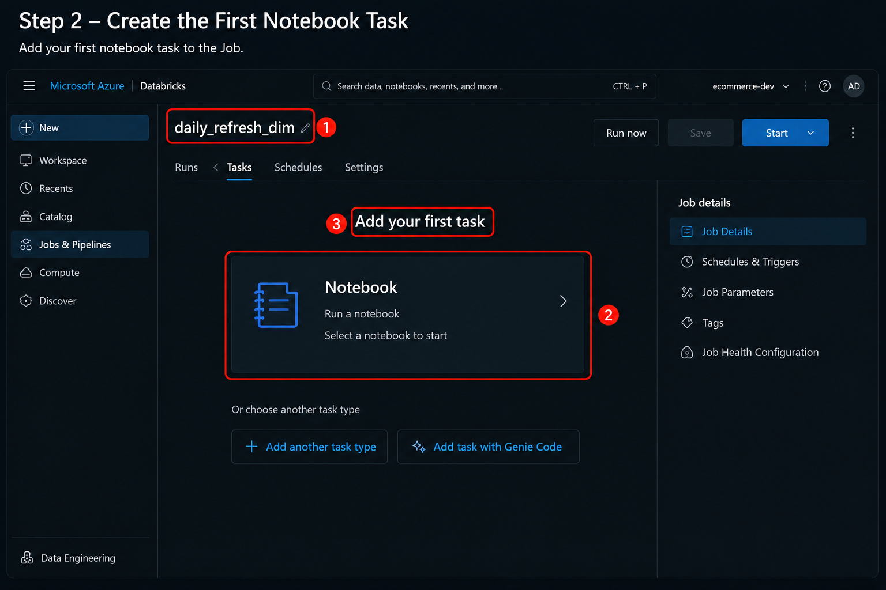
</p>

## Description

After creating the Job, Azure Databricks prompts you to add the first task.

Each task represents a unit of work executed within the workflow.

For this project, every task executes a Databricks notebook.

---

## Job Name

```
daily_refresh_dim
```

---

## Available Task Types

The interface supports several task types including:

* Notebook
* SQL
* Python Script
* Python Wheel
* JAR
* Run Job
* Delta Live Tables

This project uses **Notebook Tasks**.

---

## Actions Performed

* Create first notebook task
* Select Notebook
* Open task configuration

---

## Expected Result

The workflow now contains one notebook task awaiting configuration.

---

## Best Practice

Keep one logical transformation per notebook.

Example:

```
Bronze Ingestion

Silver Transformation

Gold Aggregation
```

instead of combining multiple ETL stages into a single notebook.

---

# 📘 Step 3 — Select the Notebook

<p align="center">
    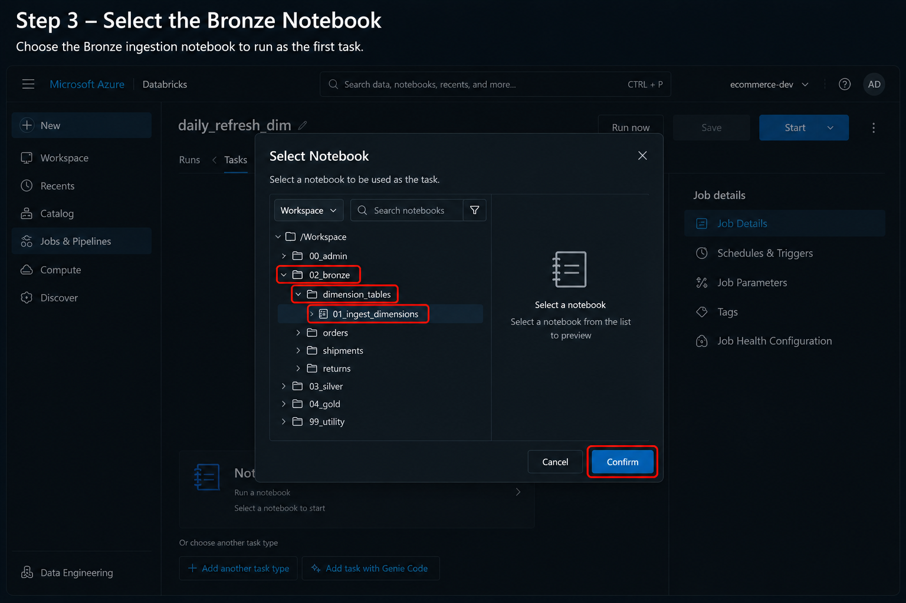
</p>

## Description

The notebook browser allows you to choose which Databricks notebook should execute as part of the workflow.

The notebook selected in this guide performs the Bronze layer ingestion for all dimension datasets.

---

## Selected Notebook

```
02_bronze
    └── dimension_tables
            └── 01_ingest_dimensions
```

---

## Actions Performed

1. Open Workspace browser.
2. Navigate to the Bronze folder.
3. Select **01_ingest_dimensions**.
4. Click **Confirm**.

---

## Expected Result

The notebook path is automatically populated in the task configuration.

---

## Why This Notebook?

This notebook ingests:

* Customers
* Products
* Categories
* Brands
* Calendar

into Bronze Delta Tables.

---

## Best Practice

Organize notebooks using a consistent folder hierarchy.

Example:

```
Bronze/

Silver/

Gold/

Utilities/
```

This makes large projects easier to maintain.

---

# 📘 Step 4 — Configure the Notebook Task

<p align="center">
    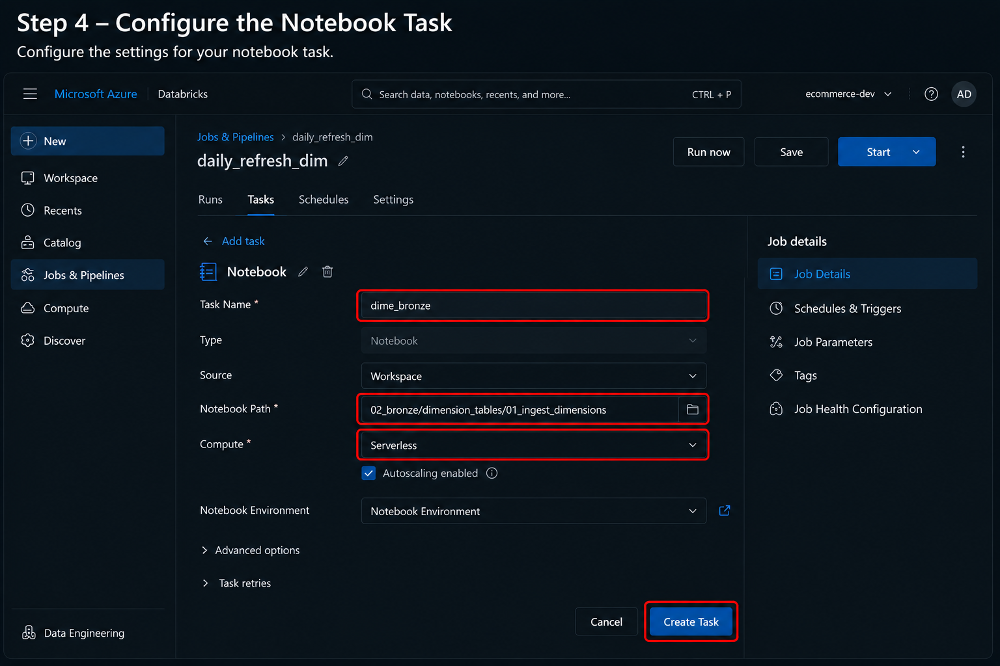
</p>

## Description

Once the notebook has been selected, the task configuration page allows you to define how the notebook will execute.

The workflow uses **Serverless Compute**, eliminating the need to manage clusters manually.

---

## Configuration

| Property  | Value                  |
| --------- | ---------------------- |
| Task Name | `dime_bronze`          |
| Type      | Notebook               |
| Source    | Workspace              |
| Compute   | Serverless             |
| Notebook  | `01_ingest_dimensions` |

---

## Actions Performed

* Assign task name
* Verify notebook path
* Select Serverless Compute
* Review notebook environment
* Prepare task creation

---

## Why Serverless Compute?

Serverless Compute offers several operational benefits:

* No cluster management
* Faster startup time
* Automatic scaling
* Reduced operational overhead
* Pay-per-use execution model

---

# 📘 Step 5 — Create the First Task

<p align="center">
    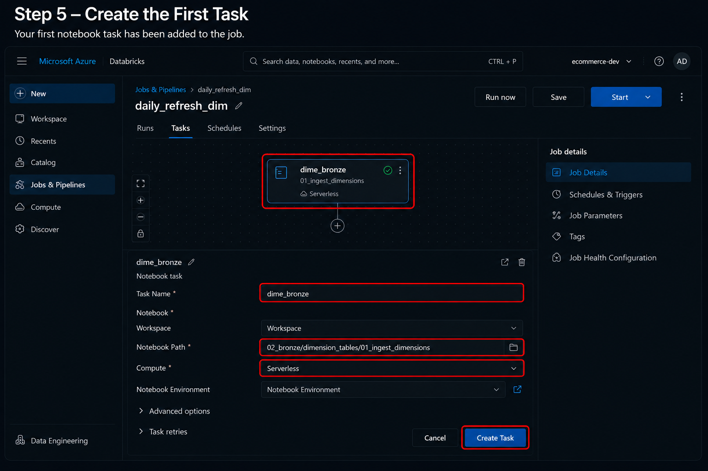
</p>

## Description

After configuring the notebook settings, the task can now be added to the workflow. This creates the first executable node within the Azure Databricks Job.

Each task represents a single processing unit in the orchestration workflow. As additional tasks are added, Databricks automatically visualizes the workflow as a directed execution graph.

---

## Task Configuration

| Property    | Value                        |
| ----------- | ---------------------------- |
| Task Name   | `dime_bronze`                |
| Task Type   | Notebook                     |
| Notebook    | `01_ingest_dimensions`       |
| Source      | Workspace                    |
| Compute     | Serverless                   |
| Environment | Default Notebook Environment |

---

## Actions Performed

1. Review the notebook configuration.
2. Verify the selected notebook path.
3. Confirm Serverless Compute.
4. Click **Create Task**.
5. Add the notebook to the workflow canvas.

---

## Expected Result

After the task is created, the workflow canvas displays the first notebook node.

```text
daily_refresh_dim

┌────────────────────────────┐
│      dime_bronze           │
│ Notebook                   │
│ Serverless Compute         │
└────────────────────────────┘
```

The workflow is now ready for additional dependent notebook tasks.

---

## Best Practice

Assign meaningful task names that clearly indicate the processing stage.

**Recommended**

```text
Bronze_Dimension
Silver_Product_Dim
Gold_Product_Dim
```

**Avoid**

```text
Task1
Notebook1
Job_A
```

---

## Verification Checklist

* ✅ Task successfully created
* ✅ Notebook path verified
* ✅ Serverless Compute selected
* ✅ Workflow canvas displays the notebook task

---

# 📘 Step 6 — Add Additional Notebook Tasks

<p align="center">
    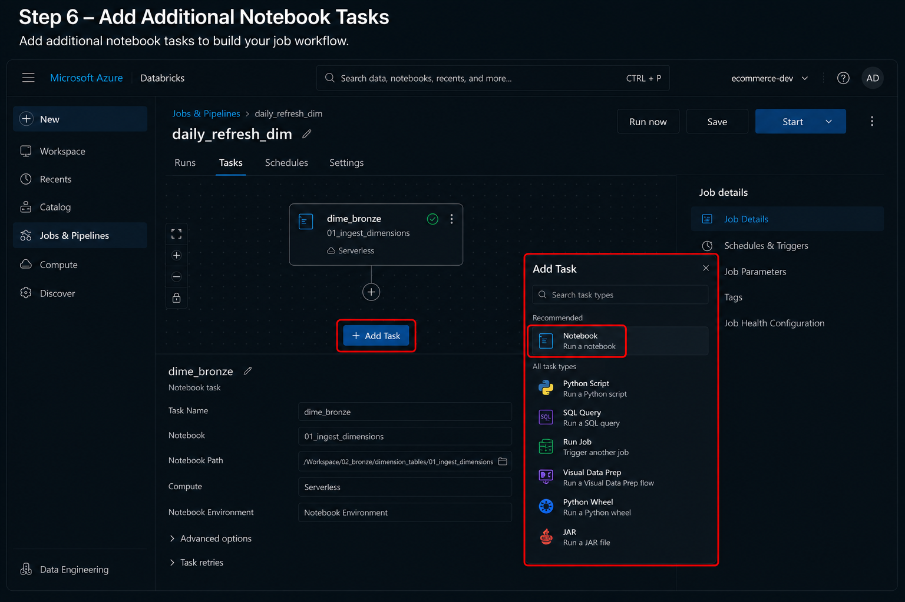
</p>

## Description

A production-grade ETL pipeline typically consists of multiple notebooks, each responsible for a specific transformation. Azure Databricks allows additional tasks to be added to the workflow, enabling modular and maintainable pipeline design.

Each new task can execute a notebook, SQL query, Python script, JAR, or another Databricks Job.

---

## Supported Task Types

Azure Databricks supports multiple task types within a workflow:

| Task Type        | Purpose                            |
| ---------------- | ---------------------------------- |
| Notebook         | Execute a Databricks notebook      |
| SQL Query        | Run SQL statements                 |
| Python Script    | Execute standalone Python scripts  |
| Python Wheel     | Run packaged Python applications   |
| JAR              | Execute Java or Scala applications |
| Run Job          | Trigger another Databricks Job     |
| Visual Data Prep | Low-code data preparation          |

In this project, **Notebook** tasks are used for all ETL stages.

---

## Actions Performed

1. Click **Add Task**.
2. Open the **Add Task** dialog.
3. Select **Notebook**.
4. Configure the notebook.
5. Repeat for each transformation notebook.

---

## Expected Result

The workflow expands with additional notebook tasks that will later be connected using task dependencies.

---

## Benefits of Modular Tasks

Separating the pipeline into multiple notebook tasks provides several advantages:

* Easier debugging
* Independent notebook development
* Improved maintainability
* Better reusability
* Simplified testing
* Faster troubleshooting
* Clear workflow visualization

---

## Best Practice

Design each notebook to perform a single logical transformation. Avoid combining Bronze, Silver, and Gold processing into a single notebook.

---

## Verification Checklist

* ✅ Additional notebook tasks added
* ✅ Notebook task selected
* ✅ Workflow canvas updated
* ✅ Ready for dependency configuration

---

# 📘 Step 7 — Complete Dimension Job Workflow

<p align="center">
    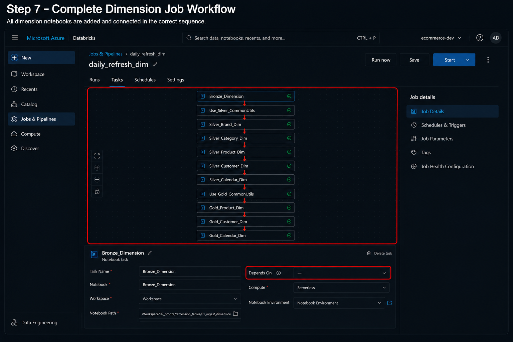
</p>

## Description

After creating all notebook tasks, they are connected using task dependencies to define the execution sequence. Azure Databricks executes downstream tasks only after all upstream dependencies complete successfully.

This workflow represents the complete **Dimension Data Pipeline**.

---

## Dimension Workflow

```text
Bronze_Dimension
        │
        ▼
Use_Silver_CommonUtils
        │
        ▼
Silver_Brand_Dim
        │
        ▼
Silver_Category_Dim
        │
        ▼
Silver_Product_Dim
        │
        ▼
Silver_Customer_Dim
        │
        ▼
Silver_Calendar_Dim
        │
        ▼
Use_Gold_CommonUtils
        │
        ▼
Gold_Product_Dim
        │
        ▼
Gold_Customer_Dim
        │
        ▼
Gold_Calendar_Dim
```

---

## Processing Stages

### Bronze Layer

* Ingest raw dimension datasets
* Preserve source data
* Add ingestion metadata

### Silver Layer

* Clean records
* Remove duplicates
* Standardize formats
* Validate business rules

### Gold Layer

* Build dimensional tables
* Optimize for analytics
* Prepare Power BI datasets

---

## Actions Performed

* Add notebook tasks
* Configure dependencies
* Validate execution order
* Save the workflow

---

## Expected Result

The complete workflow graph is displayed with connected notebook nodes and dependency arrows.

---

## Benefits of Dependencies

* Sequential execution
* Failure isolation
* Automatic orchestration
* Dependency validation
* Easier monitoring
* Reliable execution order

---

## Verification Checklist

* ✅ Workflow graph completed
* ✅ Dependency arrows configured
* ✅ All notebook tasks connected
* ✅ Job saved successfully

---

# 📘 Step 8 — Verify Successful Dimension Job Execution

<p align="center">
    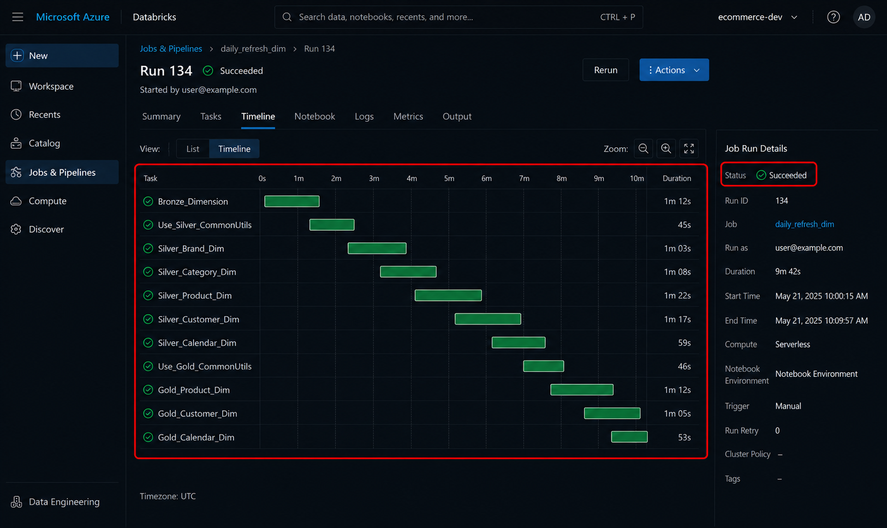
</p>

## Description

After saving the workflow, the job is executed manually to verify that each notebook runs successfully. The **Runs** page provides a timeline view showing task execution, status, duration, and overall job health.

Successful execution confirms that the workflow, notebook configurations, and task dependencies are correctly configured.

---

## Execution Timeline

The timeline should display the following notebook tasks:

```text
Bronze_Dimension
│
├── Use_Silver_CommonUtils
│
├── Silver_Brand_Dim
├── Silver_Category_Dim
├── Silver_Product_Dim
├── Silver_Customer_Dim
├── Silver_Calendar_Dim
│
├── Use_Gold_CommonUtils
│
├── Gold_Product_Dim
├── Gold_Customer_Dim
└── Gold_Calendar_Dim
```

Each task should display:

* Green execution indicator
* Completed status
* Start time
* End time
* Execution duration

---

## Run Details

The **Run Details** panel should display:

| Property   | Expected Value |
| ---------- | -------------- |
| Status     | Succeeded      |
| Trigger    | Manual         |
| Compute    | Serverless     |
| Duration   | Execution Time |
| Start Time | Recorded       |
| End Time   | Recorded       |

---

## Indicators of a Successful Run

A healthy workflow should include:

* Green task nodes
* Completed execution timeline
* No failed tasks
* No skipped tasks
* No dependency errors
* Overall job status marked as **Succeeded**

---

## Troubleshooting Failed Runs

If a task fails:

1. Open the failed task.
2. Review notebook output logs.
3. Identify the error message.
4. Correct the issue in the notebook.
5. Re-run the workflow.
6. Verify that downstream tasks execute successfully.

---

## Verification Checklist

* ✅ Workflow executed successfully
* ✅ All notebook tasks completed
* ✅ Green execution indicators displayed
* ✅ Overall job status is **Succeeded**
* ✅ No dependency or notebook errors detected

---

# 📘 Step 9 — Create Fact Job

<p align="center">
    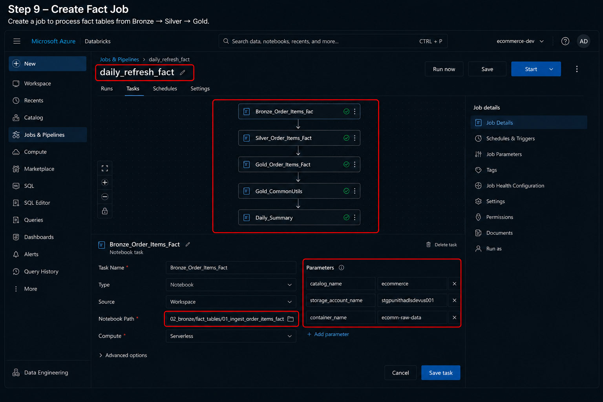
</p>

## Description

After successfully building the Dimension workflow, the next step is to create a dedicated **Fact Data Pipeline**. Fact tables store transactional business events such as orders, shipments, and returns. Separating fact processing from dimension processing keeps the architecture modular, scalable, and easier to maintain.

The Fact Job orchestrates all notebooks required to ingest, transform, and publish transactional datasets into the Gold layer.

---

## Job Name

```text
daily_refresh_fact
```

---

## Workflow Overview

```text
Bronze_Order_Items_Fact
            │
            ▼
Silver_Order_Items_Fact
            │
            ▼
Gold_Order_Items_Fact
            │
            ▼
Gold_CommonUtils
            │
            ▼
Daily_Summary
```

---

## Configuration

| Property  | Value                |
| --------- | -------------------- |
| Job Name  | `daily_refresh_fact` |
| Task Type | Notebook             |
| Compute   | Serverless           |
| Source    | Workspace            |
| Trigger   | Manual (initially)   |

---

## Actions Performed

1. Create a new Databricks Job.
2. Add the Bronze Fact notebook.
3. Add Silver transformation notebooks.
4. Add Gold aggregation notebook.
5. Add Daily Summary notebook.
6. Configure task dependencies.
7. Save the workflow.

---

## Expected Result

A complete Fact Job workflow is created and ready to be orchestrated by the master workflow.

---

## Best Practice

Keep Dimension and Fact pipelines as separate jobs. This allows independent execution, easier troubleshooting, and better scalability for large production environments.

---

## Verification Checklist

* ✅ Fact Job created
* ✅ Notebook tasks added
* ✅ Dependencies configured
* ✅ Workflow saved successfully

---

# 📘 Step 10 — Create Master Daily Refresh Job

<p align="center">
    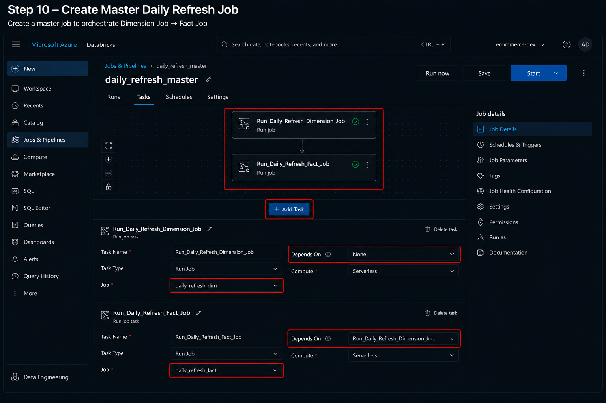
</p>

## Description

The **Master Daily Refresh Job** acts as the central orchestrator for the entire data platform. Instead of directly executing notebooks, this workflow triggers previously created Databricks Jobs using **Run Job** tasks.

This design simplifies orchestration by allowing multiple workflows to be coordinated from a single entry point.

---

## Master Workflow

```text
Run_Daily_Refresh_Dimension_Job
                │
                ▼
Run_Daily_Refresh_Fact_Job
```

---

## Configuration

| Property        | Value                  |
| --------------- | ---------------------- |
| Job Name        | `daily_refresh_master` |
| Task Type       | Run Job                |
| First Job       | `daily_refresh_dim`    |
| Second Job      | `daily_refresh_fact`   |
| Execution Order | Sequential             |

---

## Actions Performed

1. Create a new Databricks Job.
2. Add a **Run Job** task.
3. Select **daily_refresh_dim**.
4. Add another **Run Job** task.
5. Select **daily_refresh_fact**.
6. Configure task dependency.
7. Save the workflow.

---

## Benefits

* Centralized orchestration
* Modular workflows
* Independent job maintenance
* Simplified scheduling
* Easier monitoring

---

## Expected Result

The master workflow contains two connected **Run Job** tasks that execute the Dimension Job followed by the Fact Job.

---

## Verification Checklist

* ✅ Master Job created
* ✅ Run Job tasks configured
* ✅ Jobs linked correctly
* ✅ Workflow saved

---

# 📘 Step 11 — Configure Job Dependencies

<p align="center">
    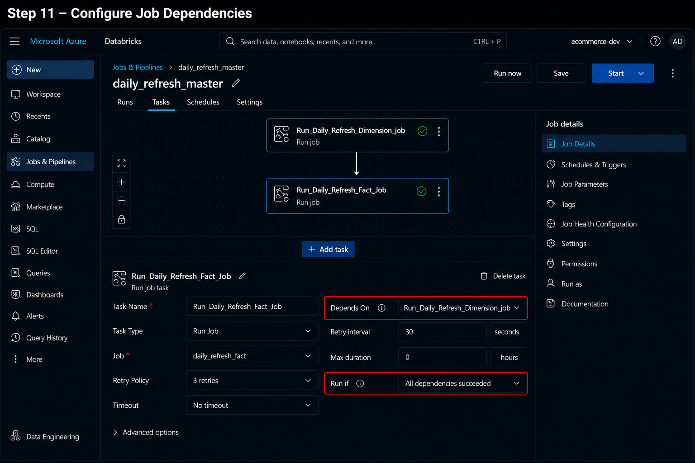
</p>

## Description

Task dependencies define the order in which tasks are executed. Azure Databricks ensures that downstream tasks begin only after all required upstream tasks complete successfully.

In this project, the Fact pipeline depends on the successful completion of the Dimension pipeline.

---

## Dependency Flow

```text
daily_refresh_dim
        │
        ▼
daily_refresh_fact
```

---

## Dependency Settings

| Setting      | Value                             |
| ------------ | --------------------------------- |
| Depends On   | `Run_Daily_Refresh_Dimension_Job` |
| Run If       | All dependencies succeeded        |
| Retry Policy | 3 Retries                         |
| Timeout      | No Timeout                        |

---

## Actions Performed

1. Open the Fact Job task.
2. Configure **Depends On**.
3. Select the Dimension Job task.
4. Verify dependency arrow.
5. Save the configuration.

---

## Why Dependencies Matter

Dependencies help ensure:

* Correct execution order
* Reliable workflow orchestration
* Data consistency
* Automatic failure handling
* Prevention of incomplete downstream processing

---

## Expected Result

The workflow graph clearly shows the dependency between the Dimension and Fact jobs.

---

## Verification Checklist

* ✅ Dependency configured
* ✅ Dependency arrow visible
* ✅ Run condition set correctly
* ✅ Workflow validated

---

# 📘 Step 12 — Configure Daily Schedule

<p align="center">
    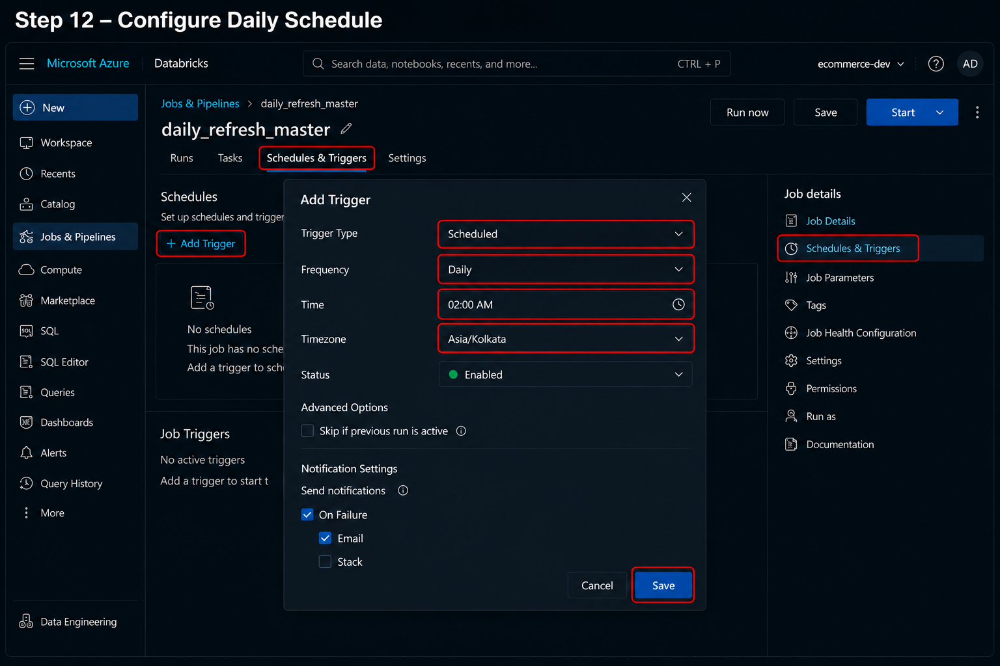
</p>

## Description

Once the workflow has been validated, configure a recurring schedule so that the master job runs automatically without manual intervention.

Scheduling ensures that the data platform is refreshed consistently and remains available for downstream analytics and reporting.

---

## Schedule Configuration

| Property     | Value        |
| ------------ | ------------ |
| Trigger Type | Scheduled    |
| Frequency    | Daily        |
| Time         | 02:00 AM     |
| Timezone     | Asia/Kolkata |
| Status       | Enabled      |

---

## Actions Performed

1. Open **Schedules & Triggers**.
2. Click **Add Trigger**.
3. Select **Scheduled**.
4. Choose **Daily** frequency.
5. Set the execution time.
6. Select the appropriate timezone.
7. Save the schedule.

---

## Benefits of Scheduling

* Fully automated execution
* Consistent refresh times
* Reduced manual effort
* Reliable data availability
* Supports production workloads

---

## Expected Result

The Master Daily Refresh Job is configured to execute automatically at the scheduled time.

---

## Verification Checklist

* ✅ Schedule created
* ✅ Daily frequency selected
* ✅ Timezone configured
* ✅ Trigger enabled
* ✅ Schedule saved successfully

---

# 📘 Step 13 — Verify Scheduled Job Execution

<p align="center">
    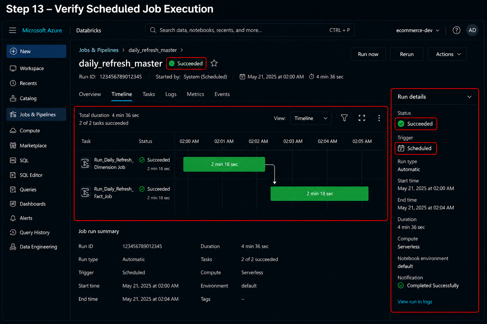
</p>

## Description

After configuring the schedule, monitor the **Job Runs** page to verify that the workflow executes successfully according to the configured schedule.

The execution timeline provides visibility into task progress, duration, trigger type, and overall workflow health.

---

## Expected Execution Flow

```text
Scheduled Trigger
        │
        ▼
daily_refresh_master
        │
        ▼
daily_refresh_dim
        │
        ▼
daily_refresh_fact
        │
        ▼
Completed Successfully
```

---

## Run Details

| Property     | Expected Value         |
| ------------ | ---------------------- |
| Trigger      | Scheduled              |
| Status       | Succeeded              |
| Run Type     | Automatic              |
| Compute      | Serverless             |
| Duration     | Recorded               |
| Notification | Completed Successfully |

---

## Indicators of a Successful Run

A successful scheduled execution should display:

* Green task indicators
* Completed workflow timeline
* Scheduled trigger type
* Successful execution status
* No failed or skipped tasks
* Accurate execution timestamps

---

## Monitoring Recommendations

Regularly review workflow executions to identify:

* Failed tasks
* Long-running jobs
* Retry attempts
* Dependency issues
* Execution duration trends

Monitoring job history helps maintain a reliable and efficient production pipeline.

---

# 🎯 Summary

By completing this guide, you have successfully configured Azure Databricks Workflows to orchestrate a production-ready Medallion Architecture pipeline.

The implementation includes:

* Automated notebook orchestration
* Separate Dimension and Fact workflows
* Master workflow using **Run Job** tasks
* Task dependency management
* Daily scheduled execution
* Serverless Compute
* Workflow monitoring and execution history
* Reliable automation for downstream analytics

