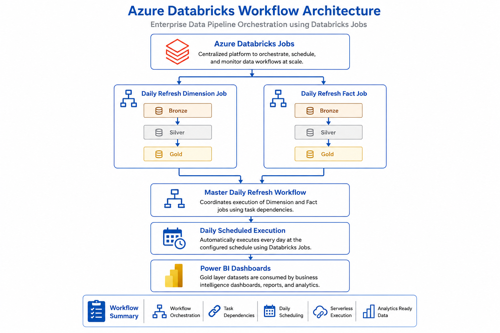
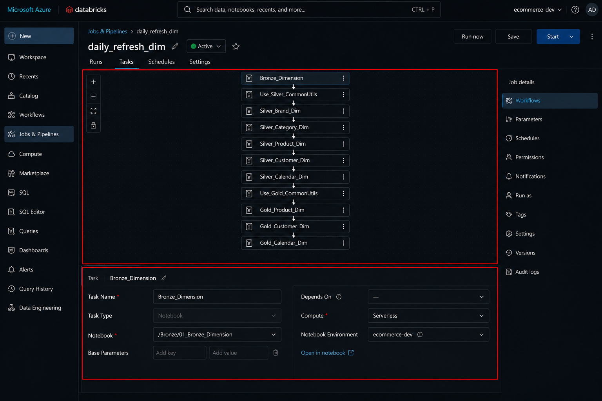
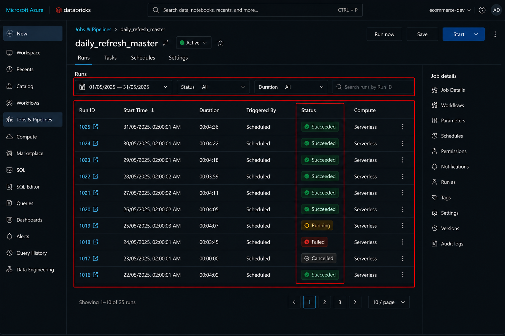
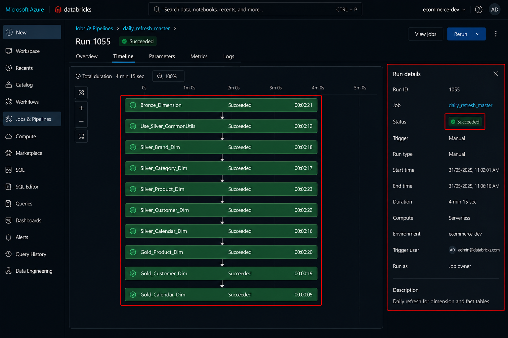
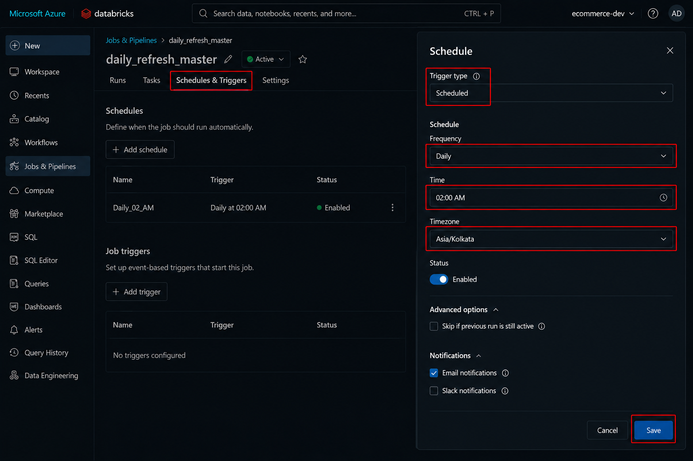

# 🛠 Orchestration and Scheduling


⬅️ [Back toMedallion Processing](../06_Medallion_Processing/README.md)

---

# 📚 Table of Contents

- Overview
- Learning Objectives
- Workflow Architecture
- Why Orchestration?
- Pipeline Stages
- Workflow Tasks
- Task Dependencies
- Workflow Execution Flow
- Workflow Components
- Source and Target Flow
- Workflow Resource Hierarchy
- Workflow Monitoring
- Workflow Run Status
- Job Run History
- Task Details
- Workflow Architecture
- Databricks Workflow
- Workflow Run History
- Successful Workflow Execution
- Workflow Schedule
- Best Practices
  - Workflow Design
  - Scheduling Best Practices
  - Compute Best Practices
  - Monitoring Best Practices
  - Reliability Best Practices
- Common Failure Scenarios
- Interview Questions
- Summary
- Key Takeaways
- Related Documentation
- Completion Checklist
- Final Workflow Overview
- Congratulations!

---

# 📖 Overview

Once the Bronze, Silver, and Gold pipelines have been developed, the next step is to automate their execution using **Azure Databricks Workflows**.

The environment setup (catalog creation, schemas, volumes, and initial configuration) is performed only once during project initialization and is **not included** in the scheduled workflow.

The workflow orchestrates only the recurring ETL pipeline, ensuring that:

- Bronze ingestion executes first.
- Silver transformations begin only after Bronze ingestion completes successfully.
- Gold Dimension tables are built after the Silver layer is ready.
- Gold Fact tables are generated using trusted Silver Fact data and Gold Dimension tables.
- Daily summary tables are refreshed after all Gold tables have been successfully created.

This automated workflow provides a reliable, scalable, and production-ready orchestration framework for enterprise data engineering workloads.

---

# 🎯 Learning Objectives

After completing this guide, you will be able to:

- Understand Databricks Workflows
- Create Workflow Jobs
- Configure Job Tasks
- Define Task Dependencies
- Schedule ETL Pipelines
- Configure Retry Policies
- Monitor Workflow Executions
- Analyze Job Run History
- Debug Failed Tasks
- Automate End-to-End Data Pipelines

---

# 🏗 Workflow Architecture

```text
                    Azure Databricks Workflow

                              │
                              ▼

                    Environment Setup Notebook
                              │
                              ▼

                     Bronze Layer Notebooks
                              │
                              ▼

                     Silver Layer Notebooks
                              │
                              ▼

                 Gold Dimension Notebooks
                              │
                              ▼

                    Gold Fact Notebook
                              │
                              ▼

                  Daily Summary Notebook
                              │
                              ▼

                       Power BI Dashboards
```

---

# 🚀 Why Orchestration?

Executing notebooks manually becomes difficult as the pipeline grows.

Databricks Workflows automates the complete execution process by:

- Managing notebook dependencies
- Executing notebooks in sequence
- Automatically retrying failed tasks
- Recording execution history
- Sending failure notifications
- Scheduling recurring jobs
- Providing centralized monitoring

---

# ⚙️ Pipeline Stages

The scheduled workflow executes the following stages sequentially.

| Stage | Description |
|--------|-------------|
| 01_Bronze | Ingests raw Dimension and Fact datasets into Bronze Delta tables |
| 02_Silver | Cleanses, validates, and standardizes Bronze data into trusted Silver Delta tables |
| 03_Gold Dimension | Builds business-ready Dimension tables |
| 04_Gold Fact | Builds analytical Fact tables by joining Silver Facts with Gold Dimensions |
| 05_Daily Summary | Generates aggregated daily business metrics for dashboards |

---

# 📂 Workflow Tasks

The ShopVista Workflow contains the following recurring tasks.

```text
ShopVista_Data_Pipeline
│
├── 01_Bronze
│
├── 02_Silver
│
├── 03_Gold_Dimensions
│
├── 04_Gold_Fact
│
└── 05_Daily_Summary
```

Each task executes only after its dependent task has completed successfully.

---

# 🔗 Task Dependencies

```text
01_Bronze
      │
      ▼
02_Silver
      │
      ▼
03_Gold_Dimensions
      │
      ▼
04_Gold_Fact
      │
      ▼
05_Daily_Summary
```

This dependency chain ensures that each processing layer receives trusted data from the previous stage.

---

# 📊 Workflow Execution Flow

```text
Start Workflow
      │
      ▼
Build Bronze Tables
      │
      ▼
Build Silver Tables
      │
      ▼
Build Gold Dimension Tables
      │
      ▼
Build Gold Fact Tables
      │
      ▼
Generate Daily Summary
      │
      ▼
Workflow Completed
```

---

# 📋 Workflow Components

The orchestration solution consists of several key components.

| Component    | Purpose                                |
| ------------ | -------------------------------------- |
| Workflow Job | Orchestrates the complete ETL pipeline |
| Tasks        | Individual notebook executions         |
| Dependencies | Controls execution order               |
| Job Cluster  | Executes workflow tasks                |
| Scheduler    | Triggers automatic execution           |
| Retry Policy | Handles transient failures             |
| Run History  | Stores execution history               |
| Logs         | Captures notebook output and errors    |

---

# 📂 Source and Target Flow

```text
Source Data
      │
      ▼
Azure Databricks Workflow
      │
      ▼
Bronze Layer
      │
      ▼
Silver Layer
      │
      ▼
Gold Dimension Layer
      │
      ▼
Gold Fact Layer
      │
      ▼
Daily Summary Layer
      │
      ▼
Power BI Dashboard
```

---

# 🔗 Configure Task Dependencies

Tasks are executed only after their upstream dependencies complete successfully.

```text
Bronze Layer
      │
      ▼
Silver Layer
      │
      ▼
Gold Dimension Tables
      │
      ▼
Gold Fact Tables
      │
      ▼
Daily Summary
```

This ensures that downstream notebooks always receive trusted and complete data.

---

# 🔄 Retry Policy

Transient failures can occur because of temporary infrastructure or connectivity issues.

Configure automatic retries to improve pipeline reliability.

| Setting | Value |
|---------|-------|
| Retries | 2–3 |
| Retry Interval | 5 Minutes |
| Retry on Timeout | Yes |

Benefits include:

- Automatic recovery from transient failures
- Reduced manual intervention
- Improved workflow reliability

---

# ⏰ Scheduling

Databricks Workflows support both manual and scheduled execution.

Typical scheduling options include:

| Schedule | Use Case |
|----------|----------|
| Manual | Development and testing |
| Daily | Daily ETL refresh |
| Weekly | Weekly reporting |
| Monthly | Monthly business reporting |

Example production schedule:

```text
Frequency : Daily

Time : 01:00 AM

Time Zone : UTC
```

---

# 📂 Workflow Configuration Summary

| Component | Configuration |
|-----------|---------------|
| Workflow Type | Multi-task Job |
| Tasks | 5 |
| Execution Mode | Sequential |
| Dependency Management | Yes |
| Job Cluster | Yes |
| Retry Policy | Enabled |
| Scheduling | Manual / Cron |
| Monitoring | Enabled |

---
# 📂 Workflow Resource Hierarchy

The orchestration layer organizes all ETL tasks into a single Databricks Workflow.

```text
Azure Databricks
│
└── Workflows
     │
     └── ShopVista_Data_Pipeline
          │
          ├── Bronze
          ├── Silver
          ├── Gold_Dimensions
          ├── Gold_Fact
          └── Daily_Summary
```

This centralized workflow ensures that all pipeline stages execute in the correct order with built-in dependency management.

---

# 🔄 Workflow Execution Flow

The workflow executes each notebook sequentially.

```text
                 Manual / Scheduled Trigger
                           │
                           ▼
                  Databricks Workflow
                           │
                           ▼
                     Bronze Layer
                           │
                           ▼
                     Silver Layer
                           │
                           ▼
                Gold Dimension Tables
                           │
                           ▼
                   Gold Fact Table
                           │
                           ▼
                  Daily Summary Table
                           │
                           ▼
                  Power BI Dashboards
```

Each task begins only after the previous task completes successfully.

---

# 📊 Workflow Monitoring

Azure Databricks provides built-in monitoring for every workflow execution.

The monitoring dashboard displays:

- Workflow status
- Running tasks
- Successful tasks
- Failed tasks
- Execution duration
- Cluster information
- Error logs
- Retry attempts

This enables quick identification and troubleshooting of pipeline failures.

---

# 📈 Workflow Run Status

Each workflow run is assigned one of the following statuses.

| Status | Description |
|---------|-------------|
| 🟢 Succeeded | All tasks completed successfully |
| 🟡 Running | Workflow is currently executing |
| 🔴 Failed | One or more tasks failed |
| ⏸️ Cancelled | Workflow execution was cancelled |
| ⏳ Pending | Waiting for cluster resources |

---

# 📜 Job Run History

Every workflow execution is recorded in the Databricks **Run History**.

Run History includes:

- Run ID
- Start Time
- End Time
- Execution Duration
- User
- Trigger Type
- Task Status
- Error Details

Maintaining run history helps with auditing, debugging, and performance analysis.

---

# 📋 Task Details

Selecting a task provides detailed execution information.

Available details include:

- Notebook executed
- Cluster used
- Execution time
- Parameters
- Output logs
- Spark UI
- Error messages
- Retry information

These details simplify troubleshooting and pipeline optimization.

---

# 📸 Workflow Architecture

The following diagram illustrates the complete Databricks Workflow orchestration.

<div align="center">



</div>

---

# 📸 Databricks Workflow

The workflow contains all pipeline tasks with dependency relationships.

<div align="center">



</div>

---

# 📸 Workflow Run History

The Databricks **Run History** page displays previous workflow executions.

<div align="center">



</div>

---

# 📸 Successful Workflow Execution

After successful execution, every task displays a **Succeeded** status.

<div align="center">



</div>

---

# 📸 Workflow Schedule

The workflow can be configured with manual or scheduled triggers.

<div align="center">



</div>

---

# 💡 Best Practices

Follow these best practices when designing Databricks Workflows.

## Workflow Design

- Create one workflow for a complete ETL pipeline.
- Keep tasks modular and reusable.
- Use descriptive task names.
- Configure dependencies explicitly.
- Avoid circular dependencies.
- Execute only validated notebooks.

---

## Scheduling

- Schedule workflows during low-traffic hours.
- Avoid overlapping workflow executions.
- Use cron expressions for production schedules.
- Validate schedules before enabling production jobs.

---

## Compute

- Use Job Clusters instead of All-Purpose Clusters.
- Enable autoscaling when appropriate.
- Configure auto-termination to reduce costs.
- Select an appropriate Databricks Runtime version.

---

## Monitoring

- Review workflow runs regularly.
- Investigate failed tasks promptly.
- Monitor execution duration trends.
- Configure notifications for workflow failures.

---

## Reliability

- Configure retry policies for transient failures.
- Validate upstream task completion before downstream execution.
- Keep workflows idempotent where possible.
- Maintain consistent notebook versions through Git integration.

---

# ⚠️ Common Failure Scenarios

| Issue | Possible Cause | Resolution |
|-------|----------------|------------|
| Bronze task failed | Source data unavailable | Verify source files and storage access |
| Silver task failed | Data validation or transformation error | Review notebook logs and input data |
| Gold Dimension task failed | Missing Silver Dimension tables | Confirm Silver workflow completed successfully |
| Gold Fact task failed | Missing Gold Dimension tables | Verify dependency configuration |
| Daily Summary task failed | Gold Fact table unavailable | Ensure Gold Fact task completed successfully |
| Workflow not triggered | Schedule disabled or paused | Verify workflow trigger configuration |
| Cluster startup failure | Insufficient compute resources | Check cluster configuration and quotas |
| Permission denied | Unity Catalog or storage access issue | Validate user and service principal permissions |

---
# 🎤 Interview Questions

The following questions are commonly asked in **Azure Databricks**, **Data Engineering**, and **ETL Pipeline** interviews.

---

## 1. What is Azure Databricks Workflow?

**Answer:**

Azure Databricks Workflows is a native orchestration service that automates the execution of notebooks, Python scripts, SQL queries, and Delta Live Tables. It enables dependency management, scheduling, monitoring, and retry mechanisms for data pipelines.

---

## 2. Why do we use Databricks Workflows instead of manually running notebooks?

**Answer:**

Databricks Workflows:

- Automates notebook execution
- Maintains task dependencies
- Supports scheduling
- Provides monitoring and logs
- Automatically retries failed tasks
- Reduces manual effort

---

## 3. What is a Workflow Job?

**Answer:**

A Workflow Job is a collection of tasks executed together based on defined dependencies. It represents the complete ETL pipeline.

---

## 4. What is the difference between a Task and a Job?

| Job | Task |
|------|------|
| Represents the complete workflow | Represents an individual notebook or script |
| Contains multiple tasks | Executes a single unit of work |
| Manages orchestration | Performs one processing step |

---

## 5. What are Task Dependencies?

Task dependencies define the execution order of tasks. A downstream task starts only after its upstream task completes successfully.

Example:

```text
Bronze
   │
   ▼
Silver
   │
   ▼
Gold Dimension
   │
   ▼
Gold Fact
```

---

## 6. What happens if a task fails?

If a task fails:

- Downstream tasks do not execute.
- The workflow is marked as **Failed**.
- Logs and error messages are available for troubleshooting.
- Automatic retries can be configured for transient failures.

---

## 7. What is a Job Cluster?

A Job Cluster is a temporary compute cluster created specifically for a workflow execution. It starts when the workflow begins and terminates automatically after completion, helping optimize resource usage and cost.

---

## 8. What scheduling options are available?

Databricks Workflows support:

- Manual execution
- Scheduled execution
- Cron-based scheduling
- Time zone configuration

---

## 9. How do you monitor a workflow?

Workflow executions can be monitored using:

- Run History
- Task Status
- Execution Duration
- Cluster Details
- Notebook Output
- Spark UI
- Error Logs

---

## 10. What are the benefits of workflow orchestration?

- Automation
- Reliability
- Dependency management
- Monitoring
- Error recovery
- Scalability
- Production readiness

---

# 📊 Summary

In this module, we implemented an enterprise-grade orchestration solution using **Azure Databricks Workflows** to automate the complete ShopVista ETL pipeline.

The workflow orchestrates every stage of the Medallion Architecture by executing pipeline tasks in the correct sequence, ensuring reliable and repeatable data processing.

The implemented workflow includes:

- Bronze Layer ingestion
- Silver Layer transformation
- Gold Dimension table creation
- Gold Fact table creation
- Daily Summary generation

Using Databricks Workflows, the entire ETL pipeline can be executed manually or on a predefined schedule with built-in monitoring, retry policies, and execution history.

---

# 🎯 Key Takeaways

After completing this module, you have learned how to:

- Create Azure Databricks Workflows
- Configure multi-task workflow jobs
- Define task dependencies
- Automate ETL pipeline execution
- Configure job clusters
- Schedule recurring pipeline runs
- Monitor workflow executions
- Analyze run history
- Troubleshoot workflow failures
- Build a production-ready orchestration solution

---

# 📚 Next Topic

➡️ [Orchestration and Scheduling](01_Jobs_setup.md)

