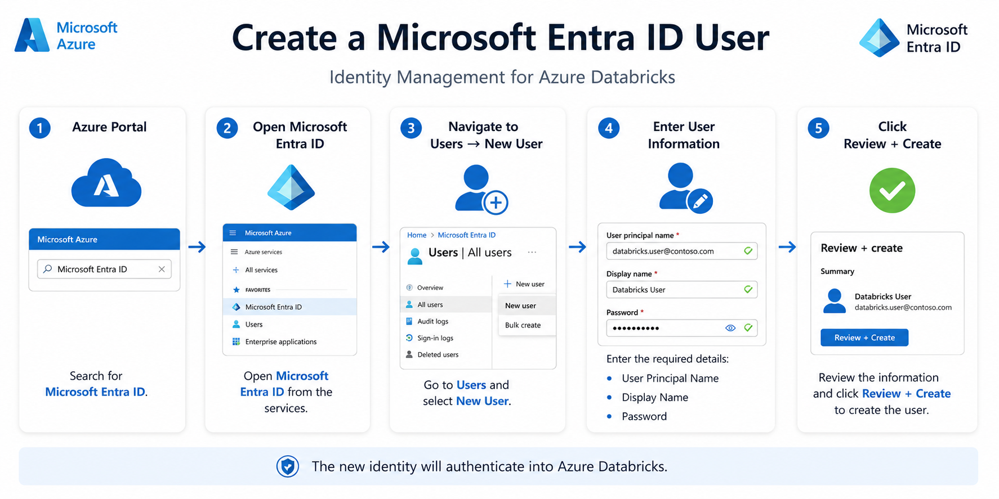
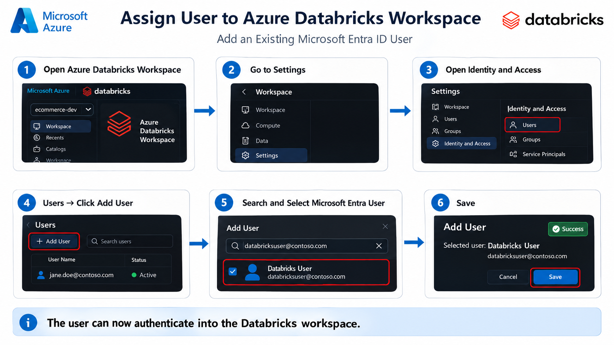
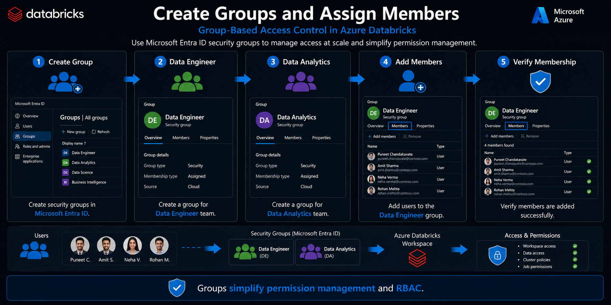
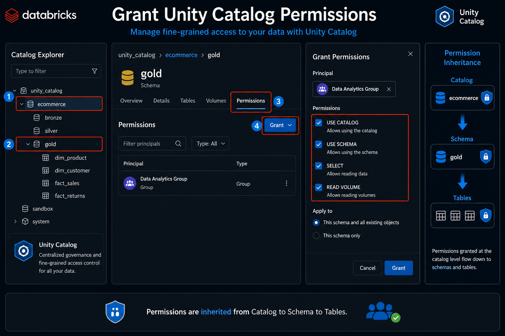
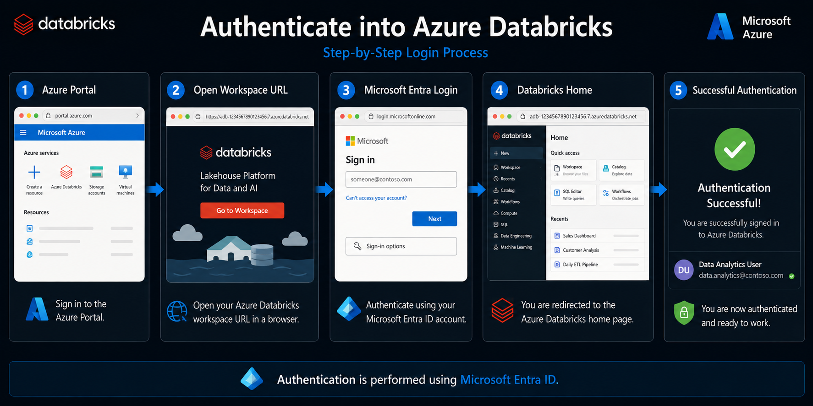
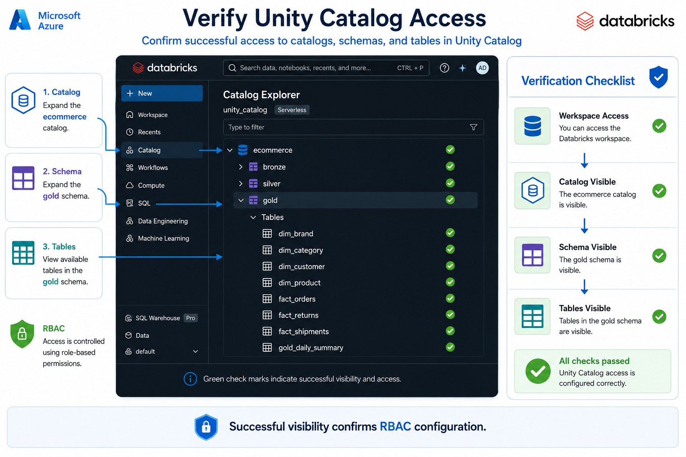
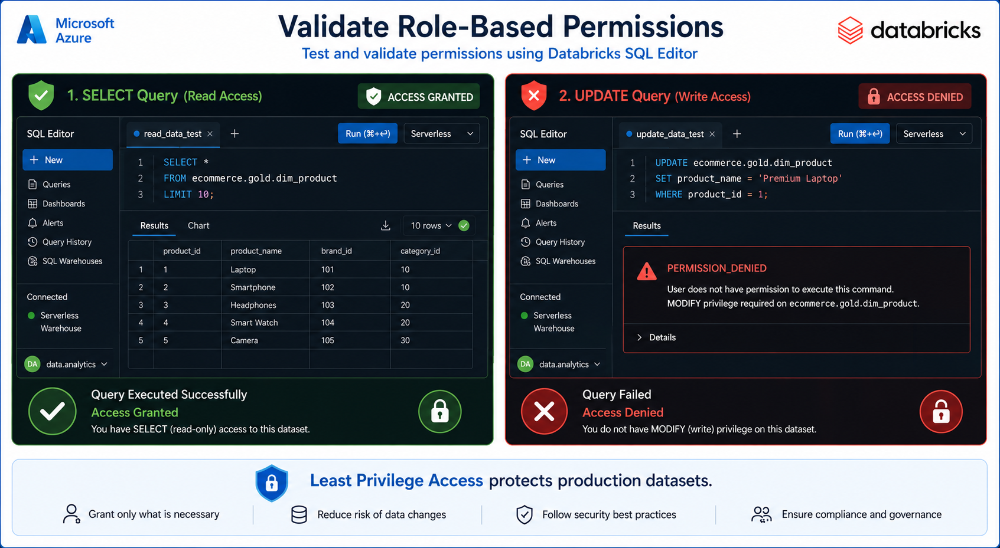
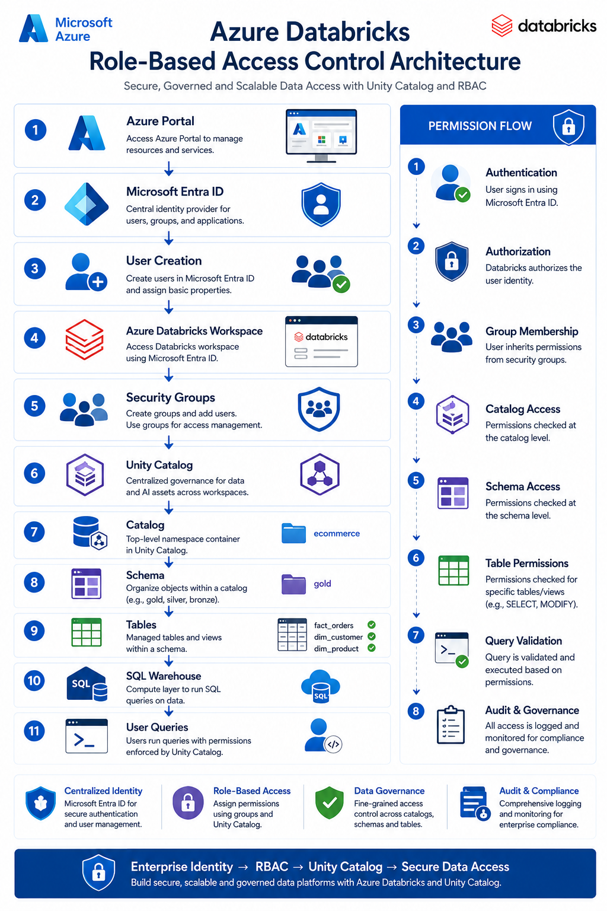

# 🔐 Configure Unity Catalog and Role-Based Access Control (RBAC) in Azure Databricks


⬅️ [Back to Unity Catalog](README.md)

---

# 📚 Table of Contents

- Introduction
- Architecture Overview
- Prerequisites
- Step 1 – Create Microsoft Entra ID User
- Step 2 – Add User to Azure Databricks Workspace
- Step 3 – Create Security Groups
- Step 4 – Grant Unity Catalog Permissions
- Step 5 – Authenticate into Azure Databricks
- Step 6 – Verify Catalog Access
- Step 7 – Validate Permissions
- Complete RBAC Architecture
- Best Practices
- Summary

---

# Introduction

Azure Databricks integrates with **Microsoft Entra ID** (formerly Azure Active Directory) for enterprise authentication and authorization.

Instead of assigning permissions directly to every individual user, organizations typically use **Security Groups**. Users become members of groups, and permissions are granted to groups through **Unity Catalog**.

This approach simplifies administration while improving security, scalability, and governance.

---

# Architecture Overview

The architecture follows a centralized identity and governance model:

- Microsoft Entra ID manages enterprise identities.
- Azure Databricks authenticates users.
- Security Groups manage role assignments.
- Unity Catalog controls permissions.
- SQL Warehouses enforce access during query execution.

---

# Prerequisites

Before configuring RBAC, ensure the following resources are available:

- Azure Subscription
- Azure Databricks Workspace
- Microsoft Entra ID Tenant
- Unity Catalog Enabled Workspace
- Catalogs and Schemas
- Workspace Administrator privileges

---

# Step 1 – Create Microsoft Entra ID User

<div align="center">



</div>

Create a new Microsoft Entra ID user that will be used to authenticate into Azure Databricks.

## Procedure

1. Open the **Azure Portal**.
2. Search for **Microsoft Entra ID**.
3. Navigate to **Users**.
4. Click **New User**.
5. Enter the following details:
   - User Principal Name (UPN)
   - Display Name
   - Password
6. Click **Review + Create**.
7. Verify that the user is successfully created.

---

# Step 2 – Add User to Azure Databricks Workspace

<div align="center">



</div>

After creating the identity, assign the user to the Azure Databricks workspace.

## Procedure

1. Open the Azure Databricks Workspace.
2. Navigate to:

```
Settings
   └── Identity and Access
         └── Users
```

3. Click **Add User**.
4. Search for the Microsoft Entra ID user.
5. Select the user.
6. Save the changes.

---

# Step 3 – Create Security Groups

<div align="center">



</div>

Security Groups simplify enterprise permission management by assigning permissions to groups instead of individual users.

## Example Groups

- Data Engineer
- Data Analytics
- Data Scientist
- Administrators

## Benefits

- Centralized access management
- Easier administration
- Scalable permission model
- Enterprise governance
- Simplified onboarding and offboarding

---

# Step 4 – Grant Unity Catalog Permissions

<div align="center">



</div>

Unity Catalog provides centralized governance for all data stored in Azure Databricks.

## Grant Permissions

Assign permissions at:

- Catalog Level
- Schema Level
- Table Level

Common privileges include:

- USE CATALOG
- USE SCHEMA
- SELECT
- READ VOLUME

Permission inheritance:

```text
Catalog
   │
   ▼
Schema
   │
   ▼
Tables
```

---

# Step 5 – Authenticate into Azure Databricks

<div align="center">



</div>

Azure Databricks uses Microsoft Entra ID for authentication.

## Authentication Flow

```text
Azure Portal
      │
      ▼
Workspace URL
      │
      ▼
Microsoft Entra ID Login
      │
      ▼
Azure Databricks Workspace
```

---

# Step 6 – Verify Catalog Access

<div align="center">



</div>

After logging into Azure Databricks, verify that the assigned Unity Catalog objects are visible.

Example Catalog Structure

```text
ecommerce
│
├── bronze
├── silver
└── gold
```

## Verify

- Catalog visibility
- Schema visibility
- Tables visibility
- Views visibility
- Volumes visibility


---

# Step 7 – Validate Permissions

<div align="center">



</div>

Open the SQL Editor to validate that permissions are working correctly.

## Read Access Test

```sql
SELECT *
FROM ecommerce.gold.gld_fact_daily_orders_summary;
```

✅ Expected Result

- Query executes successfully.
- Data is returned.

---

## Write Access Test

```sql
UPDATE ecommerce.gold.gld_fact_daily_orders_summary
SET currency = 'USD';
```

❌ Expected Result

```text
PERMISSION_DENIED
MODIFY privilege required
```

---

# Complete RBAC Architecture

<div align="center">



</div>

Complete permission flow:

```
Microsoft Entra ID

        │

        ▼

Enterprise User

        │

        ▼

Azure Databricks Workspace

        │

        ▼

Security Group

        │

        ▼

Unity Catalog

        │

        ▼

Catalog

        │

        ▼

Schema

        │

        ▼

Tables

        │

        ▼

SQL Warehouse

        │

        ▼

Query Authorization
```

---

# Best Practices

- Always assign permissions to groups instead of individual users.
- Grant the minimum privileges required.
- Separate Engineer, Analyst, and Administrator roles.
- Enable Unity Catalog for centralized governance.
- Audit permissions regularly.
- Avoid granting MODIFY permissions unless necessary.
- Apply the Principle of Least Privilege.
- Use Microsoft Entra ID for authentication.
- Use catalogs to isolate environments such as Development, Testing, and Production.

---

# Summary

In this guide you learned how to:

- Create Microsoft Entra ID users
- Add users to Azure Databricks
- Create security groups
- Assign Unity Catalog permissions
- Authenticate into Databricks
- Verify catalog access
- Validate SQL permissions
- Implement enterprise-grade Role-Based Access Control

Following this approach provides secure, scalable, and centrally managed access to Azure Databricks while simplifying administration across large organizations.
