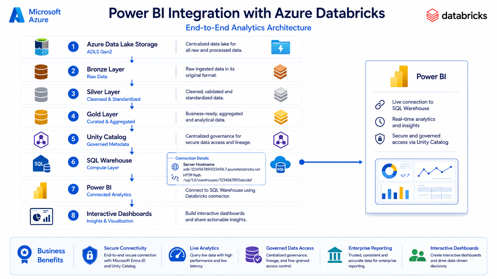
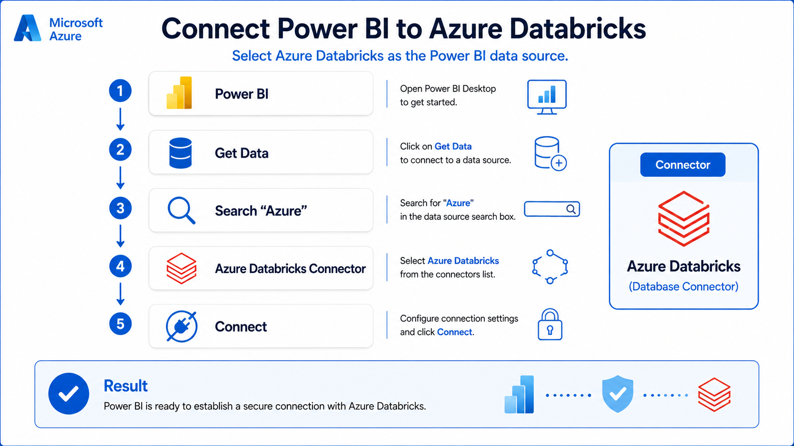
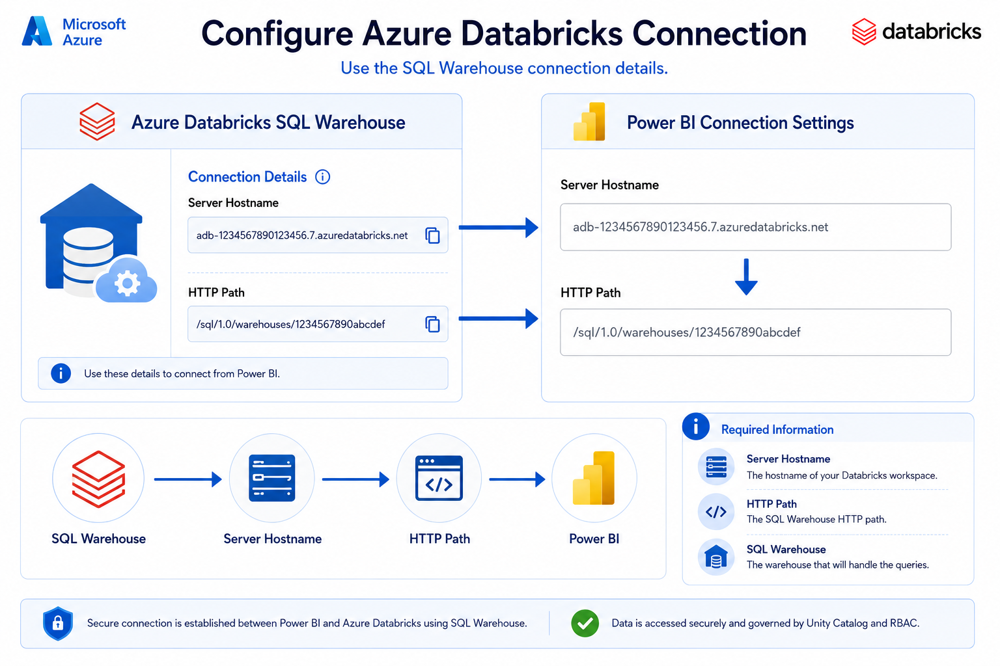
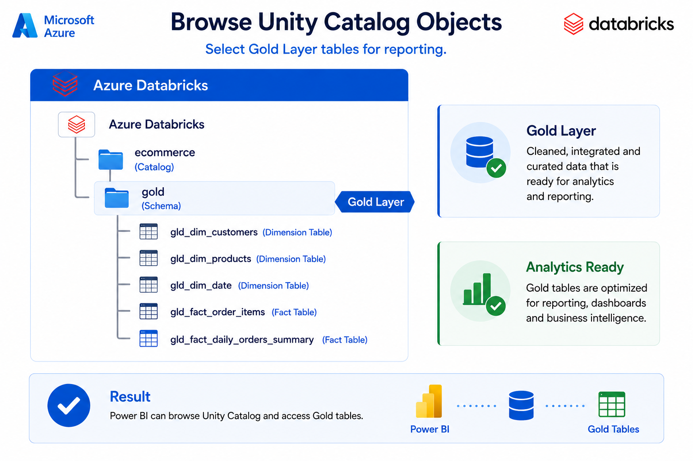
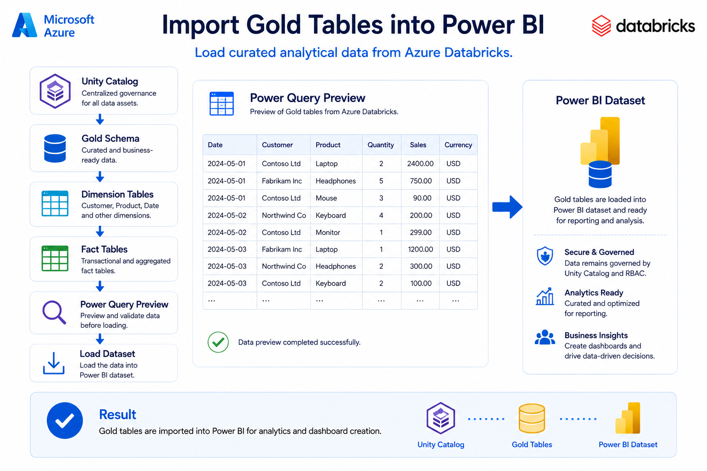

# 📊 Connect Azure Databricks to Power BI


---

# Table of Contents

- Overview
- Objectives
- Solution Architecture
- Prerequisites
- Connection Workflow
- Step 1 – Connect Power BI to Azure Databricks
- Step 2 – Configure SQL Warehouse Connection
- Step 3 – Browse Unity Catalog
- Step 4 – Load Gold Layer Tables
- Step 5 – Build Interactive Reports
- Security Model
- Benefits
- Best Practices
- Summary

---

# 📖 Overview

Power BI integrates directly with **Azure Databricks SQL Warehouse**, enabling business users to build interactive dashboards and analytical reports using trusted datasets stored in the **Unity Catalog Gold layer**.

Instead of exporting data manually or maintaining separate reporting databases, Power BI queries Azure Databricks in real time through the SQL Warehouse endpoint. This architecture provides secure, scalable, and high-performance access to curated business data while leveraging Unity Catalog for centralized governance.

This guide demonstrates how to establish a secure connection between Power BI and Azure Databricks, browse Unity Catalog objects, import Gold layer tables, and create interactive dashboards.

---

# 🎯 Objectives

After completing this guide, you will be able to:

- Connect Power BI to Azure Databricks
- Configure SQL Warehouse connection settings
- Browse Unity Catalog objects
- Load Gold layer Dimension and Fact tables
- Build interactive dashboards
- Understand the security model
- Implement reporting best practices

---

# 🏗️ Solution Architecture

<div align="center">



</div>

The following architecture illustrates how Power BI securely connects to Azure Databricks through a SQL Warehouse and retrieves curated datasets from the Unity Catalog Gold layer.

```text
Azure Data Lake Storage Gen2
             │
             ▼
      Bronze Layer
             │
             ▼
      Silver Layer
             │
             ▼
       Gold Layer
             │
             ▼
     Unity Catalog
             │
             ▼
 Azure Databricks SQL Warehouse
             │
      ┌───────────────┐
      │ Server Host   │
      │ HTTP Path     │
      └───────────────┘
             │
             ▼
        Power BI
             │
             ▼
 Interactive Dashboards
```

---

# ✅ Prerequisites

Before connecting Power BI to Azure Databricks, ensure the following components are available.

- Azure Databricks Workspace
- Unity Catalog-enabled workspace
- Running SQL Warehouse
- Gold Layer tables
- Power BI Desktop or Power BI Service
- Unity Catalog permissions
- SQL Warehouse access
- Microsoft Entra ID authentication

---

# 🔄 Connection Workflow

The integration process consists of the following stages.

```text
Power BI Desktop
        │
        ▼
Azure Databricks Connector
        │
        ▼
SQL Warehouse
(Server Hostname + HTTP Path)
        │
        ▼
Unity Catalog
        │
        ▼
Gold Layer Tables
        │
        ▼
Power BI Data Model
        │
        ▼
Interactive Reports
```

---

# ✅ Prerequisites

Before connecting Power BI, ensure the following components are available:

- Azure Databricks Workspace
- Unity Catalog configured
- SQL Warehouse running
- Gold Layer tables available
- Power BI Desktop or Power BI Service
- Appropriate Unity Catalog permissions
- Access to SQL Warehouse

---

# 📸 Step 1 – Connect Power BI to Azure Databricks

<div align="center">



</div>

### Objective

Connect Power BI to Azure Databricks using the built-in Azure Databricks connector.

---

### Procedure

1. Open **Power BI Desktop**.
2. Select **Get Data**.
3. Search for **Azure Databricks**.
4. Select the connector.
5. Click **Connect**.

---

# 📸 Step 2 – Configure Connection Settings

<div align="center">



</div>

### Objective

Provide the SQL Warehouse connection details.

---

### Open Azure Databricks

Navigate to:

```
SQL Warehouses

↓

Serverless Warehouse

↓

Connection Details
```

Copy the following values:

- Server Hostname
- HTTP Path

---

### Enter in Power BI

Provide:

```
Server Hostname

HTTP Path
```

Authenticate using your preferred authentication method.

---

# 📸 Step 3 – Browse Unity Catalog

<div align="center">



</div>

### Objective

Browse available catalogs and schemas.

---

Power BI displays Unity Catalog objects.

Example:

```
ecommerce

    ├── bronze

    ├── silver

    └── gold
```

Expand the **Gold** schema to view analytical tables.

Example:

```
gld_dim_customers

gld_dim_products

gld_dim_date

gld_fact_order_items

gld_fact_daily_orders_summary
```

---

# 📸 Step 4 – Load Gold Tables

<div align="center">



</div>

### Objective

Load curated tables into Power BI.

---

### Select Required Tables

Typical selections include:

- Customer Dimension
- Product Dimension
- Date Dimension
- Order Fact
- Daily Summary Fact

Click **Load**.

Power BI imports the selected tables into the data model.

---

# 📊 Step 5 – Build Reports

Once the data is loaded, create dashboards using Power BI visualizations.

Common reports include:

- Sales Dashboard
- Revenue Trend
- Customer Analytics
- Product Performance
- Regional Sales
- Monthly Revenue
- Daily Orders
- Inventory Reports

Power BI automatically creates relationships when supported by the imported schema.

---

# 🔒 Security

Power BI only displays data that the authenticated user is authorized to access through Unity Catalog.

Security is enforced using:

- Microsoft Entra ID Authentication
- Unity Catalog Permissions
- SQL Warehouse Access Control
- Catalog-Level Security
- Schema-Level Security
- Table-Level Security

---

# ⚡ Benefits

Using Azure Databricks with Power BI provides several advantages:

- Centralized enterprise data
- Secure authentication
- Governed access through Unity Catalog
- Analytics-ready Gold layer
- No manual exports
- High-performance SQL Warehouse
- Real-time reporting
- Scalable architecture
- Enterprise-grade security

---

# 💡 Best Practices

- Connect only to Gold layer tables.
- Use SQL Warehouses for reporting workloads.
- Assign permissions through Unity Catalog groups.
- Avoid direct access to Bronze tables.
- Monitor SQL Warehouse usage.
- Use meaningful table and schema names.
- Keep dimensions and fact tables separate.
- Schedule Power BI refresh during low-usage periods.

---

# 🎯 Key Takeaways

- Power BI integrates directly with Azure Databricks.
- SQL Warehouse provides optimized query performance.
- Unity Catalog controls secure data access.
- Gold layer tables should be used for analytics.
- Server Hostname and HTTP Path are required for connection.
- Power BI can build interactive dashboards directly from Databricks without exporting data.