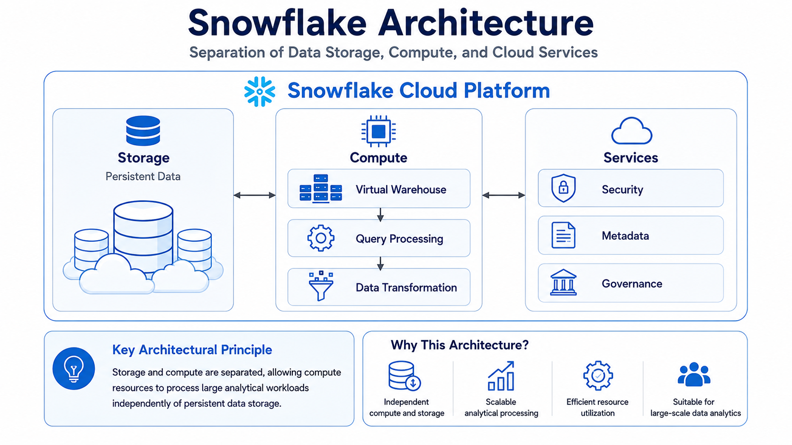

# ❄️ Snowflake Fundamentals


⬅️ [Back to Snowflake](../README.md)

---

# 📚 Table of Contents

* 📖 Overview
* 🎯 Learning Objectives
* ❄️ What is Snowflake?
* ☁️ Snowflake as a Cloud Data Platform
* 🏗️ Snowflake Architecture
* 🗄️ Snowflake vs RDBMS
* 📊 RDBMS vs Snowflake Comparison
* 🚀 Snowflake Key Characteristics
* 🐍 Snowpark
* 🔄 Snowflake Data Processing
* 📈 When to Use Snowflake
* 💡 Key Advantages
* 🎤 Interview Questions
* 🎯 Key Takeaways
* 📖 Summary
* ✅ Completion Checklist

---

# 📖 Overview

Snowflake is a **cloud-based data platform** designed for large-scale data storage, processing, analytics, data engineering, machine learning, AI application development, data sharing, and data governance.

Unlike traditional database systems that are installed and managed on servers, Snowflake is provided as a **fully managed cloud service**.

Snowflake is designed primarily for **analytical workloads** and can process large datasets and complex queries efficiently.

---

# 🎯 Learning Objectives

After completing this module, you will be able to:

* Understand Snowflake fundamentals
* Explain what Snowflake is
* Understand Snowflake as a cloud-based data platform
* Compare Snowflake with traditional RDBMS systems
* Understand analytical workloads
* Understand Snowflake's cloud-based architecture
* Understand Snowpark
* Identify suitable Snowflake use cases
* Explain the differences between transactional and analytical systems

---

# ❄️ What is Snowflake?

Snowflake is a **cloud-based SQL data warehouse and data platform** designed for large-scale data analytics workloads.

It provides a unified environment for:

* 🏢 Data Warehousing
* 🔄 Data Engineering
* 🤖 Machine Learning
* 🧠 AI Application Development
* 🔗 Data Sharing
* 🔐 Data Governance
* 📊 Data Analytics

A simplified view is:

```text
                         Snowflake
                             │
          ┌──────────────────┼──────────────────┐
          │                  │                  │
          ▼                  ▼                  ▼
   Data Warehousing    Data Engineering    Data Analytics
          │                  │                  │
          └──────────────────┼──────────────────┘
                             │
          ┌──────────────────┼──────────────────┐
          │                  │                  │
          ▼                  ▼                  ▼
    Machine Learning      AI Apps         Data Sharing
                             │
                             ▼
                       Data Governance
```

---

# ☁️ Snowflake as a Cloud Data Platform

Snowflake is delivered as a **fully managed SaaS cloud service**.

Unlike traditional RDBMS platforms, Snowflake does not require users to install database software on their own computers or manage the underlying database infrastructure.

```text
Traditional RDBMS

Application
     │
     ▼
Database Server
     │
     ▼
Operating System
     │
     ▼
Infrastructure
     │
     ▼
Hardware


Snowflake

User / Application
        │
        ▼
     Snowflake
        │
        ▼
Managed Cloud Infrastructure
```

Snowflake handles much of the underlying infrastructure management, allowing data engineers and analysts to focus on data and workloads.

---

# 🏗️ Snowflake Architecture

Snowflake is designed to separate data storage from compute resources.

A simplified conceptual architecture is:



This architecture makes Snowflake suitable for analytical workloads where large amounts of data may need to be scanned and processed.

---

# 🗄️ Snowflake vs RDBMS

Traditional **RDBMS** platforms such as Oracle and MySQL are commonly used for transactional applications.

Examples include:

* Application databases
* Banking transactions
* Order processing
* Customer management systems
* Operational applications

Snowflake is primarily designed for **analytical workloads**.

Examples include:

* Business Intelligence
* Data Warehousing
* Reporting
* Large-scale Analytics
* Data Engineering
* Machine Learning workloads

---

# 📊 RDBMS vs Snowflake

| Feature                    | Traditional RDBMS                                 | Snowflake                                 |
| -------------------------- | ------------------------------------------------- | ----------------------------------------- |
| Primary Purpose            | Transactional and operational workloads           | Analytical workloads                      |
| Examples                   | Oracle, MySQL                                     | Snowflake                                 |
| Deployment                 | Installed on servers or managed database services | Fully managed cloud SaaS                  |
| Infrastructure Management  | Often requires administration                     | Managed by Snowflake                      |
| Scaling                    | Usually requires infrastructure scaling           | Cloud-based elastic scaling               |
| Large Analytical Queries   | Can become resource intensive                     | Designed for large analytical workloads   |
| Data Warehousing           | Supported                                         | Core capability                           |
| Big Data Analytics         | Possible but may require additional architecture  | Designed for large-scale analytics        |
| Cloud Native               | Depends on deployment                             | Yes                                       |
| SQL Support                | Yes                                               | Yes                                       |
| Snowpark                   | No                                                | Yes                                       |
| Data Sharing               | Usually requires additional mechanisms            | Native data sharing capabilities          |
| Machine Learning           | Requires additional tools/services                | Supported through the Snowflake ecosystem |
| AI Application Development | Requires external platforms                       | Supported through Snowflake capabilities  |

---

# 🔄 Transactional vs Analytical Workloads

Understanding workload type is important when selecting a database or data platform.

## 🏢 Transactional Workloads

Traditional RDBMS systems are commonly used for transactional workloads.

```text
Application
     │
     ▼
Transactional Database
     │
     ├── INSERT
     ├── UPDATE
     ├── DELETE
     └── SELECT
```

Typical characteristics:

* Frequent transactions
* Small and fast queries
* Concurrent users
* Strong transactional consistency
* Operational applications

Examples:

* Banking systems
* E-commerce applications
* Employee management systems
* Order management systems

---

## 📊 Analytical Workloads

Snowflake is designed for analytical workloads involving large amounts of data.

```text
Large Dataset
      │
      ▼
Snowflake
      │
      ▼
Complex SQL Query
      │
      ▼
Large-Scale Data Scan
      │
      ▼
Business Insights
```

Typical characteristics:

* Large datasets
* Complex SQL queries
* Aggregations
* Historical analysis
* Reporting
* Business Intelligence

Examples:

```sql
SELECT
    customer_id,
    SUM(order_amount) AS total_sales
FROM orders
GROUP BY customer_id;
```

---

# 🚀 Snowflake Key Characteristics

## ☁️ Cloud Based

Snowflake is built as a cloud-native data platform and is available as a managed service.

---

## 🧮 Designed for Analytical Workloads

Snowflake is designed to execute analytical queries over large datasets.

For example, analytical workloads may scan millions or billions of rows to calculate:

* Revenue
* Customer metrics
* Product performance
* Sales trends
* Operational KPIs

---

## 📈 Scalable Compute

Snowflake provides compute resources through **virtual warehouses**.

Conceptually:

```text
Snowflake
    │
    ├── Warehouse A
    │      └── BI Queries
    │
    ├── Warehouse B
    │      └── ETL Processing
    │
    └── Warehouse C
           └── Data Science
```

Different workloads can therefore use separate compute resources.

---

## 🗄️ Centralized Data Platform

Snowflake can support multiple workloads on a common platform.

```text
                    Snowflake
                        │
       ┌────────────────┼────────────────┐
       │                │                │
       ▼                ▼                ▼
 Data Engineering   Analytics       Data Science
       │                │                │
       ▼                ▼                ▼
   Pipelines          BI Tools          ML
```

---

# 🐍 Snowpark

**Snowpark** is a developer framework provided by Snowflake that allows developers and data engineers to work with data using programming languages such as:

* Python
* Java
* Scala

Snowpark is particularly useful when data processing requires programming logic beyond traditional SQL.

Conceptually:

```text
Python / Java / Scala
          │
          ▼
       Snowpark
          │
          ▼
      Snowflake
          │
          ▼
     Data Processing
```

Snowpark allows developers to build data processing applications while keeping processing close to the data within Snowflake.

---

# 🔄 Snowpark vs SQL

SQL is commonly used for declarative analytical operations.

Example:

```sql
SELECT
    product_id,
    SUM(quantity) AS total_quantity
FROM order_items
GROUP BY product_id;
```

Snowpark can be used when more programmatic processing is required.

Example conceptual flow:

```text
Python Application
       │
       ▼
     Snowpark
       │
       ▼
    Snowflake
       │
       ▼
Data Processing
```

Therefore:

| SQL                     | Snowpark                            |
| ----------------------- | ----------------------------------- |
| Declarative querying    | Programmatic data processing        |
| Excellent for analytics | Useful for complex processing logic |
| SQL-based               | Python / Java / Scala               |
| BI and reporting        | Data Engineering / Data Science     |

---

# 📈 When to Use Snowflake

Snowflake is particularly suitable for:

* Enterprise Data Warehousing
* Business Intelligence
* Large-scale Analytics
* Data Engineering
* ELT Pipelines
* Historical Data Analysis
* Data Sharing
* Data Science
* Machine Learning Workloads
* AI-related Data Applications

Example architecture:

```text
Source Systems
      │
      ▼
Data Ingestion
      │
      ▼
Snowflake
      │
      ├───────────────┐
      ▼               ▼
Data Engineering   Analytics
      │               │
      ▼               ▼
Transformations   BI / Reporting
      │               │
      └───────┬───────┘
              ▼
         Business Users
```

---

# 💡 Key Advantages

Snowflake provides several capabilities that make it suitable for modern analytical platforms.

### ☁️ Cloud Native

No traditional database server installation is required.

### 📊 Analytics

Designed for large-scale analytical workloads.

### 📈 Scalability

Compute resources can scale according to workload requirements.

### 🔄 Data Engineering

Supports modern data engineering and transformation workflows.

### 🐍 Snowpark

Supports programmatic data processing using Python, Java, and Scala.

### 🔗 Data Sharing

Provides capabilities for sharing data across organizations and workloads.

### 🔐 Governance

Provides security and governance capabilities for enterprise data platforms.

---

# 🆚 Snowflake vs Traditional RDBMS — Simple Explanation

A simple way to remember the difference:

```text
Traditional RDBMS
        │
        ▼
Operational / Transactional Systems
        │
        ├── Oracle
        ├── MySQL
        └── PostgreSQL


Snowflake
        │
        ▼
Analytical / Data Warehouse Workloads
        │
        ├── BI
        ├── Data Engineering
        ├── Analytics
        ├── Data Science
        └── AI Applications
```

| Feature | Traditional Data Warehouse | Snowflake |
|---------|----------------------------|-----------|
| 🏗️ Architecture | Typically on-premises or VM-based; compute and storage are often tightly coupled. | Cloud-native architecture with independent compute and storage. |
| ⚡ Performance & Optimization | Requires manual indexing, partitioning, and query optimization. | Provides automatic optimization features such as micro-partitioning, pruning, and caching. |
| 📦 Data Types Supported | Primarily structured relational data. | Supports structured and semi-structured data such as JSON, Parquet, and Avro. |
| 🔧 Maintenance | Requires administration for backups, patching, upgrades, and performance tuning. | Fully managed SaaS platform with minimal infrastructure administration. |
| 💰 Cost Model | Typically involves hardware, infrastructure, licensing, or fixed capacity costs. | Consumption-based pricing with compute resources that can be suspended when idle. |
| ☁️ Cloud Support | Traditionally deployed on-premises or within a specific cloud environment. | Available across multiple cloud providers, including AWS, Azure, and Google Cloud. |
| 📊 Best Fit | Stable and predictable analytical workloads. | Dynamic, scalable, and large-scale modern analytics workloads. |

### Interview Explanation

> **Snowflake is a cloud-based SQL data warehouse and data platform designed primarily for large-scale analytical workloads. Traditional RDBMS systems such as Oracle and MySQL are commonly used for transactional and operational applications. Snowflake is a fully managed cloud SaaS service and supports scalable analytical processing. It also provides Snowpark for programmatic data processing using languages such as Python, Java, and Scala.**

---

# 🎤 Interview Questions

### 1. What is Snowflake?

Snowflake is a cloud-based data warehouse and data platform designed for large-scale analytical workloads. It provides capabilities for data warehousing, data engineering, analytics, data sharing, governance, machine learning, and AI application development.

### 2. Is Snowflake a database?

Snowflake provides database and data warehousing capabilities, but it is more accurately described as a **cloud data platform** rather than simply a traditional database.

### 3. Is Snowflake installed on a computer?

No. Snowflake is provided as a fully managed cloud SaaS service. Users interact with the platform through interfaces such as SQL, connectors, APIs, and client tools.

### 4. What is the difference between Snowflake and an RDBMS?

Traditional RDBMS systems such as Oracle and MySQL are commonly used for transactional workloads, while Snowflake is primarily designed for large-scale analytical and data warehousing workloads.

### 5. Can Snowflake handle large datasets?

Yes. Snowflake is designed for analytical workloads involving very large datasets and complex queries.

### 6. Does Snowflake support SQL?

Yes. SQL is one of the primary ways users query and transform data in Snowflake.

### 7. Does Snowflake support Snowpark?

Yes. Snowflake supports **Snowpark**, which allows developers and data engineers to use languages such as Python, Java, and Scala for programmatic data processing.

### 8. What is Snowpark?

Snowpark is Snowflake's developer framework for building data processing applications using programming languages such as Python, Java, and Scala while processing data within Snowflake.

### 9. Why is Snowflake suitable for Data Engineering?

Snowflake provides scalable analytical compute, cloud-based storage, SQL processing, data engineering capabilities, Snowpark, data sharing, and governance in a unified platform.

### 10. Why would you choose Snowflake over a traditional RDBMS?

For large-scale analytical workloads, Snowflake provides a cloud-native, managed platform designed for data warehousing and analytics, whereas traditional RDBMS platforms are commonly optimized for operational and transactional workloads.

---

# 🎯 Key Takeaways

* ❄️ Snowflake is a **cloud-based data platform**.
* ☁️ It is provided as a **fully managed SaaS service**.
* 📊 Snowflake is primarily designed for **analytical workloads**.
* 🏢 Traditional RDBMS systems such as Oracle and MySQL are commonly used for **transactional workloads**.
* 📈 Snowflake is designed to process large analytical datasets.
* 🧮 Snowflake provides scalable compute through virtual warehouses.
* 🐍 Snowpark supports programmatic data processing.
* 🔗 Snowflake provides data sharing capabilities.
* 🔐 Snowflake provides enterprise data governance capabilities.
* 🤖 Snowflake supports data engineering, machine learning, and AI-related workloads.

---

# 🚀 Next Module

➡️ [Snowflake Free Account Setup](../02_Snowflake_Account_Setup/README.md)
