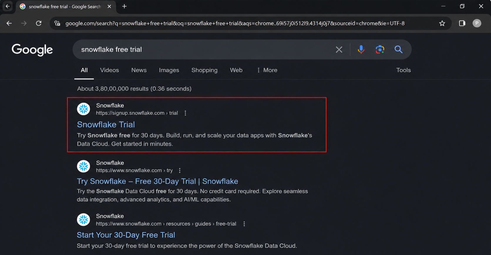
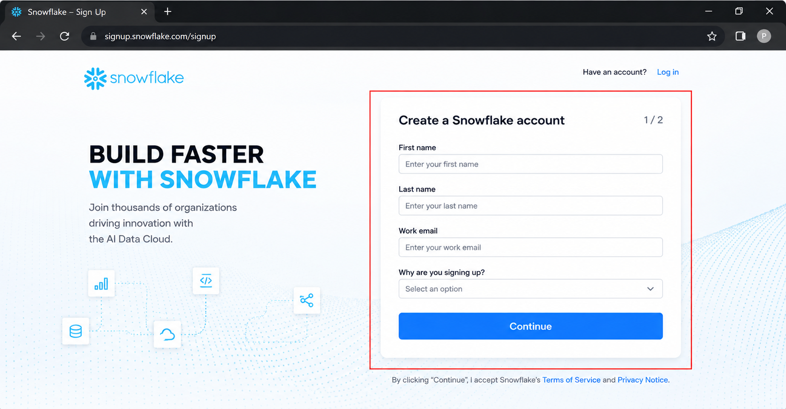
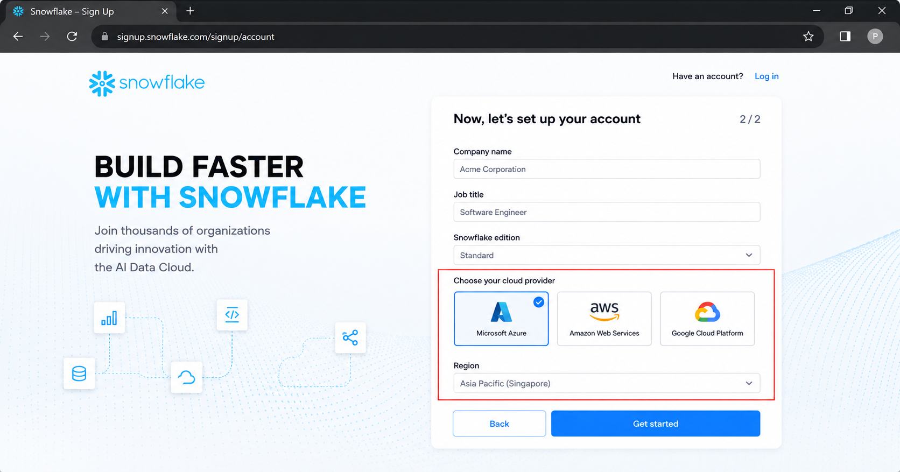
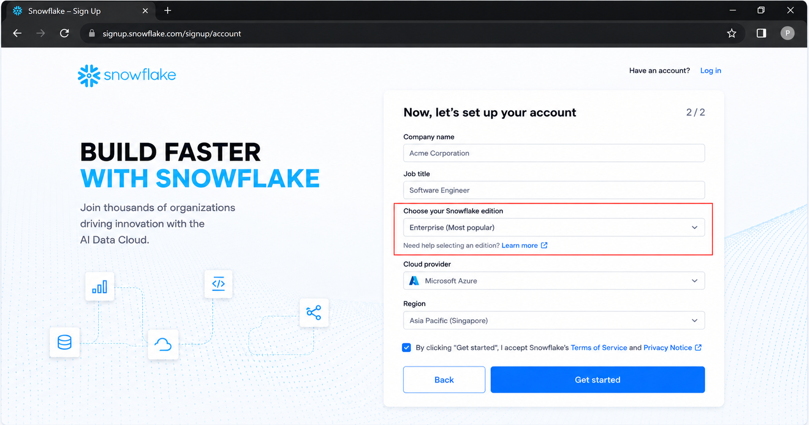
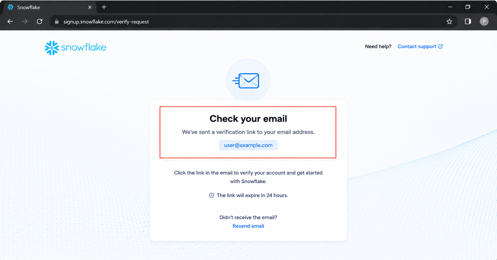
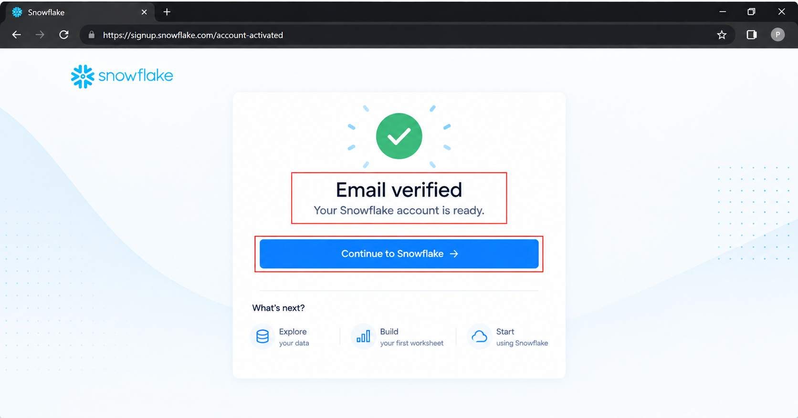
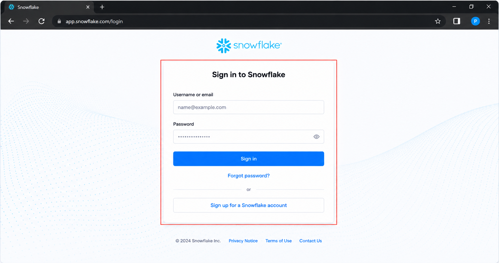
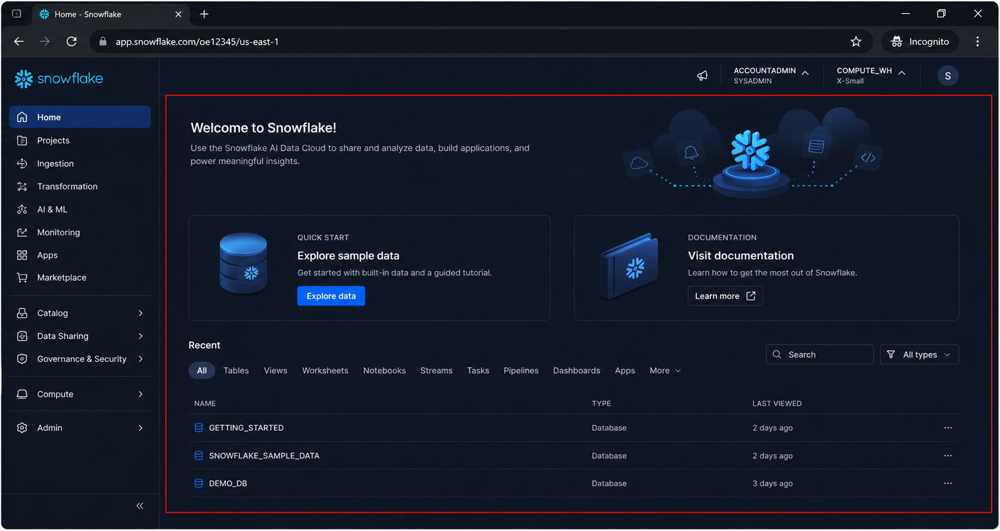
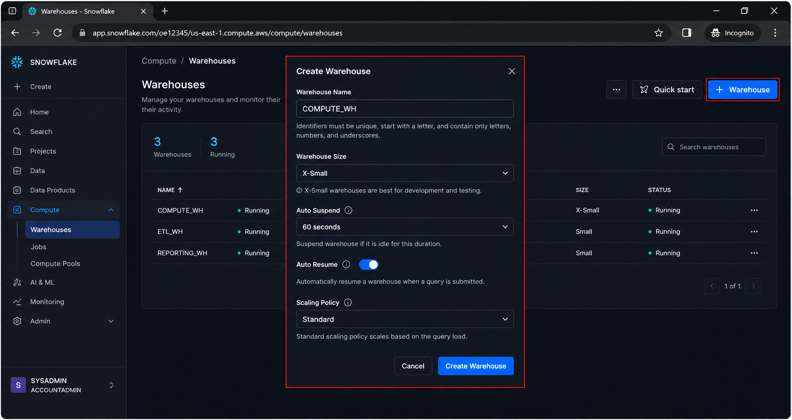

# ❄️ Snowflake Free Account Setup


⬅️ [Back to Snowflake Fundamentals](../01_Fundamentals/README.md)

---

# 📖 Overview

This guide explains how to create a **Snowflake Free Trial Account** and prepare the environment for learning Snowflake Data Engineering.

Snowflake currently provides a **30-day trial with free usage credits**. A valid email address is required to create the trial account, and payment information is not required to start the trial.

During signup, you select:

* Snowflake Edition
* Cloud Provider
* Cloud Region
* Account information

These selections are important because the cloud provider, region, and edition selected during signup cannot be changed later for that trial account.

---

# 📚 Table of Contents

* 📖 Overview
* 🎯 Learning Objectives
* ✅ Prerequisites
* ☁️ Snowflake Trial Account
* 🚀 Step 1 – Open Snowflake Trial Signup
* 📝 Step 2 – Enter Account Information
* ☁️ Step 3 – Select Cloud Provider
* 🌎 Step 4 – Select Region
* 🏢 Step 5 – Select Snowflake Edition
* 📧 Step 6 – Verify Email
* 🔐 Step 7 – Activate Account
* ❄️ Step 8 – Sign in to Snowsight
* 🖥️ Step 9 – Explore Snowflake Interface
* 🧑‍💻 Step 10 – Verify Account
* 🧮 Step 11 – Create a Virtual Warehouse
* 🗄️ Step 12 – Create a Database
* 📊 Step 13 – Create a Schema
* 🧪 Step 14 – Run a Test Query
* 💰 Trial Credit Management
* ⚠️ Important Trial Considerations
* 🏗️ Snowflake Learning Environment
* 📸 Screenshots
* 💡 Best Practices
* 🎤 Interview Questions
* 📊 Summary
* 🎯 Key Takeaways

---

# 🎯 Learning Objectives

After completing this setup, you will be able to:

* Create a Snowflake trial account
* Select a cloud provider and region
* Select a Snowflake edition
* Activate your Snowflake account
* Access Snowsight
* Understand the Snowflake interface
* Create a virtual warehouse
* Create a database and schema
* Execute SQL queries
* Monitor trial usage
* Safely manage Snowflake compute resources

---

# ✅ Prerequisites

Before creating the account, ensure you have:

* A valid email address
* A modern web browser
* Internet connectivity
* Basic SQL knowledge
* Basic database concepts

A payment card is **not required to start the Snowflake trial**.

---

# ☁️ Snowflake Trial Account

Snowflake provides a free trial environment for evaluating the platform.

According to the current Snowflake documentation:

* The trial lasts **30 days or until the free usage balance is exhausted**, whichever comes first.
* A valid email address is required.
* Payment information is not required to start the trial.
* Trial usage is based on compute and storage consumption.
* Running virtual warehouses consumes credits.
* The trial can later be converted to a paid account.

The current Snowflake signup page advertises a **30-day trial with $400 in free credits**.

---

# 🚀 Step 1 – Open Snowflake Trial Signup

Open the official Snowflake trial signup page:

[Snowflake Free Trial](https://signup.snowflake.com/?utm_source=chatgpt.com)

The signup page provides the option to create a Snowflake account.

<div align="center">



</div>

---

# 📝 Step 2 – Enter Account Information

Enter the required account information.

Typical fields include:

* First Name
* Last Name
* Work Email
* Company Name
* Job Title

<div align="center">



</div>

For personal learning, provide accurate information appropriate for your use case.

Click:

```text
Sign Up
```

The signup process will continue to the Snowflake trial configuration.

---

# ☁️ Step 3 – Select Cloud Provider

Snowflake allows you to select the cloud platform for your account.

Common choices include:

```text
AWS
Azure
Google Cloud
```

<div align="center">



</div>

## Recommended Selection

For this learning journey, you can select **Azure** if you want to align Snowflake with your existing Azure Data Engineering learning.

Alternatively, AWS or Google Cloud can be selected.

> Choose the cloud provider based on your learning requirements. The provider selected during signup cannot be changed for the trial account.

---

# 🌎 Step 4 – Select Region

Select a region geographically close to you.

For example:

```text
Cloud Provider
      │
      ▼
    Azure
      │
      ▼
  Region
      │
      ▼
Nearest suitable region
```

<div align="center">



</div>

## Region Selection Guidelines

Choose a region that:

* Is geographically close to your location
* Supports the Snowflake features you want to learn
* Matches your cloud learning environment where practical

Snowflake recommends selecting a region close to your users to improve performance and reduce potential data-transfer considerations.

---

# 🏢 Step 5 – Select Snowflake Edition

Snowflake provides different editions with different capabilities.

For learning and Data Engineering practice, **Enterprise Edition** is a reasonable choice when available in the trial signup flow.


Example:

```text
Snowflake Edition
       │
       ▼
   Enterprise
```

Snowflake's current signup page presents **Enterprise Edition** as the selected trial option in its default signup experience.

---

# 📧 Step 6 – Verify Email

After submitting the signup form, Snowflake sends an activation email.

Open your email inbox and look for the Snowflake verification or activation email.

<div align="center">



</div>


If the email is not visible:

1. Check the Spam/Junk folder.
2. Verify the email address used during signup.
3. Wait a few minutes.
4. Request another verification email if available.

Snowflake also recommends checking corporate email filters if the activation email is blocked.

---

# 🔐 Step 7 – Activate Account

Open the activation link from the Snowflake email.

You will be directed to the Snowflake account activation page.


<div align="center">



</div>


Complete the required account setup information.

After activation, Snowflake provides the URL required to access your account.

---

# ❄️ Step 8 – Sign in to Snowsight

Snowflake's browser-based interface is called **Snowsight**.

Open the Snowflake account URL provided during registration.

You can also access Snowflake through the official interface:

[Snowflake Snowsight](https://app.snowflake.com/?utm_source=chatgpt.com)


<div align="center">



</div>


Enter your Snowflake credentials and sign in.

---

# 🖥️ Step 9 – Explore Snowflake Interface

After login, you will be presented with the Snowflake Snowsight interface.


<div align="center">



</div>


Important areas include:

```text
Snowsight
│
├── Projects / Worksheets
├── Data
├── Catalog
├── Compute
├── Monitoring
└── Administration
```

The exact interface can change as Snowflake evolves.

---

# 🧑‍💻 Step 10 – Verify Account

After logging in, verify that your Snowflake account is working correctly.

Open a SQL worksheet and execute:

```sql
SELECT CURRENT_USER();
```

Then:

```sql
SELECT CURRENT_ACCOUNT();
```

And:

```sql
SELECT CURRENT_REGION();
```

These queries help verify the current Snowflake session and account environment.

---

# 🧮 Step 11 – Create a Virtual Warehouse

A **virtual warehouse** provides compute resources for Snowflake workloads.

Navigate to:

```text
Compute
   │
   ▼
Warehouses
   │
   ▼
Create Warehouse
```


<div align="center">



</div>

For learning purposes, use a small warehouse.

Example:

```text
Warehouse Name:
COMPUTE_WH

Size:
X-Small / Small

Auto Suspend:
5 minutes

Auto Resume:
Enabled
```

You can also create the warehouse using SQL:

```sql
CREATE WAREHOUSE COMPUTE_WH
WITH
    WAREHOUSE_SIZE = 'XSMALL'
    AUTO_SUSPEND = 300
    AUTO_RESUME = TRUE;
```

A running warehouse consumes Snowflake credits, so keeping auto-suspend enabled is important for trial usage management.

---

# 🗄️ Step 12 – Create a Database

Create a database for learning.

```sql
CREATE DATABASE DE_LEARNING;
```

Verify:

```sql
SHOW DATABASES;
```

Expected structure:

```text
DE_LEARNING
```

---

# 📊 Step 13 – Create a Schema

Create a schema inside the learning database.

```sql
CREATE SCHEMA DE_LEARNING.RAW;
```

Verify:

```sql
SHOW SCHEMAS
IN DATABASE DE_LEARNING;
```

Example:

```text
DE_LEARNING
│
└── RAW
```

---

# 🧪 Step 14 – Run a Test Query

Create a simple table:

```sql
CREATE TABLE DE_LEARNING.RAW.STUDENTS (
    STUDENT_ID INTEGER,
    STUDENT_NAME VARCHAR,
    AGE INTEGER
);
```

Insert sample records:

```sql
INSERT INTO DE_LEARNING.RAW.STUDENTS
VALUES
    (1, 'Alice', 25),
    (2, 'Bob', 28),
    (3, 'Charlie', 24);
```

Query the data:

```sql
SELECT *
FROM DE_LEARNING.RAW.STUDENTS;
```

Expected result:

```text
+------------+--------------+-----+
| STUDENT_ID | STUDENT_NAME | AGE |
+------------+--------------+-----+
| 1          | Alice        | 25  |
| 2          | Bob          | 28  |
| 3          | Charlie      | 24  |
+------------+--------------+-----+
```

---

# 🔄 Complete Setup Flow

```text
Snowflake Trial Signup
          │
          ▼
Enter Account Information
          │
          ▼
Select Cloud Provider
          │
          ▼
Select Region
          │
          ▼
Select Snowflake Edition
          │
          ▼
Verify Email
          │
          ▼
Activate Account
          │
          ▼
Login to Snowsight
          │
          ▼
Create Virtual Warehouse
          │
          ▼
Create Database
          │
          ▼
Create Schema
          │
          ▼
Create Table
          │
          ▼
Run SQL Query
```

---

# 💰 Trial Credit Management

Snowflake trial usage is not unlimited.

Compute and storage usage consume the free usage balance. Virtual warehouses consume credits while they are running.

Monitor your remaining balance from the Snowflake interface.

Users with the `ACCOUNTADMIN` role can view the remaining trial balance and usage information in Snowsight.

---

# ⚠️ Important Trial Considerations

## ⏱️ Trial Duration

The trial continues for:

```text
30 Days
     OR
Free Usage Balance Exhausted
     ↓
Whichever Happens First
```

---

## 🧮 Virtual Warehouse Costs

A running virtual warehouse consumes credits.

Therefore:

```text
Warehouse Running
       │
       ▼
Compute Consumption
       │
       ▼
Credits Used
```

Stop or suspend warehouses when they are not required.

---

## ⏸️ Auto Suspend

Use a short auto-suspend period for learning environments.

Recommended:

```text
AUTO_SUSPEND = 300 seconds
```

This automatically suspends the warehouse after a period of inactivity.

Snowflake specifically recommends using a short auto-suspend period to reduce unnecessary credit consumption.

---

## 💳 Payment Information

Payment information is not required to start the trial.

However, adding a credit card converts the trial account to a paid account.

Therefore, do **not** add payment information unless you intentionally want to convert the account to a paid account.

---

# 🏗️ Snowflake Learning Environment

After completing the setup, the recommended learning environment is:

```text
Snowflake Account
│
├── COMPUTE_WH
│
└── DE_LEARNING
      │
      ├── RAW
      │
      ├── STAGING
      │
      ├── SILVER
      │
      └── GOLD
```

This structure can later be expanded as you learn:

* Data Loading
* Stages
* File Formats
* COPY INTO
* Streams
* Tasks
* Dynamic Tables
* Snowpark
* Data Sharing
* Data Governance

---

# 📸 Screenshots

Store setup screenshots inside the following directory:

```text
images/
│
├── 01_snowflake_trial_signup.png
├── 02_cloud_provider_selection.png
├── 03_region_selection.png
├── 04_snowflake_edition.png
├── 05_email_verification.png
├── 06_account_activation.png
├── 07_snowsight_login.png
├── 08_snowsight_interface.png
└── 09_create_virtual_warehouse.png
```

---

# 💡 Best Practices

* Use the official Snowflake signup page.
* Select a region close to your intended users.
* Use a small virtual warehouse for learning.
* Enable auto-suspend.
* Enable auto-resume when useful.
* Suspend warehouses when finished.
* Monitor trial credit consumption.
* Avoid unnecessarily large warehouses.
* Remove unused databases and tables when appropriate.
* Do not add payment information unless you intentionally want a paid account.
* Use separate databases/schemas to organize learning exercises.

Snowflake recommends checking warehouse size and using short auto-suspend periods to reduce free-credit consumption.

---

# 🎤 Interview Questions

### 1. Is Snowflake free?

Snowflake provides a free trial. The current signup page advertises a 30-day trial with $400 in free credits.

### 2. How long does the Snowflake trial last?

The trial lasts 30 days or until the free usage balance is exhausted, whichever occurs first.

### 3. Do I need a credit card to create a trial?

No. A valid email address is sufficient to start a Snowflake trial.

### 4. What consumes Snowflake credits?

Virtual warehouse compute and storage usage consume the available trial balance.

### 5. Why should I enable auto-suspend?

Auto-suspend prevents an unused virtual warehouse from continuously consuming compute credits.

### 6. What is Snowsight?

Snowsight is Snowflake's browser-based web interface used to work with Snowflake resources, SQL, data, monitoring, and administration.

### 7. What is a virtual warehouse?

A virtual warehouse provides compute resources for Snowflake workloads such as queries and data loading.

### 8. Can Snowflake run without a virtual warehouse?

For workloads that require warehouse compute, a warehouse must be running to execute queries or load data.

---

# 📊 Summary

In this guide, you created and prepared a Snowflake trial environment for Data Engineering learning.

The setup process covered:

```text
Trial Account
      │
      ▼
Cloud Provider
      │
      ▼
Region
      │
      ▼
Edition
      │
      ▼
Email Verification
      │
      ▼
Snowsight
      │
      ▼
Virtual Warehouse
      │
      ▼
Database
      │
      ▼
Schema
      │
      ▼
Table
      │
      ▼
SQL Query
```

You now have a Snowflake environment ready for learning SQL analytics, data loading, data engineering, Snowpark, and advanced Snowflake features.

---

# 🎯 Key Takeaways

* ❄️ Snowflake provides a cloud-based data platform.
* 🆓 A trial account can be created without payment information.
* ⏱️ The trial is available for up to 30 days or until the free usage balance is exhausted.
* ☁️ Cloud provider and region should be selected carefully.
* 🧮 Virtual warehouses provide compute resources.
* ⏸️ Auto-suspend helps control credit consumption.
* 🖥️ Snowsight is the primary browser-based interface.
* 🗄️ Databases and schemas organize Snowflake data.
* 💰 Monitor trial usage regularly.

---

# 🚀 Next Module

➡️ [Snowflake vs Databricks](../03_snowflake_vs_databricks/README.md)