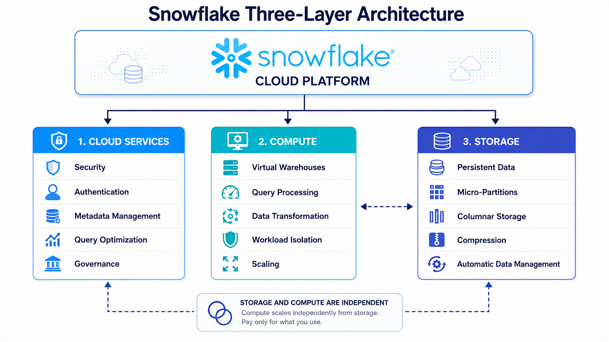
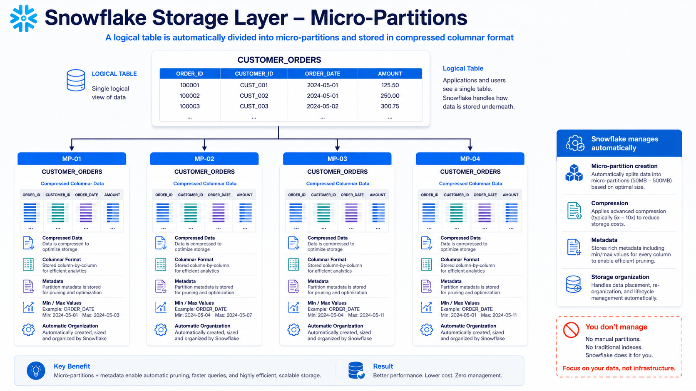
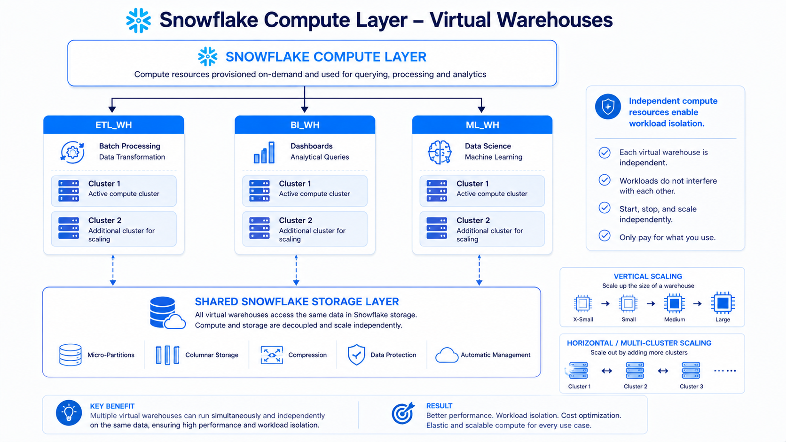
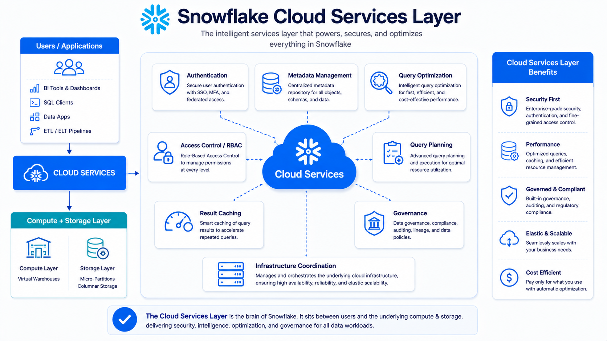
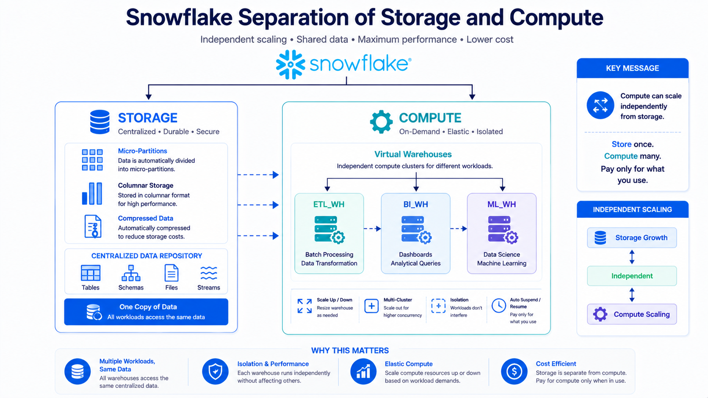
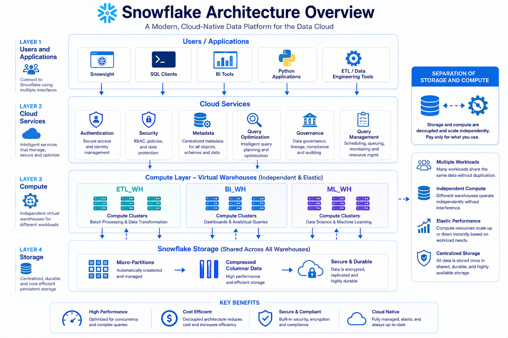

# 🏗️ Snowflake Architecture


---

# 📚 Table of Contents

- 📖 Overview
- 🎯 Learning Objectives
- 🏗️ Snowflake Architecture
- 🧩 Three-Layer Architecture
  - 🗄️ Storage Layer
  - ⚙️ Compute Layer
  - ☁️ Cloud Services Layer
- 🔄 Separation of Storage and Compute
- 🗄️ Storage Layer
- ⚙️ Compute Layer
- ☁️ Cloud Services Layer
- 🔐 Security and Access Control
- 🚀 Workload Isolation
- 🔌 Connecting to Snowflake
- 🌐 Web-Based User Interface
- 💻 Command-Line Clients
- 🔗 ODBC and JDBC
- 🐍 Native Programming Connections
- 🔄 Third-Party Connectors
- 🆚 Traditional Database Architecture
- 📊 Snowflake Architecture Flow
- 💡 Key Benefits
- 🎤 Interview Questions
- 🎯 Key Takeaways


---

# 📖 Overview

Snowflake uses a **cloud-native architecture** designed to separate **data storage, compute resources, and cloud services**.

Unlike traditional database systems where compute and storage are commonly tightly coupled, Snowflake separates these responsibilities into independent layers.

The three primary architectural layers are:

```text
┌──────────────────────────────────────────────┐
│              ☁️ Cloud Services              │
│                                              │
│ Security | Management | Metadata | Optimization│
└──────────────────────────────────────────────┘
                     │
                     ▼
┌──────────────────────────────────────────────┐
│                 ⚙️ Compute                   │
│                                              │
│        Virtual Warehouses / Clusters         │
└──────────────────────────────────────────────┘
                     │
                     ▼
┌──────────────────────────────────────────────┐
│               🗄️ Storage                    │
│                                              │
│ Structured | Semi-structured | Unstructured │
└──────────────────────────────────────────────┘
```

This architecture allows Snowflake to independently scale storage and compute while providing centralized services for security, metadata, optimization, and management.

---

# 🎯 Learning Objectives

After completing this module, you will be able to:

* Understand Snowflake's three-layer architecture
* Explain the Storage Layer
* Understand Snowflake micro-partitions
* Explain the Compute Layer
* Understand Virtual Warehouses
* Explain workload isolation
* Understand the Cloud Services Layer
* Understand Snowflake security and RBAC
* Understand metadata management
* Understand result caching
* Identify different ways to connect to Snowflake
* Compare Snowflake architecture with traditional databases

---

# 🏗️ Snowflake Architecture

Snowflake architecture can be divided into three major layers:



Each layer has a specific responsibility.

---

# 🧩 Three-Layer Architecture

## 🗄️ 1. Storage Layer

The Storage Layer is responsible for storing data.

Snowflake stores table data in **micro-partitions** using a compressed columnar format.

The storage layer handles:

* Data storage
* Micro-partitioning
* Compression
* Metadata management
* Structured data
* Semi-structured data
* Unstructured data




You do not need to manually manage traditional database indexes or partitions.

---

## ⚙️ 2. Compute Layer

The Compute Layer provides processing resources through **Virtual Warehouses**.

Virtual Warehouses execute workloads such as:

* SQL queries
* Data loading
* Data transformation
* Data processing
* Analytical workloads

Snowflake allows different workloads to use separate virtual warehouses.



This provides **workload isolation**.

---

## ☁️ 3. Cloud Services Layer

The Cloud Services Layer coordinates and manages Snowflake operations.

It is responsible for services such as:

* 🔐 Authentication
* 🛡️ Access Control
* 📋 Metadata Management
* ⚙️ Infrastructure Management
* 💰 Billing
* 🚀 Query Optimization
* ⚡ Result Caching




This layer acts as the coordination and management layer of Snowflake.

---

# 🔄 Separation of Storage and Compute

One of the important characteristics of Snowflake is the separation of **storage and compute**.



This separation provides flexibility because compute resources can be scaled independently from the storage layer.

### Example

Suppose a company has:

```text
Large Data Storage
        │
        ▼
    10 TB Data
```

During normal operations:

```text
Small Compute Requirement
```

During a large reporting workload:

```text
Higher Compute Requirement
```

The compute resources can be scaled without requiring the underlying data storage to be redesigned.

---

# 🗄️ Storage Layer

Snowflake stores table data in **micro-partitions**.

The data is stored in a compressed columnar format.

```text
                    Table
                      │
                      ▼
              Micro-Partitions
                      │
          ┌───────────┼───────────┐
          ▼           ▼           ▼
        MP-1        MP-2        MP-3
          │           │           │
          ▼           ▼           ▼
      Compressed   Compressed   Compressed
      Columnar     Columnar     Columnar
       Storage      Storage      Storage
```

Snowflake manages the underlying storage automatically.

### Storage Layer Responsibilities

| Responsibility      | Description                             |
| ------------------- | --------------------------------------- |
| 🗄️ Storage        | Stores Snowflake table data             |
| 📦 Micro-partitions | Organizes data into small storage units |
| 🗜️ Compression    | Compresses stored data                  |
| 📋 Metadata         | Maintains metadata about stored data    |
| 📊 Columnar Storage | Stores data in a column-oriented format |

---

# 📦 Micro-Partitions

Snowflake automatically organizes table data into **micro-partitions**.

You do not manually create or maintain traditional partitions.

```text
Table
 │
 ├── Micro-Partition 1
 │
 ├── Micro-Partition 2
 │
 ├── Micro-Partition 3
 │
 └── Micro-Partition 4
```

Snowflake manages:

* Micro-partition creation
* Data organization
* Compression
* Metadata
* Partition-level information

This reduces the need for manual storage optimization.

---

# ⚙️ Compute Layer

Snowflake uses **Virtual Warehouses** to provide compute resources.

A virtual warehouse is a cluster of compute resources used to execute queries and other workloads.

```text
                 Virtual Warehouse
                        │
             ┌──────────┼──────────┐
             ▼          ▼          ▼
          Cluster 1  Cluster 2  Cluster 3
             │          │          │
             ▼          ▼          ▼
           Compute    Compute    Compute
```

---

# 📈 Scaling Virtual Warehouses

Virtual Warehouses can scale in two primary ways:

### 📏 Vertical Scaling

Increase the size of the warehouse.

```text
X-Small
   │
   ▼
Small
   │
   ▼
Medium
   │
   ▼
Large
```

Increasing warehouse size provides more compute resources for a workload.

---

### ↔️ Horizontal Scaling

Use multiple clusters within a multi-cluster warehouse.

```text
              Multi-Cluster Warehouse
                       │
          ┌────────────┼────────────┐
          ▼            ▼            ▼
       Cluster 1    Cluster 2    Cluster 3
          │            │            │
          ▼            ▼            ▼
        Users        Users        Users
```

Horizontal scaling can help handle workloads with many concurrent users or queries.

---

# 🚀 Workload Isolation

Snowflake allows organizations to create separate warehouses for different workloads.

For example:

```text
                       Snowflake
                           │
                 ⚙️ Compute Layer
                           │
       ┌───────────────────┼───────────────────┐
       │                   │                   │
       ▼                   ▼                   ▼
   ETL_WH               BI_WH              DATA_SCIENCE_WH
       │                   │                   │
       ▼                   ▼                   ▼
 Data Loading          Analytics              ML / DS
```

### Benefits

* Workload isolation
* Independent scaling
* Better resource management
* Reduced workload interference
* Easier monitoring

---

# ☁️ Cloud Services Layer

The Cloud Services Layer provides centralized services required to operate Snowflake.

```text
              ☁️ Cloud Services
                       │
       ┌───────────────┼───────────────┐
       │               │               │
       ▼               ▼               ▼
    Security       Management       Metadata
       │               │               │
       └───────────────┼───────────────┘
                       │
                       ▼
                 Optimization
```

---

# 🔐 Authentication and Access Control

Snowflake provides authentication and authorization capabilities.

Access can be managed using **Role-Based Access Control (RBAC)**.

```text
User
 │
 ▼
Role
 │
 ▼
Privileges
 │
 ▼
Database / Schema / Table
```

Example:

```text
DATA_ENGINEER
      │
      ├── USAGE
      ├── SELECT
      ├── INSERT
      └── UPDATE
```

RBAC allows administrators to control what users and roles can access.

---

# 📋 Metadata Management

Snowflake maintains metadata about databases, schemas, tables, columns, and other objects.

Example:

```text
Database
   │
   ▼
Schema
   │
   ▼
Table
   │
   ▼
Columns
   │
   ▼
Metadata
```

Metadata can be used by Snowflake services for:

* Query processing
* Optimization
* Object management
* Data discovery
* Access control

---

# 🚀 Query Optimization

Snowflake automatically performs query optimization to improve query execution.

The architecture uses metadata and storage information to reduce unnecessary data processing.

```text
SQL Query
    │
    ▼
Query Analysis
    │
    ▼
Optimization
    │
    ▼
Relevant Data
    │
    ▼
Compute
    │
    ▼
Result
```

Snowflake reduces the amount of data that needs to be processed when possible.

---

# ⚡ Result Caching

Snowflake can reuse cached query results when the appropriate conditions are met.

```text
First Query
    │
    ▼
Query Execution
    │
    ▼
Result
    │
    ▼
Result Cache
    │
    ▼
Same / Compatible Query
    │
    ▼
Cached Result
```

Result caching can reduce unnecessary query execution and improve response time.

---

# 🔌 Connecting to Snowflake

Snowflake supports multiple ways to connect applications, tools, and users to the platform.

```text
                         Snowflake
                             ▲
                             │
       ┌─────────────────────┼─────────────────────┐
       │                     │                     │
       │                     │                     │
       ▼                     ▼                     ▼
   Web UI              CLI / SnowSQL        ODBC / JDBC
       │                     │                     │
       │                     │                     │
       └─────────────────────┼─────────────────────┘
                             │
                             ▼
                    Native Connections
                             │
                    ┌────────┴────────┐
                    ▼                 ▼
                  Python           Snowpark
                    │
                    ▼
             Third-Party Connectors
                    │
              ┌─────┴─────┐
              ▼           ▼
             ETL          BI
```

---

# 🌐 Web-Based User Interface

Snowflake provides a browser-based user interface called **Snowsight**.

It can be used for:

* Running SQL queries
* Managing databases
* Managing schemas
* Managing warehouses
* Monitoring workloads
* Managing users and roles
* Exploring data

```text
Browser
   │
   ▼
Snowsight
   │
   ▼
Snowflake
```

---

# 💻 Command-Line Clients

Snowflake can also be accessed through command-line tools such as **SnowSQL**.

```text
Terminal
    │
    ▼
 SnowSQL
    │
    ▼
Snowflake
```

Command-line access is useful for:

* Automation
* Scripting
* SQL execution
* Development workflows
* Data engineering tasks

---

# 🔗 ODBC and JDBC

Snowflake provides **ODBC and JDBC drivers** that allow external applications to connect to Snowflake.

```text
Application
     │
     ├── ODBC
     │
     └── JDBC
           │
           ▼
       Snowflake
```

These connections are commonly used by:

* BI tools
* Reporting applications
* ETL tools
* Enterprise applications

Example:

```text
Tableau
   │
   ▼
ODBC / JDBC
   │
   ▼
Snowflake
```

---

# 🐍 Native Programming Connections

Developers can connect applications to Snowflake using programming languages and supported client libraries.

Common examples include:

* Python
* Java
* Scala
* Snowpark

Example:

```text
Python Application
        │
        ▼
 Snowflake Connector
        │
        ▼
    Snowflake
```

For data engineering workloads, Python can be used to automate data loading, execute SQL, and build data processing applications.

---

# 🔄 Snowpark

**Snowpark** provides a developer framework for building data applications that execute processing within Snowflake.

Supported languages include:

* Python
* Java
* Scala

Example:

```text
Python
  │
  ▼
Snowpark
  │
  ▼
Snowflake Compute
  │
  ▼
Snowflake Data
```

Snowpark allows developers to work with Snowflake data using programmatic APIs rather than writing only SQL.

---

# 🔌 Third-Party Connectors

Snowflake can integrate with external ETL, ELT, and BI platforms using connectors.

Example:

```text
                    Snowflake
                        ▲
                        │
          ┌─────────────┴─────────────┐
          │                           │
          ▼                           ▼
      ETL Tools                    BI Tools
          │                           │
          ▼                           ▼
     Informatica                 ThoughtSpot
```

Third-party integrations can be used to move, transform, analyze, and visualize data stored in Snowflake.

---

# 🆚 Snowflake vs Traditional Database Architecture

Traditional database systems often tightly couple storage and compute.

For example:

```text
Traditional Database
        │
        ▼
┌──────────────────────┐
│      Database        │
│                      │
│ Storage + Compute    │
│      Together        │
└──────────────────────┘
```

Snowflake separates these responsibilities:

```text
Snowflake
     │
     ├───────────────┐
     ▼               ▼
 Storage          Compute
     │               │
     │        Virtual Warehouses
     │               │
     ▼               ▼
Micro-Partitions    Clusters
```

This separation provides greater flexibility for scaling and workload isolation.

---

# 📊 Snowflake Architecture Flow



---

# 🖼️ Architecture Diagram

The following diagram illustrates the three major Snowflake architectural layers:


The architecture can be summarized as:

```text
☁️ Cloud Services
        │
        ▼
⚙️ Compute
        │
        ▼
🗄️ Database Storage
```

---

# 💡 Key Benefits

Snowflake's architecture provides several important benefits.

### 🔄 Separation of Storage and Compute

Storage and compute can operate independently.

### 📈 Elastic Scaling

Virtual warehouses can scale according to workload requirements.

### 🧩 Workload Isolation

Different workloads can use separate virtual warehouses.

### 🛠️ Managed Infrastructure

Snowflake manages infrastructure, storage optimization, and metadata.

### 🔐 Centralized Security

Authentication and access control are managed through Snowflake's services and RBAC capabilities.

### ⚡ Query Optimization

Snowflake automatically uses metadata and optimization techniques to improve query execution.

### 💾 Automatic Storage Management

Micro-partitions, compression, and storage organization are handled automatically.

### 🔌 Multiple Connectivity Options

Snowflake supports:

* Web UI
* SnowSQL
* ODBC
* JDBC
* Python
* Snowpark
* Third-party connectors

---

# 🎤 Interview Questions

### 1. What are the three layers of Snowflake architecture?

Snowflake architecture consists of:

1. **Storage Layer**
2. **Compute Layer**
3. **Cloud Services Layer**

---

### 2. What is the Storage Layer?

The Storage Layer stores data in automatically managed micro-partitions using compressed columnar storage.

---

### 3. What is a micro-partition?

A micro-partition is a small unit of storage used by Snowflake to organize table data. Snowflake automatically manages the creation and organization of micro-partitions.

---

### 4. Do we manually create indexes in Snowflake?

Snowflake's architecture does not require traditional manually maintained database indexes for normal table access. Snowflake manages storage organization and metadata automatically.

---

### 5. What is a Virtual Warehouse?

A Virtual Warehouse is a cluster of compute resources used to execute queries and perform data processing operations in Snowflake.

---

### 6. How can a Virtual Warehouse scale?

A warehouse can scale:

* **Vertically** by increasing its warehouse size.
* **Horizontally** using multiple clusters in a multi-cluster warehouse.

---

### 7. Why use multiple Virtual Warehouses?

Multiple warehouses can isolate workloads.

For example:

```text
ETL_WH
   │
   └── Data Loading

BI_WH
   │
   └── Analytics

ML_WH
   │
   └── Data Science
```

---

### 8. What does the Cloud Services Layer do?

The Cloud Services Layer handles services such as:

* Authentication
* Access control
* Metadata management
* Infrastructure management
* Billing
* Query optimization
* Result caching

---

### 9. How do you connect to Snowflake?

Snowflake can be accessed through:

* Snowsight
* SnowSQL
* ODBC
* JDBC
* Python
* Snowpark
* Third-party ETL and BI connectors

---

### 10. What is Snowpark?

Snowpark is a framework that allows developers to build data applications using languages such as Python, Java, and Scala while processing data within Snowflake.

---

### 11. How is Snowflake different from traditional databases?

Traditional database architectures often tightly couple compute and storage. Snowflake separates storage and compute, allowing independent scaling and workload isolation.

---

# 🎯 Key Takeaways

* ❄️ Snowflake uses a **three-layer architecture**.
* 🗄️ The **Storage Layer** stores data in automatically managed micro-partitions.
* 📦 Data is stored using compressed columnar storage.
* ⚙️ The **Compute Layer** uses Virtual Warehouses.
* 📈 Virtual Warehouses support vertical and horizontal scaling.
* 🔄 Separate warehouses can isolate different workloads.
* ☁️ The **Cloud Services Layer** handles security, metadata, management, optimization, and caching.
* 🔐 Snowflake supports role-based access control.
* ⚡ Result caching can improve query response times.
* 🔌 Snowflake provides multiple connectivity options.
* 🐍 Snowpark enables programmatic development using Python, Java, and Scala.
* 🔗 Snowflake supports ODBC, JDBC, native clients, and third-party connectors.
* 🚀 Separation of storage and compute is a fundamental part of Snowflake's architecture.

---

