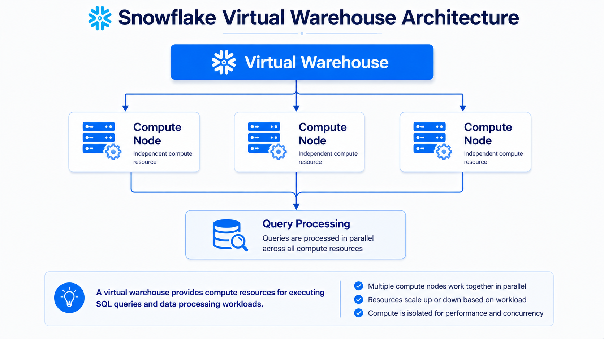
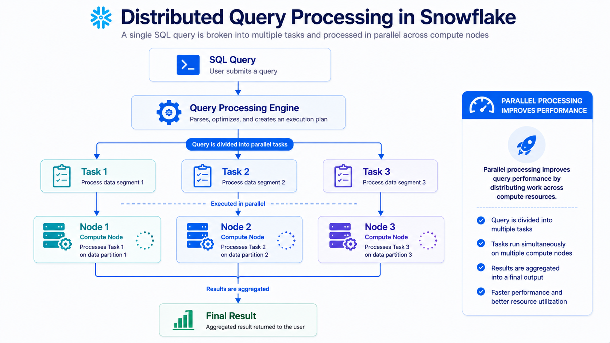
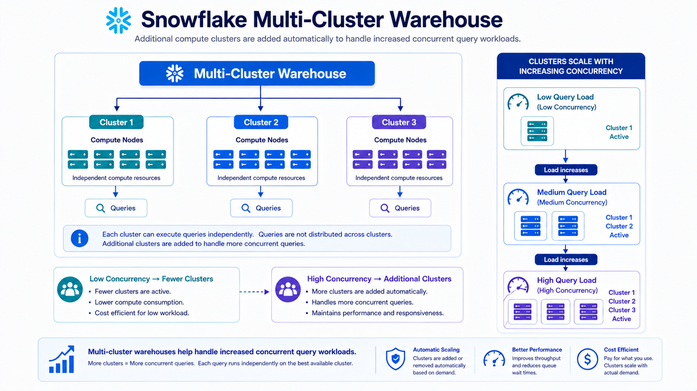
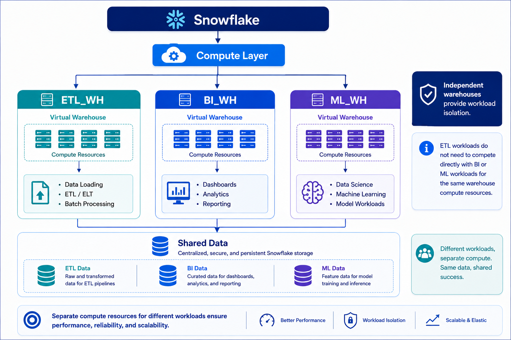
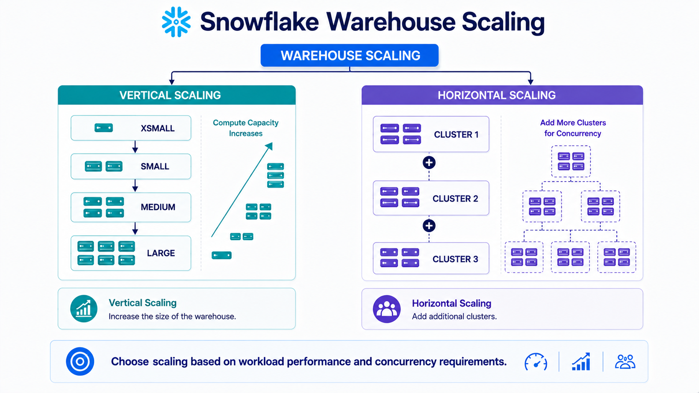

# ⚙️ Snowflake Virtual Warehouses


---

# 📚 Table of Contents

- 📖 Overview
- 🎯 Learning Objectives
- ⚙️ What is a Virtual Warehouse?
- 🏗️ Virtual Warehouse Architecture
- 🔄 Distributed Query Processing
- 📏 Warehouse Size
- 🔀 Multi-Cluster Warehouses
- 🧩 Workload Isolation
- 🏢 One Warehouse per Workload Category
- 🖥️ Creating a Virtual Warehouse
  - 🌐 Using Snowflake UI
  - 💻 Using SQL
- 📝 CREATE WAREHOUSE Example
- ⚙️ Warehouse Configuration
- 🚀 Auto Suspend
- 🔄 Auto Resume
- 📈 Scaling Strategy
- 🏗️ Example Data Engineering Architecture
- 💡 Best Practices
- 🎤 Interview Questions
- 🎯 Key Takeaways
- 📖 Summary
- ✅ Completion Checklist

---

# 📖 Overview

A **Virtual Warehouse** is a cluster of compute resources in Snowflake that executes SQL queries and performs data processing workloads.

Virtual Warehouses provide the compute layer of Snowflake and are independent from the storage layer.

They can be used for different workloads such as:

- 📥 Data Loading
- 🔄 ETL / ELT
- 📊 Analytics
- 📈 Business Intelligence
- 🤖 Data Science
- 🧪 Development and Testing

Snowflake allows organizations to create separate Virtual Warehouses for different workload categories.

```text
                         ❄️ Snowflake
                              │
                    ⚙️ Compute Layer
                              │
          ┌───────────────────┼───────────────────┐
          │                   │                   │
          ▼                   ▼                   ▼
       ETL_WH               BI_WH              ML_WH
          │                   │                   │
          ▼                   ▼                   ▼
      ETL / ELT           Analytics           Data Science
```

---

# 🎯 Learning Objectives

After completing this module, you will be able to:

* Understand Virtual Warehouses
* Understand distributed query processing
* Understand warehouse sizing
* Understand workload isolation
* Understand Multi-Cluster Warehouses
* Understand Auto Suspend
* Understand Auto Resume
* Create Virtual Warehouses using the Snowflake UI
* Create Virtual Warehouses using SQL
* Design workload-specific warehouses
* Explain Virtual Warehouses in interviews

---

# ⚙️ What is a Virtual Warehouse?

A **Virtual Warehouse** is a cluster of compute resources used by Snowflake to execute queries and process data.

It provides the compute resources required for operations such as:

* SQL query execution
* Data loading
* Data transformation
* Data analysis
* Reporting
* ETL / ELT processing

A simplified representation is:

<div align="center">



</div>

Virtual Warehouses provide **distributed computing**, allowing workloads to be processed using multiple compute resources.

---

# 🏗️ Virtual Warehouse Architecture

A Virtual Warehouse consists of compute resources that work together to execute workloads.

```text
                       ⚙️ Virtual Warehouse
                                │
                 ┌──────────────┼──────────────┐
                 │              │              │
                 ▼              ▼              ▼
             Compute Node   Compute Node   Compute Node
                 │              │              │
                 └──────────────┼──────────────┘
                                ▼
                         Parallel Processing
                                │
                                ▼
                              Result
```

The compute layer is separate from Snowflake's storage layer.

```text
                 Snowflake
                     │
          ┌──────────┴──────────┐
          ▼                     ▼
     🗄️ Storage              ⚙️ Compute
          │                     │
          ▼                     ▼
 Micro-Partitions       Virtual Warehouse
```

---

# 🔄 Distributed Query Processing

Virtual Warehouses use distributed computing to process queries.

A large query can be divided into smaller processing tasks that execute in parallel.

<div align="center">



</div>

Parallel processing allows Snowflake to efficiently handle large analytical workloads.

---

# 📏 Warehouse Size

Snowflake provides different Virtual Warehouse sizes.

The warehouse size determines the amount of compute resources available to the warehouse.

A simplified progression is:

```text
XSMALL
   │
   ▼
SMALL
   │
   ▼
MEDIUM
   │
   ▼
LARGE
   │
   ▼
XLARGE
   │
   ▼
XXLARGE
```

As the warehouse size increases, additional compute resources become available.

### Example

```text
XSMALL
  │
  ▼
Small amount of compute

MEDIUM
  │
  ▼
More compute resources

LARGE
  │
  ▼
Higher compute capacity
```

Warehouse sizing should be selected according to workload requirements.

---

# 🔀 Multi-Cluster Warehouses

A **Multi-Cluster Warehouse** allows multiple compute clusters to operate under the same Virtual Warehouse.

When query concurrency increases, additional clusters can be started to handle the workload.

<div align="center">



</div>

The additional clusters help handle increased query concurrency.

---

# 📈 Multi-Cluster Scaling

A simplified workload pattern looks like this:

```text
                 Query Load
                     │
                     ▼
              ┌─────────────┐
              │  Cluster 1  │
              └─────────────┘
                     │
              Load increases
                     │
                     ▼
              ┌─────────────┐
              │  Cluster 2  │
              └─────────────┘
                     │
              Load increases
                     │
                     ▼
              ┌─────────────┐
              │  Cluster 3  │
              └─────────────┘
```

This provides horizontal scaling for workloads with high concurrency.

---

# 🧩 Workload Isolation

One of the important uses of Virtual Warehouses is **workload isolation**.

Different workloads can use separate warehouses.

<div align="center">



</div>

This prevents one workload from directly competing for the same compute resources as another workload.

---

# 🏢 One Warehouse per Workload Category

A common approach is to create one Virtual Warehouse for each major workload category.

### 📥 ETL Warehouse

```text
ETL_WH
  │
  ├── Data Loading
  ├── Transformations
  └── ELT Processing
```

### 📊 BI Warehouse

```text
BI_WH
  │
  ├── Dashboards
  ├── Reports
  └── Analytical Queries
```

### 🤖 Data Science Warehouse

```text
ML_WH
  │
  ├── Data Science
  ├── Feature Engineering
  └── Machine Learning
```

Example architecture:

```text
                         Snowflake
                             │
                    ⚙️ Compute Layer
                             │
        ┌────────────────────┼────────────────────┐
        │                    │                    │
        ▼                    ▼                    ▼
     ETL_WH                BI_WH                ML_WH
        │                    │                    │
        ▼                    ▼                    ▼
      ETL                  BI / SQL             ML / DS
```

---

# 🖥️ Creating a Virtual Warehouse

A Virtual Warehouse can be created using either:

* 🌐 Snowflake UI
* 💻 SQL

---

# 🌐 Creating a Warehouse Using Snowflake UI

The Snowflake UI provides a graphical interface for creating and configuring Virtual Warehouses.

A typical configuration includes:

* Warehouse name
* Warehouse size
* Auto Suspend
* Auto Resume
* Scaling configuration
* Multi-cluster settings

Example:

```text
Warehouse Name
      │
      ▼
ETL_DEV_WH
      │
      ▼
Warehouse Size
      │
      ▼
XSMALL
      │
      ▼
Auto Suspend
      │
      ▼
60 Seconds
      │
      ▼
Auto Resume
      │
      ▼
Enabled
```

---

# 💻 Creating a Warehouse Using SQL

Virtual Warehouses can also be created using SQL.

Example:

```sql
CREATE WAREHOUSE IF NOT EXISTS ETL_DEV_WH
WITH
    WAREHOUSE_SIZE = 'XSMALL'
    AUTO_SUSPEND = 60
    AUTO_RESUME = TRUE;
```

This creates a warehouse named:

```text
ETL_DEV_WH
```

with:

* `XSMALL` warehouse size
* `60` seconds auto-suspend
* Auto-resume enabled

---

# 📝 CREATE WAREHOUSE Example

```sql
CREATE WAREHOUSE IF NOT EXISTS ETL_DEV_WH
WITH
    WAREHOUSE_SIZE = 'XSMALL'
    AUTO_SUSPEND = 60
    AUTO_RESUME = TRUE;
```

### Explanation

| Parameter            | Value          | Purpose                                           |
| -------------------- | -------------- | ------------------------------------------------- |
| `CREATE WAREHOUSE` | —             | Creates a Virtual Warehouse                       |
| `IF NOT EXISTS`    | —             | Prevents an error if the warehouse already exists |
| `ETL_DEV_WH`       | Warehouse name | Identifies the warehouse                          |
| `WAREHOUSE_SIZE`   | `XSMALL`     | Defines compute size                              |
| `AUTO_SUSPEND`     | `60`         | Suspends the warehouse after inactivity           |
| `AUTO_RESUME`      | `TRUE`       | Automatically resumes when a workload requires it |

---

# 🚀 Auto Suspend

**Auto Suspend** automatically suspends a Virtual Warehouse after a specified period of inactivity.

Example:

```text
Warehouse Running
       │
       ▼
No Queries
       │
       ▼
60 Seconds
       │
       ▼
Warehouse Suspended
```

This helps avoid unnecessary compute usage when the warehouse is idle.

Example configuration:

```sql
AUTO_SUSPEND = 60
```

The value represents the inactivity period in seconds.

---

# 🔄 Auto Resume

**Auto Resume** automatically starts a suspended warehouse when a workload requires compute resources.

```text
Warehouse Suspended
        │
        ▼
New Query
        │
        ▼
Auto Resume
        │
        ▼
Warehouse Running
        │
        ▼
Query Execution
```

Example:

```sql
AUTO_RESUME = TRUE
```

---

# ⚙️ Warehouse Configuration

A Virtual Warehouse can be configured with several important settings.

| Configuration       | Purpose                                 |
| ------------------- | --------------------------------------- |
| 🏷️ Warehouse Name | Identifies the warehouse                |
| 📏 Warehouse Size   | Controls compute capacity               |
| ⏸️ Auto Suspend   | Suspends the warehouse after inactivity |
| ▶️ Auto Resume    | Automatically resumes when required     |
| 🔀 Multi-Cluster    | Supports multiple compute clusters      |
| 📈 Scaling          | Controls compute capacity for workloads |

---

# 📈 Scaling Strategy

Virtual Warehouse scaling can be considered in two dimensions.

<div align="center">



</div>

### 📏 Vertical Scaling

Increase the warehouse size.

```text
XSMALL
  │
  ▼
SMALL
  │
  ▼
MEDIUM
  │
  ▼
LARGE
```

Use this when individual queries require more compute resources.

### ↔️ Horizontal Scaling

Add additional clusters using a Multi-Cluster Warehouse.

```text
Cluster 1
    │
    ▼
Cluster 2
    │
    ▼
Cluster 3
```

Use this primarily when query concurrency increases.

---

# 🏗️ Example Data Engineering Architecture

A practical Snowflake data engineering environment can use separate warehouses for different workloads.

```text
                         Snowflake
                             │
                 ☁️ Cloud Services
                             │
                             ▼
                    ⚙️ Compute Layer
                             │
        ┌────────────────────┼────────────────────┐
        │                    │                    │
        ▼                    ▼                    ▼
     ETL_DEV_WH            BI_DEV_WH           ML_DEV_WH
        │                    │                    │
        ▼                    ▼                    ▼
   Data Loading          BI Queries           Data Science
   ELT Processing        Reporting            ML Workloads
        │                    │                    │
        └────────────────────┼────────────────────┘
                             ▼
                      🗄️ Snowflake Storage
                             │
                      Micro-Partitions
```

---

# 💡 Best Practices

* 🎯 Create separate warehouses for different workload categories.
* 📏 Choose warehouse size based on workload requirements.
* ⏸️ Enable Auto Suspend for warehouses that are not continuously used.
* 🔄 Enable Auto Resume when workloads need automatic startup.
* 📈 Use Multi-Cluster Warehouses for high-concurrency workloads.
* 🏢 Isolate ETL, BI, and data science workloads where appropriate.
* 💰 Monitor warehouse usage and compute consumption.
* 🧪 Use smaller warehouses for development and testing when practical.
* 🔍 Monitor query performance before increasing warehouse size.
* ⚖️ Scale based on workload characteristics rather than automatically choosing the largest warehouse.

---

# 🎤 Interview Questions

### 1. What is a Virtual Warehouse in Snowflake?

A Virtual Warehouse is a cluster of compute resources used to execute SQL queries and process workloads in Snowflake.

---

### 2. What is the purpose of a Virtual Warehouse?

It provides the compute resources required for:

* Query execution
* Data loading
* ETL / ELT
* Analytics
* Data processing

---

### 3. How does a Virtual Warehouse process queries?

It uses distributed computing to divide processing work across compute resources and execute tasks in parallel.

---

### 4. What is a Multi-Cluster Warehouse?

A Multi-Cluster Warehouse can use multiple compute clusters under one warehouse to handle increased query concurrency.

---

### 5. Why use separate warehouses for different workloads?

Separate warehouses provide workload isolation.

For example:

```text
ETL_WH → ETL
BI_WH  → Analytics
ML_WH  → Data Science
```

---

### 6. What is Auto Suspend?

Auto Suspend automatically suspends a warehouse after a configured period of inactivity.

Example:

```sql
AUTO_SUSPEND = 60
```

---

### 7. What is Auto Resume?

Auto Resume automatically resumes a suspended warehouse when a query or workload requires it.

```sql
AUTO_RESUME = TRUE
```

---

### 8. How do you create a Virtual Warehouse using SQL?

```sql
CREATE WAREHOUSE IF NOT EXISTS ETL_DEV_WH
WITH
    WAREHOUSE_SIZE = 'XSMALL'
    AUTO_SUSPEND = 60
    AUTO_RESUME = TRUE;
```

---

### 9. What is the difference between vertical and horizontal scaling?

**Vertical scaling** increases the size of a warehouse to provide more compute capacity.

**Horizontal scaling** adds additional clusters, typically through a Multi-Cluster Warehouse, to handle increased concurrency.

---

### 10. What warehouse would you use for ETL?

A separate ETL warehouse such as:

```text
ETL_DEV_WH
```

can be used to isolate data loading and transformation workloads from BI or other workloads.

---

# 🎯 Key Takeaways

* ⚙️ A Virtual Warehouse provides Snowflake compute resources.
* 🔄 Queries can be processed using distributed computing.
* 📏 Warehouse size determines available compute capacity.
* 🔀 Multi-Cluster Warehouses provide additional clusters for concurrency.
* 🏢 Separate warehouses can isolate workload categories.
* 📥 ETL workloads can use dedicated ETL warehouses.
* 📊 BI workloads can use dedicated BI warehouses.
* 🤖 Data science workloads can use dedicated warehouses.
* ⏸️ Auto Suspend helps stop idle warehouses.
* 🔄 Auto Resume automatically starts suspended warehouses when required.
* 💻 Warehouses can be created using SQL.
* 🌐 Warehouses can also be created and configured through the Snowflake UI.

---
