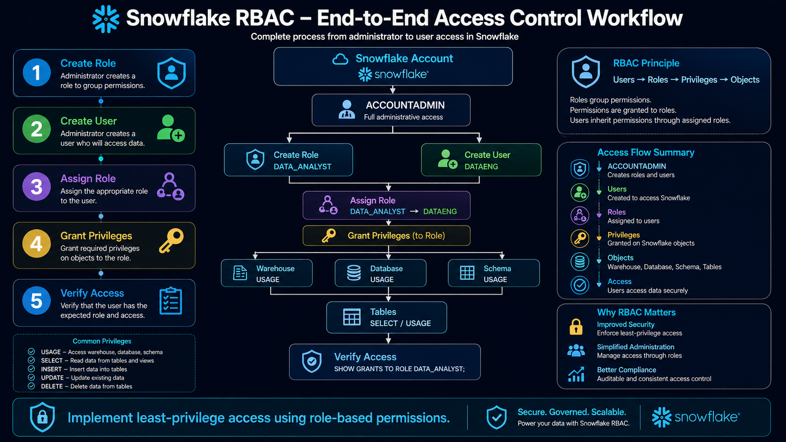
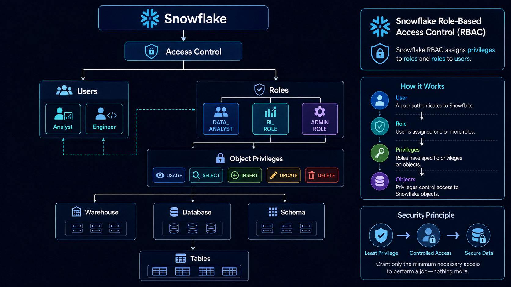
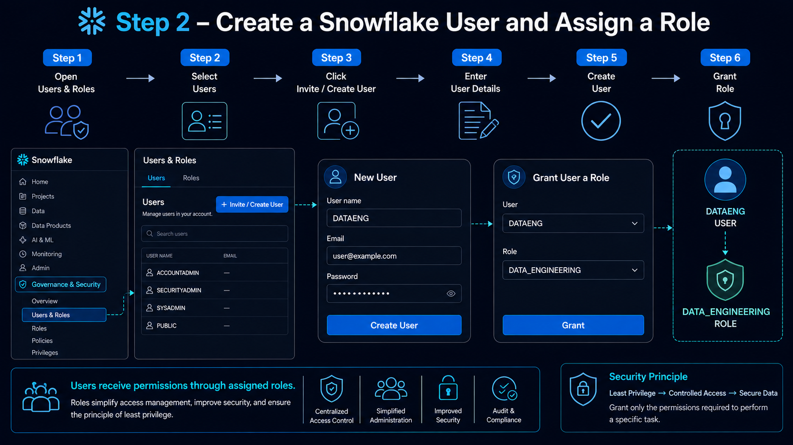
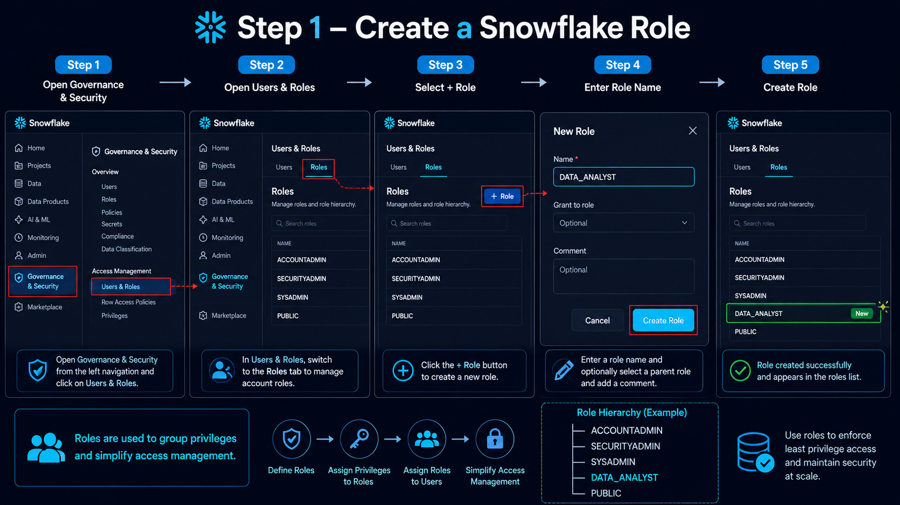
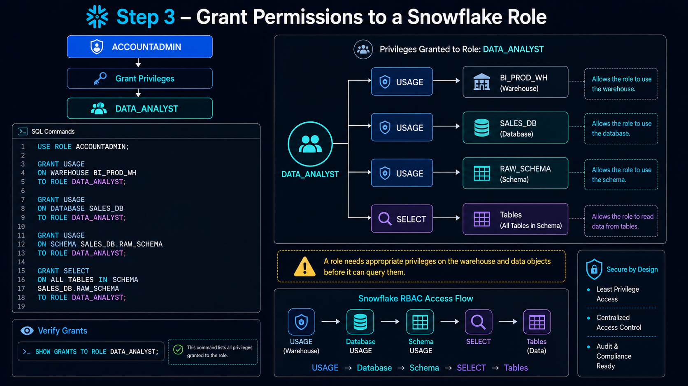
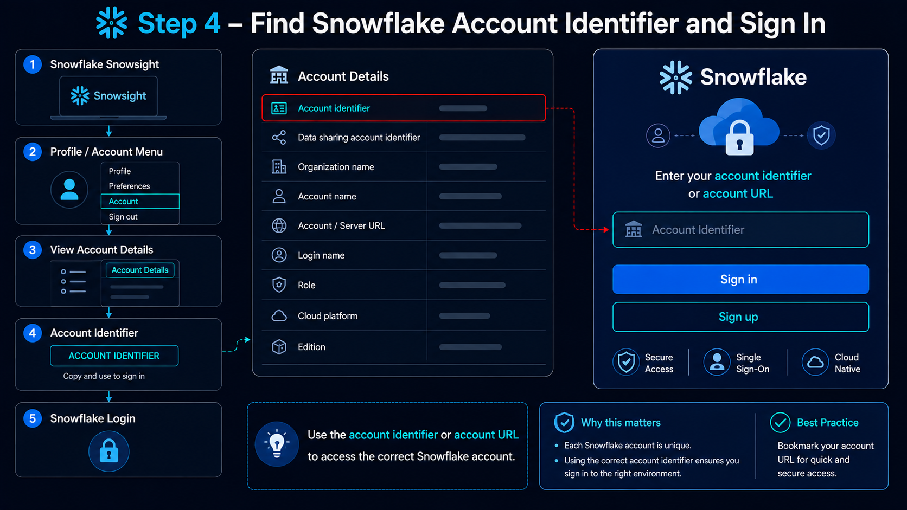
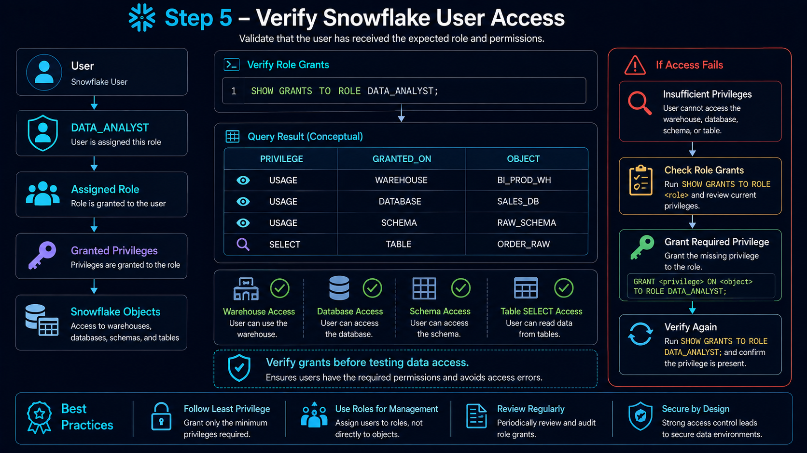

# 🔐 Snowflake Roles, Users & Access Control (RBAC)

<div align="center">



</div>


---

# 📚 Table of Contents

- 📖 Overview
- 🎯 Learning Objectives
- 🔐 What is Access Control?
- 👤 Users
- 🛡️ Roles
- 🔑 Privileges
- 🧩 Role-Based Access Control
- 🏗️ RBAC Architecture
- 🔄 Authentication vs Authorization
- 📂 Snowflake Access Control Hierarchy
- 👤 Create a User
- 🛡️ Create a Role
- 🔗 Grant Role to User
- 🔐 Grant Privileges to Role
- 📊 Database Access
- 📂 Schema Access
- 📋 Table Access
- 👁️ View Access
- 🔄 Role Hierarchy
- 🔎 Show Users and Roles
- 🧪 Validate Access
- 💡 Best Practices
- 🎤 Interview Questions
- 🎯 Key Takeaways

---

# 📖 Overview

Snowflake provides a role-based access control model for managing access to databases, schemas, tables, views, warehouses, and other Snowflake objects.

The main components of Snowflake access control are:

- 👤 **Users** — identities that authenticate to Snowflake.
- 🛡️ **Roles** — collections of privileges.
- 🔑 **Privileges** — permissions that determine what actions can be performed.
- 🗄️ **Database Objects** — resources such as databases, schemas, tables, and views.

<div align="center">



</div>

Instead of granting permissions directly to every user, permissions can be assigned to roles and roles can then be assigned to users.

---

# 🎯 Learning Objectives

After completing this module, you will be able to:

* Understand Snowflake users
* Understand Snowflake roles
* Understand privileges
* Understand Role-Based Access Control
* Understand authentication and authorization
* Create users using SQL
* Create roles using SQL
* Grant roles to users
* Grant privileges to roles
* Manage database access
* Manage schema access
* Manage table access
* Manage view access
* Understand role hierarchy
* Validate access permissions
* Apply least-privilege principles

---

# 🔐 What is Access Control?

Access control determines **who can access a resource and what actions they are allowed to perform**.

For example:

```text
User
 │
 ▼
Role
 │
 ▼
SELECT Privilege
 │
 ▼
Table
```

A user who has a role with the required privilege can perform the permitted operation.

Without the required privilege, Snowflake denies the operation.

---

# 👤 Users

A **User** represents an identity that can authenticate to Snowflake.

Users may represent:

* 👨‍💻 Data Engineers
* 📊 Data Analysts
* 🤖 Data Scientists
* ⚙️ Applications
* 🔄 Service Accounts

Example:

```text
USER
 │
 ├── Punith
 ├── DataEngineer
 └── DataAnalyst
```

A user does not normally receive all object privileges directly. Instead, privileges are assigned through roles.

---

# 🛡️ Roles

A **Role** is a collection of privileges.

Roles are used to define what a user or group of users can access.

Example:

```text
DATA_ENGINEER_ROLE
        │
        ├── USAGE
        ├── SELECT
        ├── INSERT
        ├── UPDATE
        └── DELETE
```

Another role could provide read-only access:

```text
DATA_ANALYST_ROLE
        │
        └── SELECT
```

This makes it easier to manage permissions consistently.

---

# 🔑 Privileges

A **Privilege** defines an allowed operation on a Snowflake object.

Common privileges include:

| Privilege        | Purpose                                                                   |
| ---------------- | ------------------------------------------------------------------------- |
| `USAGE`        | Allows usage of certain objects such as databases, schemas, or warehouses |
| `SELECT`       | Allows reading data from tables or views                                  |
| `INSERT`       | Allows inserting data                                                     |
| `UPDATE`       | Allows updating data                                                      |
| `DELETE`       | Allows deleting data                                                      |
| `CREATE TABLE` | Allows creating tables in a schema                                        |
| `CREATE VIEW`  | Allows creating views in a schema                                         |
| `OWNERSHIP`    | Provides ownership of an object                                           |

The exact privileges available depend on the object being secured.

---

# 🧩 Role-Based Access Control (RBAC)

**Role-Based Access Control** is a security model where privileges are assigned to roles, and roles are assigned to users.

```text
                    👤 Users
                       │
          ┌────────────┼────────────┐
          ▼            ▼            ▼
       User 1       User 2       User 3
          │            │            │
          └────────────┼────────────┘
                       ▼
                  🛡️ Role
                       │
                       ▼
                🔑 Privileges
                       │
                       ▼
              🗄️ Snowflake Objects
```

### Example

```text
Punith
   │
   ▼
DATA_ENGINEER_ROLE
   │
   ├── USAGE
   ├── SELECT
   ├── INSERT
   └── UPDATE
         │
         ▼
SALES_DB
```

This approach avoids managing every permission individually for every user.

---

# 🏗️ RBAC Architecture

A typical Snowflake RBAC architecture looks like:

```text
                         👤 Users
                            │
             ┌──────────────┼──────────────┐
             ▼              ▼              ▼
          Engineer       Analyst       Scientist
             │              │              │
             ▼              ▼              ▼
        🛡️ Engineer     🛡️ Analyst    🛡️ Scientist
             │              │              │
             ▼              ▼              ▼
        🔑 Privileges   🔑 Privileges  🔑 Privileges
             │              │              │
             └──────────────┼──────────────┘
                            ▼
                    🗄️ Snowflake Objects
                            │
             ┌──────────────┼──────────────┐
             ▼              ▼              ▼
          Database        Schema         Tables
```

---

# 🔄 Authentication vs Authorization

These two concepts are important for understanding Snowflake security.

| Authentication           | Authorization                       |
| ------------------------ | ----------------------------------- |
| Verifies who the user is | Determines what the user can access |
| Login process            | Permission process                  |
| Identity verification    | Privilege enforcement               |
| "Who are you?"           | "What can you do?"                  |

Example:

```text
Authentication
      │
      ▼
"Is this Punith?"
      │
      ▼
      Yes
      │
      ▼
Authorization
      │
      ▼
"What can Punith access?"
      │
      ▼
Role + Privileges
```

---

# 📂 Snowflake Access Control Hierarchy

Snowflake access is commonly organized around database objects.

```text
🗄️ Database
      │
      ▼
📂 Schema
      │
      ├── 📊 Tables
      │
      ├── 👁️ Views
      │
      └── Other Objects
```

A role may need appropriate privileges at multiple levels.

For example, accessing a table may require:

```text
Role
 │
 ├── USAGE on Database
 │
 ├── USAGE on Schema
 │
 └── SELECT on Table
```

---

# 👤 Create a User

A user can be created using SQL.

Example:

```sql
CREATE USER IF NOT EXISTS DATA_ENGINEER_USER
PASSWORD = 'YourStrongPassword';
```

<div align="center">  </div>

For production environments, use secure authentication mechanisms and follow your organization's password and identity-management policies.

---

# 🛡️ Create a Role

Create a role for data engineers:

```sql
CREATE ROLE IF NOT EXISTS DATA_ENGINEER_ROLE;
```

Create a read-only analyst role:

```sql
CREATE ROLE IF NOT EXISTS DATA_ANALYST_ROLE;
```

Result:

```text
Roles
│
├── DATA_ENGINEER_ROLE
│
└── DATA_ANALYST_ROLE
```
<div align="center"> 
     
</div>
---

# 🔗 Grant Role to User

Assign the Data Engineer role to a user:

```sql
GRANT ROLE DATA_ENGINEER_ROLE
TO USER DATA_ENGINEER_USER;
```

The access flow becomes:

```text
DATA_ENGINEER_USER
        │
        ▼
DATA_ENGINEER_ROLE
        │
        ▼
Privileges
```

---

# 🔐 Grant Privileges to Role

Privileges should generally be granted to roles rather than directly to individual users.

For example:

```sql
GRANT USAGE
ON DATABASE SALES_DB
TO ROLE DATA_ENGINEER_ROLE;
```

Then grant schema access:

```sql
GRANT USAGE
ON SCHEMA SALES_DB.RAW_SCHEMA
TO ROLE DATA_ENGINEER_ROLE;
```

Finally, grant table access:

```sql
GRANT SELECT
ON TABLE SALES_DB.RAW_SCHEMA.ORDER_RAW
TO ROLE DATA_ENGINEER_ROLE;
```

The resulting permission chain is:

```text
DATA_ENGINEER_ROLE
        │
        ├── USAGE → SALES_DB
        │
        ├── USAGE → RAW_SCHEMA
        │
        └── SELECT → ORDER_RAW
```
<div align="center">  </div>
---

# 📊 Database Access

Granting `USAGE` on a database allows the role to use the database when combined with the required permissions on objects within it.

Example:

```sql
GRANT USAGE
ON DATABASE SALES_DB
TO ROLE DATA_ANALYST_ROLE;
```

---

# 📂 Schema Access

Grant schema usage:

```sql
GRANT USAGE
ON SCHEMA SALES_DB.ANALYTICS_SCHEMA
TO ROLE DATA_ANALYST_ROLE;
```

A role generally needs appropriate database and schema access before accessing objects within the schema.

---

# 📋 Table Access

Grant read access to a table:

```sql
GRANT SELECT
ON TABLE SALES_DB.RAW_SCHEMA.ORDER_RAW
TO ROLE DATA_ANALYST_ROLE;
```

The role can then query the table when the required database and schema privileges are also available.

Example:

```sql
SELECT *
FROM SALES_DB.RAW_SCHEMA.ORDER_RAW;
```

---

# 👁️ View Access

Views can also be protected using roles and privileges.

Example:

```sql
GRANT SELECT
ON VIEW SALES_DB.ANALYTICS_SCHEMA.MONTHLY_SALES
TO ROLE DATA_ANALYST_ROLE;
```

This allows the analyst role to query the analytical view.

```sql
SELECT *
FROM SALES_DB.ANALYTICS_SCHEMA.MONTHLY_SALES;
```

---

# 🏢 Example Role Design

A simple enterprise role model could look like:

```text
                         Snowflake
                             │
                 ┌───────────┼───────────┐
                 ▼           ▼           ▼
          Data Engineer   Analyst    Data Scientist
                 │           │           │
                 ▼           ▼           ▼
              ENGINEER     ANALYST      DS_ROLE
                 │           │           │
                 ▼           ▼           ▼
             Read/Write     Read       Analytics/ML
```

### Data Engineer

May require:

```text
USAGE
SELECT
INSERT
UPDATE
DELETE
CREATE TABLE
CREATE VIEW
```

### Data Analyst

May require primarily:

```text
USAGE
SELECT
```

### Data Scientist

May require:

```text
USAGE
SELECT
```

plus access to specific analytical or feature datasets.

The exact privileges should be based on the organization's requirements.

---

# 🔄 Role Hierarchy

Snowflake supports role hierarchies where one role can inherit privileges from another role.

Example:

```text
                ACCOUNTADMIN
                     │
                     ▼
                SYSADMIN
                     │
             ┌───────┴───────┐
             ▼               ▼
      DATA_ENGINEER     DATA_ANALYST
```

A role can be granted to another role.

Example:

```sql
GRANT ROLE DATA_ANALYST_ROLE
TO ROLE DATA_ENGINEER_ROLE;
```

This creates a hierarchy in which the higher-level role inherits the privileges of the lower-level role.

---

# 🔎 Show Users

Snowflake provides commands to inspect users.

```sql
SHOW USERS;
```

This displays information about users in the Snowflake account.

---

# 🔎 Show Roles

List available roles:

```sql
SHOW ROLES;
```

---

# 🔍 Show Grants to a User

To inspect grants associated with a user:

```sql
SHOW GRANTS TO USER DATA_ENGINEER_USER;
```

---

# 🔍 Show Grants to a Role

To inspect privileges assigned to a role:

```sql
SHOW GRANTS TO ROLE DATA_ENGINEER_ROLE;
```

---

# 🔍 Show Grants on an Object

You can also inspect permissions on a specific object.

Example:

```sql
SHOW GRANTS ON TABLE SALES_DB.RAW_SCHEMA.ORDER_RAW;
```

---

# 🌐 Snowflake Account Access

Before validating user permissions, identify the Snowflake account and ensure you are connected to the correct account.

<div align="center">



</div>

> **Note:** Never publish real Snowflake account identifiers, usernames, passwords, or connection URLs in a public repository.

---

# 🧪 Validate Access

After assigning a role and privileges, access should be tested.

For example:

```sql
USE ROLE DATA_ANALYST_ROLE;
```

Then query an authorized table:

```sql
SELECT *
FROM SALES_DB.RAW_SCHEMA.ORDER_RAW;
```

<div align="center">  </div>

If the role has the required privileges:

```text
✅ Query succeeds
```

If the required privileges are missing:

```text
❌ Access denied
```

---

# 🔄 Complete RBAC Flow

The complete access flow can be represented as:

```text
                     👤 User
                        │
                        ▼
                 🔐 Authentication
                        │
                        ▼
                    🛡️ Role
                        │
                        ▼
                  🔑 Privileges
                        │
          ┌─────────────┼─────────────┐
          ▼             ▼             ▼
      Database        Schema        Table
          │             │             │
          └─────────────┼─────────────┘
                        ▼
                  📊 Data Access
```

---

# 🏗️ Practical Example

For the `SALES_DB` database:

```text
SALES_DB
│
├── RAW_SCHEMA
│   └── ORDER_RAW
│
└── ANALYTICS_SCHEMA
    └── MONTHLY_SALES
```

A possible RBAC model:

```text
                    👤 Users
                       │
          ┌────────────┴────────────┐
          ▼                         ▼
    Data Engineer               Data Analyst
          │                         │
          ▼                         ▼
DATA_ENGINEER_ROLE          DATA_ANALYST_ROLE
          │                         │
          │                         ├── USAGE SALES_DB
          │                         ├── USAGE ANALYTICS_SCHEMA
          │                         └── SELECT MONTHLY_SALES
          │
          ├── USAGE SALES_DB
          ├── USAGE RAW_SCHEMA
          ├── SELECT ORDER_RAW
          ├── INSERT ORDER_RAW
          └── UPDATE ORDER_RAW
```

---

# 🔒 Principle of Least Privilege

The **Principle of Least Privilege** means users should receive only the permissions required to perform their responsibilities.

For example:

```text
Data Analyst
     │
     ├── ✅ SELECT
     │
     ├── ❌ DELETE
     │
     └── ❌ OWNERSHIP
```

Instead of giving an analyst full database control, provide only the required read access.

---

# 💡 Best Practices

* 🔐 Use RBAC instead of assigning privileges directly to individual users where practical.
* 🛡️ Create roles based on job responsibilities.
* 🎯 Follow the Principle of Least Privilege.
* 👤 Keep user management separate from privilege management.
* 🔑 Grant privileges to roles.
* 🏢 Use role hierarchies carefully.
* 📂 Separate raw and analytical access.
* 📊 Give analysts read-only access where appropriate.
* 🚫 Avoid unnecessary `OWNERSHIP` privileges.
* 🔍 Regularly audit role and privilege assignments.
* 🧪 Test permissions after changes.
* 🔒 Use secure authentication mechanisms for production users and service accounts.
* 📝 Maintain clear role naming conventions.

---

# 🎤 Interview Questions

### 1. What is RBAC?

RBAC stands for **Role-Based Access Control**. It is a security model where privileges are assigned to roles and roles are assigned to users.

---

### 2. What is a Snowflake User?

A user represents an identity that can authenticate to Snowflake.

---

### 3. What is a Role?

A role is a collection of privileges that determines what a user can access or perform.

---

### 4. What is a Privilege?

A privilege defines an allowed operation on a Snowflake object, such as `SELECT`, `INSERT`, `UPDATE`, or `USAGE`.

---

### 5. Why use roles instead of granting privileges directly to users?

Roles simplify administration, improve consistency, and make it easier to manage permissions for multiple users.

```text
Users
  │
  ▼
Role
  │
  ▼
Privileges
```

---

### 6. What is the difference between authentication and authorization?

**Authentication** verifies the identity of a user.

**Authorization** determines what that authenticated user is allowed to access.

---

### 7. What is the Principle of Least Privilege?

It means granting users only the minimum permissions required to perform their responsibilities.

---

### 8. How do you create a role?

```sql
CREATE ROLE IF NOT EXISTS DATA_ANALYST_ROLE;
```

---

### 9. How do you grant a role to a user?

```sql
GRANT ROLE DATA_ANALYST_ROLE
TO USER DATA_ANALYST_USER;
```

---

### 10. How do you grant table access to a role?

```sql
GRANT SELECT
ON TABLE SALES_DB.RAW_SCHEMA.ORDER_RAW
TO ROLE DATA_ANALYST_ROLE;
```

---

### 11. How do you check privileges assigned to a role?

```sql
SHOW GRANTS TO ROLE DATA_ANALYST_ROLE;
```

---

### 12. Why does a role often need both schema and table privileges?

Because access to a table generally requires the role to have the necessary privileges on the containing database/schema as well as the required privilege on the table.

For example:

```text
Database
   │
   └── USAGE
        │
        ▼
Schema
   │
   └── USAGE
        │
        ▼
Table
   │
   └── SELECT
```

---

### 13. What is role hierarchy?

Role hierarchy allows roles to be granted to other roles, enabling privileges to be inherited through the hierarchy.

---

# 🎯 Key Takeaways

* 👤 **Users** represent identities in Snowflake.
* 🛡️ **Roles** represent collections of privileges.
* 🔑 **Privileges** define allowed operations.
* 🔐 **RBAC** manages access through roles.
* 🔄 Authentication determines who the user is.
* 🎯 Authorization determines what the user can access.
* 🗄️ Database, schema, table, and view access can be controlled using privileges.
* 🔗 Roles can be assigned to users.
* 🏢 Roles can also participate in role hierarchies.
* 🔒 Least privilege should be applied to all access decisions.
* 🔍 `SHOW GRANTS` commands help audit permissions.

---
