# ❄️ Snowflake + Amazon S3 Secure Data Integration


> 🔐 A step-by-step implementation of a **secure Snowflake-to-Amazon S3 integration** using AWS IAM roles, IAM policies, trust relationships, Snowflake Storage Integration, and an External Stage.

---

## 📌 Table of Contents

- 📖 Overview
- 🎯 Project Objectives
- 🏗️ Architecture
- 🛠️ Technologies Used
- 📂 Repository Structure
- 🔄 Implementation Workflow
- ☁️ Step 1 - Create Amazon S3 Bucket
- 📤 Step 2 - Upload Files to Amazon S3
- 🔐 Step 3 - Create S3 IAM Policy
- ⚙️ Step 4 - Configure S3 Policy Permissions
- 👤 Step 5 - Create IAM Role
- 🤝 Step 6 - Configure IAM Trust Relationship
- 🔗 Step 7 - Attach S3 Policy to IAM Role
- ✅ Step 8 - Name, Review and Create IAM Role
- 📋 Step 9 - Copy IAM Role ARN
- ❄️ Step 10 - Create Snowflake Storage Integration
- 🔄 Step 11 - Update IAM Trust Policy
- 📦 Step 12 - Create External Stage and Test S3 Access
- 🔄 End-to-End Data Flow
- 🔐 Security Architecture
- 🧪 Verification
- 💡 Best Practices
- ⚠️ Troubleshooting
- 🎯 Learning Outcomes
- 🎤 Interview Questions
- ✅ Completion Checklist
- 🏆 Final Result

---

# 📖 Overview

This project demonstrates how to securely connect **Snowflake** with **Amazon S3** using an **AWS IAM Role** and **Snowflake Storage Integration**.

Instead of storing long-lived AWS access keys inside Snowflake, the integration uses:

- ☁️ Amazon S3 for cloud object storage
- 🔐 AWS IAM Policy for S3 permissions
- 👤 AWS IAM Role for temporary access
- 🤝 IAM Trust Relationship for cross-account access
- 🔑 External ID for additional security
- ❄️ Snowflake Storage Integration for secure S3 connectivity
- 📦 Snowflake External Stage for accessing S3 files
- 🔎 `LIST` to verify S3 connectivity
- 📥 `COPY INTO` to load data into Snowflake

The complete implementation is divided into **12 practical steps**.

---

# 🎯 Project Objectives

The main objectives of this project are to:

- Create an Amazon S3 bucket.
- Upload raw CSV source files to S3.
- Create a customer-managed IAM policy.
- Configure bucket-level and object-level S3 permissions.
- Create an IAM role for Snowflake.
- Configure the Snowflake trusted entity.
- Attach the S3 policy to the IAM role.
- Configure the IAM trust relationship.
- Capture the IAM Role ARN.
- Create a Snowflake Storage Integration.
- Create a Snowflake External Stage.
- Verify access to S3 using `LIST`.
- Prepare the pipeline for loading data using `COPY INTO`.

---

# 🏗️ Architecture

The final architecture follows this pattern:

```text
                         ┌──────────────────────┐
                         │      Snowflake       │
                         │                      │
                         │   SQL / Warehouse    │
                         └──────────┬───────────┘
                                    │
                                    ▼
                         ┌──────────────────────┐
                         │ External Stage       │
                         │ STG_S3_SALES         │
                         └──────────┬───────────┘
                                    │
                                    ▼
                         ┌──────────────────────┐
                         │ Storage Integration  │
                         │ int_s3_sales          │
                         └──────────┬───────────┘
                                    │
                                    │ IAM Role ARN
                                    ▼
                         ┌──────────────────────┐
                         │      AWS IAM         │
                         │ snowflake-s3-role    │
                         └──────────┬───────────┘
                                    │
                         ┌──────────┴──────────┐
                         │                     │
                         ▼                     ▼
                  Trust Relationship     S3 IAM Policy
                         │                     │
                         │                     ▼
                         │             ┌───────────────┐
                         │             │  Amazon S3    │
                         │             │ sales-data-   │
                         │             │ demo          │
                         │             └───────────────┘
                         │
                         ▼
                    External ID
```

---

# 🛠️ Technologies Used

| Technology                 | Purpose                                   |
| -------------------------- | ----------------------------------------- |
| ❄️**Snowflake**    | Cloud data warehouse and data processing  |
| ☁️**Amazon S3**    | Source data storage                       |
| 🔐**AWS IAM**        | Identity and access management            |
| 📜**IAM Policy**     | Defines S3 permissions                    |
| 👤**IAM Role**       | Provides temporary AWS credentials        |
| 🤝**Trust Policy**   | Controls who can assume the role          |
| 🔑**External ID**    | Additional cross-account security         |
| 📦**External Stage** | Snowflake object pointing to S3           |
| 💻**Snowflake SQL**  | Integration and data-access configuration |

---

# 🔄 Implementation Workflow

```text
Step 01
Create S3 Bucket
      ↓
Step 02
Upload Source Files
      ↓
Step 03
Create IAM Policy
      ↓
Step 04
Configure S3 Permissions
      ↓
Step 05
Create IAM Role
      ↓
Step 06
Configure Trust Relationship
      ↓
Step 07
Attach S3 Policy
      ↓
Step 08
Review & Create Role
      ↓
Step 09
Copy IAM Role ARN
      ↓
Step 10
Create Snowflake Storage Integration
      ↓
Step 11
Update IAM Trust Policy
      ↓
Step 12
Create External Stage
      ↓
LIST → Verify S3 Access
      ↓
COPY INTO → Load Data
```

---

# ☁️ Step 1 - Create Amazon S3 Bucket

The first step is to create an Amazon S3 bucket that will act as the source data location.

### 📌 Bucket Configuration

```text
Bucket Name : sales-data-demo
Region      : US East (N. Virginia)
              us-east-1
Bucket Type : General purpose
Namespace   : Global namespace
```

The bucket name must be globally unique across AWS accounts.

### 🔐 Recommended Settings

The screenshot demonstrates:

* Object Ownership: `ACLs disabled`
* Public access should remain blocked.
* Encryption should be enabled.
* IAM should be used for access control.
* Versioning can be enabled.
* Prefixes can be used to organize data.

### 🖼️ Step Image

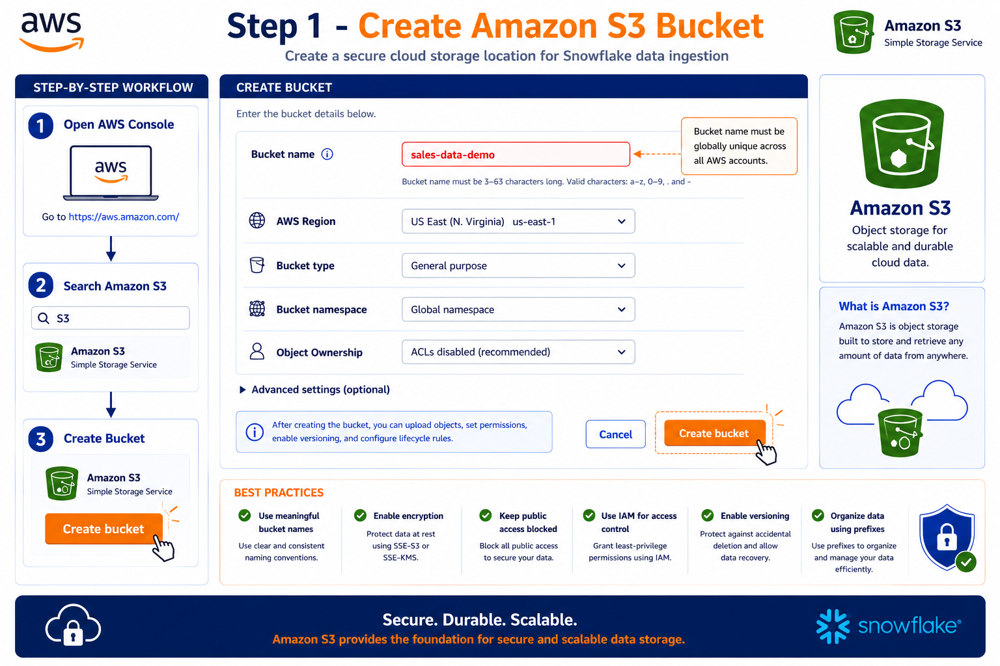

---

# 📤 Step 2 - Upload Files to Amazon S3

After creating the bucket, upload the source CSV files.

### 📂 Source Files

The project uses files similar to:

```text
orders_2025_10_24.csv
orders_2025_10_25.csv
orders_2025_10_26.csv
orders_2025_10_27.csv
```

### 📍 S3 Location

```text
s3://sales-data-demo/
```

The uploaded files become the raw source data for Snowflake ingestion.

### 🧱 Raw Data Concept

```text
Local Machine
      │
      ▼
CSV Source Files
      │
      ▼
Amazon S3
      │
      ▼
sales-data-demo
```

### 🖼️ Step Image

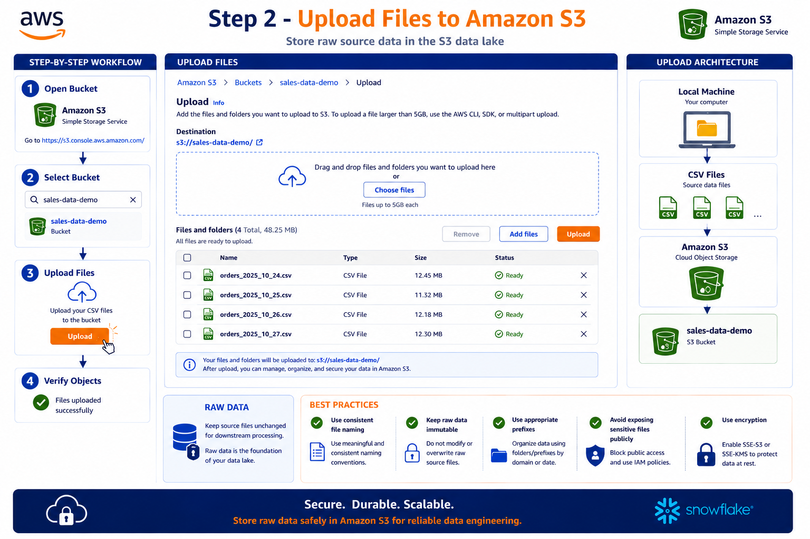

---

# 🔐 Step 3 - Create S3 IAM Policy

Create a customer-managed IAM policy that defines the permissions Snowflake requires to access the S3 bucket.

### 📌 Policy Name

```text
snowflake-s3-policy
```

### 🎯 Purpose

The policy controls which S3 operations can be performed.

The project uses:

```text
s3:ListBucket
s3:GetObject
s3:PutObject
s3:DeleteObject
```

### 📋 Policy

```json
{
 "Version": "2012-10-17",
 "Statement": [
     {
         "Effect": "Allow",
         "Action": [
           "s3:PutObject",
           "s3:GetObject",
           "s3:GetObjectVersion",
           "s3:DeleteObject",
           "s3:DeleteObjectVersion"
         ],
         "Resource": "arn:aws:s3:::<bucket>/<prefix>/*"
     },
     {
         "Effect": "Allow",
         "Action": [
             "s3:ListBucket",
             "s3:GetBucketLocation"
         ],
         "Resource": "arn:aws:s3:::<bucket>",
         "Condition": {
             "StringLike": {
                 "s3:prefix": [
                     "<prefix>/*"
                 ]
             }
         }
     }
 ]
}
```

> 💡 The policy shown in the project is scoped to the `sales-data-demo` bucket rather than using unrestricted resources.

### 🖼️ Step Image

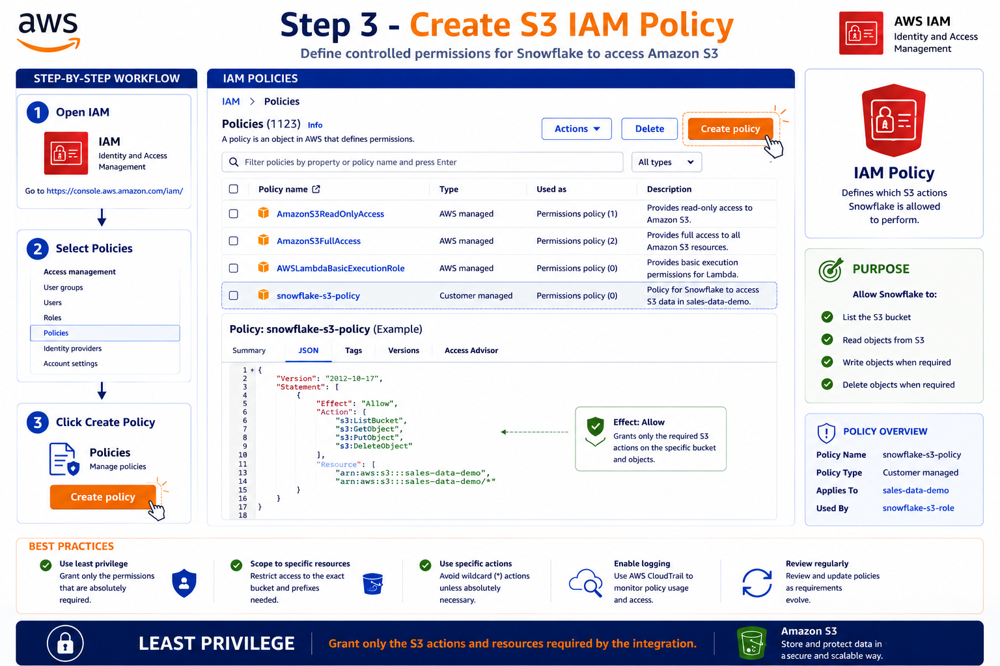

---

# ⚙️ Step 4 - Configure S3 Policy Permissions

The policy is configured with separate permission scopes.

## 🪣 Bucket-Level Permission

```text
s3:ListBucket
```

Resource:

```text
arn:aws:s3:::sales-data-demo
```

This allows Snowflake to list objects within the bucket.

## 📄 Object-Level Permissions

```text
s3:GetObject
s3:PutObject
s3:DeleteObject
```

Resource:

```text
arn:aws:s3:::sales-data-demo/*
```

These permissions allow operations on objects inside the bucket.

### 🔐 Permission Model

```text
sales-data-demo
│
├── ListBucket
│
└── Objects
    ├── GetObject
    ├── PutObject
    └── DeleteObject
```

### 🖼️ Step Image

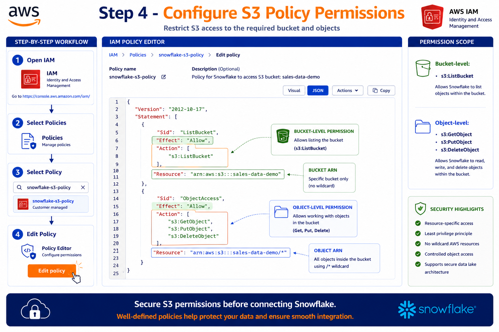

---

# 👤 Step 5 - Create IAM Role

Create an IAM role that Snowflake can assume to access the S3 data.

### 📌 Role Name

```text
snowflake-s3-role
```

### 🎯 Role Purpose

```text
Allows Snowflake to securely access the S3 data location.
```

The role provides temporary credentials rather than requiring long-lived AWS access keys.

### 🔄 Cross-Account Access

The role is designed for Snowflake access from another AWS account.

```text
Snowflake
   │
   │ AssumeRole
   ▼
snowflake-s3-role
   │
   ▼
Amazon S3
```

### 🖼️ Step Image

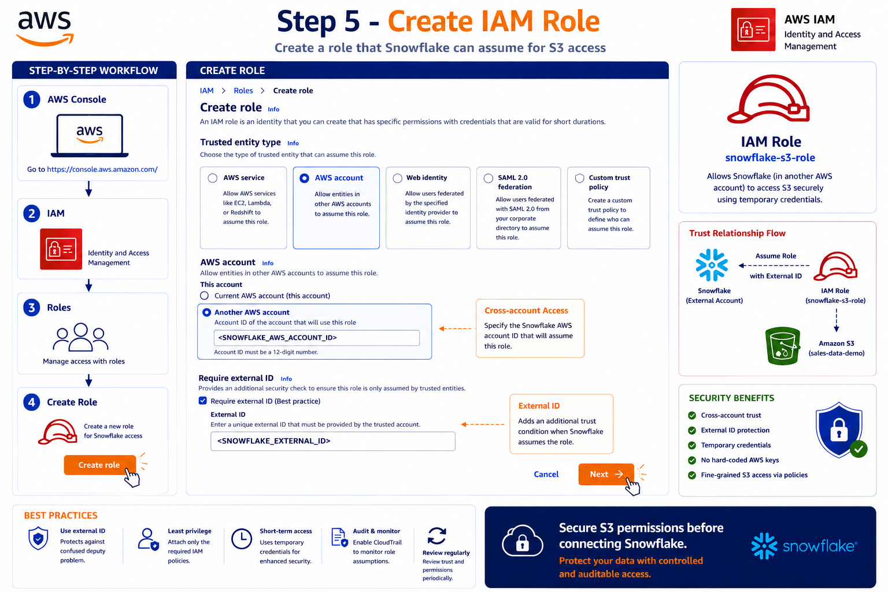

---

# 🤝 Step 6 - Configure IAM Trust Relationship

The IAM trust relationship defines **who is allowed to assume the role**.

The project configures Snowflake as the trusted external AWS account.

### 📌 Trusted Entity

```text
AWS account
    ↓
Another AWS account
    ↓
<SNOWFLAKE_AWS_ACCOUNT_ID>
```

### 🔑 External ID

The role requires an External ID:

```text
<SNOWFLAKE_EXTERNAL_ID>
```

### 🔐 Why External ID?

The External ID provides an additional trust condition and helps protect against confused-deputy scenarios.

### 🔄 Trust Flow

```text
Snowflake
    │
    │ AssumeRole
    │
    │ Role ARN
    │ External ID
    ▼
AWS IAM
    │
    ▼
snowflake-s3-role
```

### 🖼️ Step Image

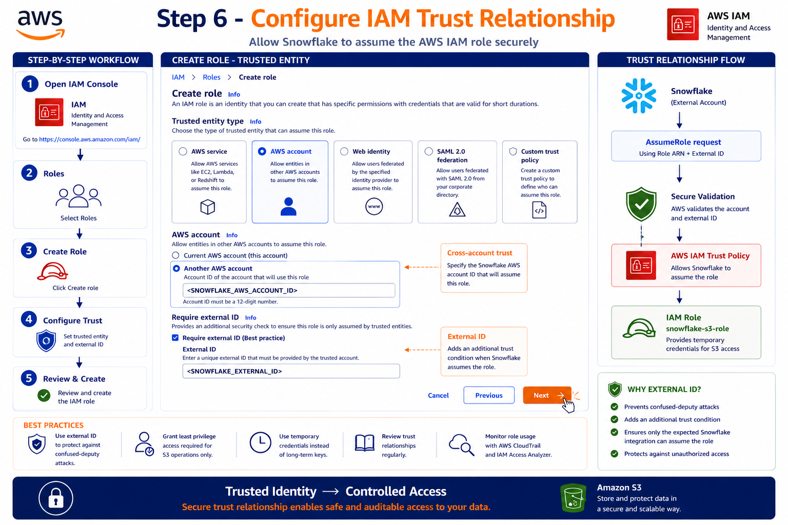

---

# 🔗 Step 7 - Attach S3 Policy to IAM Role

Attach the previously created policy to the IAM role.

### 📌 Policy

```text
snowflake-s3-policy
```

### 📌 Role

```text
snowflake-s3-role
```

### 🔄 Permission Flow

```text
Snowflake
    │
    ▼
IAM Role
snowflake-s3-role
    │
    ▼
IAM Policy
snowflake-s3-policy
    │
    ▼
Amazon S3
sales-data-demo
```

### 🔐 Permissions Provided

```text
s3:ListBucket
s3:GetObject
s3:PutObject
s3:DeleteObject
```

### 🖼️ Step Image

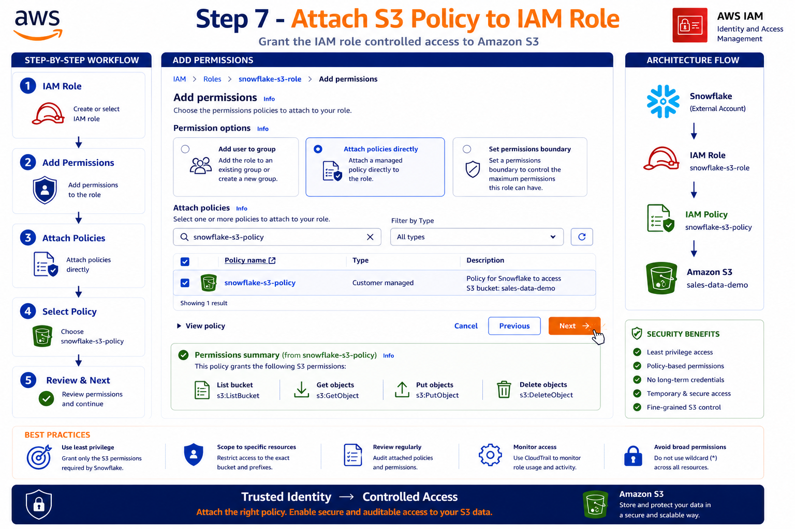

---

# ✅ Step 8 - Name, Review and Create IAM Role

Review the complete IAM role configuration before creating it.

### 📌 Role Configuration

```text
Role Name:
snowflake-s3-role
```

### 📜 Trust Relationship

The role contains a trust relationship allowing the Snowflake identity to assume it.

### 📜 Attached Policy

```text
snowflake-s3-policy
```

### 🔐 Configuration Summary

```text
IAM Role
   │
   ├── Trust Relationship
   │      └── Snowflake
   │
   └── Permissions Policy
          └── snowflake-s3-policy
```

Click:

```text
Create role
```

### 🖼️ Step Image

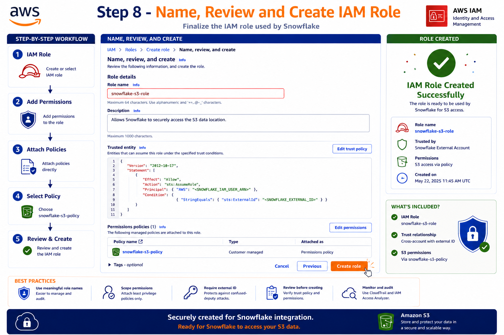

---

# 📋 Step 9 - Copy IAM Role ARN

After the IAM role has been created, copy the **Role ARN**.

### 📌 Example

```text
arn:aws:iam::<AWS_ACCOUNT_ID>:role/snowflake-s3-role
```

This ARN will be referenced by the Snowflake Storage Integration.

### 🔄 How Snowflake Uses the ARN

```text
Snowflake
    │
    ▼
Storage Integration
    │
    │ STORAGE_AWS_ROLE_ARN
    ▼
AWS IAM Role
snowflake-s3-role
```

### ⚠️ Important

Copy the Role ARN exactly.

Do not expose AWS access keys or secret credentials in source code.

### 🖼️ Step Image

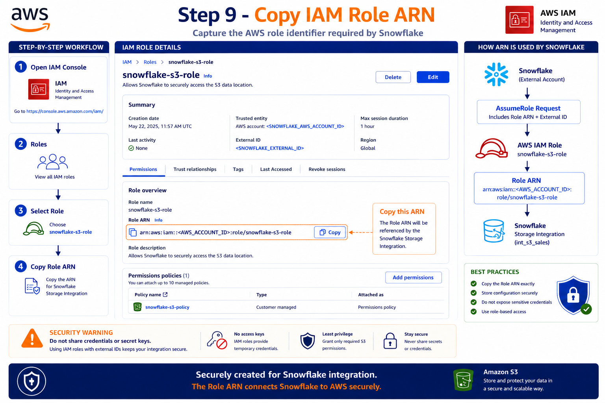

---

# ❄️ Step 10 - Create Snowflake Storage Integration

Now create the Snowflake Storage Integration that connects Snowflake to Amazon S3 through the IAM role.

### 📜 SQL

```sql
CREATE OR REPLACE STORAGE INTEGRATION int_s3_sales
    TYPE = EXTERNAL_STAGE
    STORAGE_PROVIDER = S3
    ENABLED = TRUE
    STORAGE_AWS_ROLE_ARN =
        'arn:aws:iam::<AWS_ACCOUNT_ID>:role/snowflake-s3-role'
    STORAGE_ALLOWED_LOCATIONS =
        ('s3://sales-data-demo/');
```

### 🔍 Verify the Integration

Run:

```sql
DESC INTEGRATION int_s3_sales;
```

The integration returns important values including:

```text
STORAGE_AWS_IAM_USER_ARN
STORAGE_AWS_EXTERNAL_ID
STORAGE_AWS_ROLE_ARN
STORAGE_ALLOWED_LOCATIONS
ENABLED
```

### 📋 Example Configuration

| Property         | Value                     |
| ---------------- | ------------------------- |
| Integration      | `int_s3_sales`          |
| Type             | `EXTERNAL_STAGE`        |
| Provider         | `S3`                    |
| Enabled          | `TRUE`                  |
| IAM Role         | `snowflake-s3-role`     |
| Allowed Location | `s3://sales-data-demo/` |

### 🔐 Important

The `STORAGE_AWS_IAM_USER_ARN` and `STORAGE_AWS_EXTERNAL_ID` returned by Snowflake are used to finalize the AWS IAM trust policy.

### 🖼️ Step Image

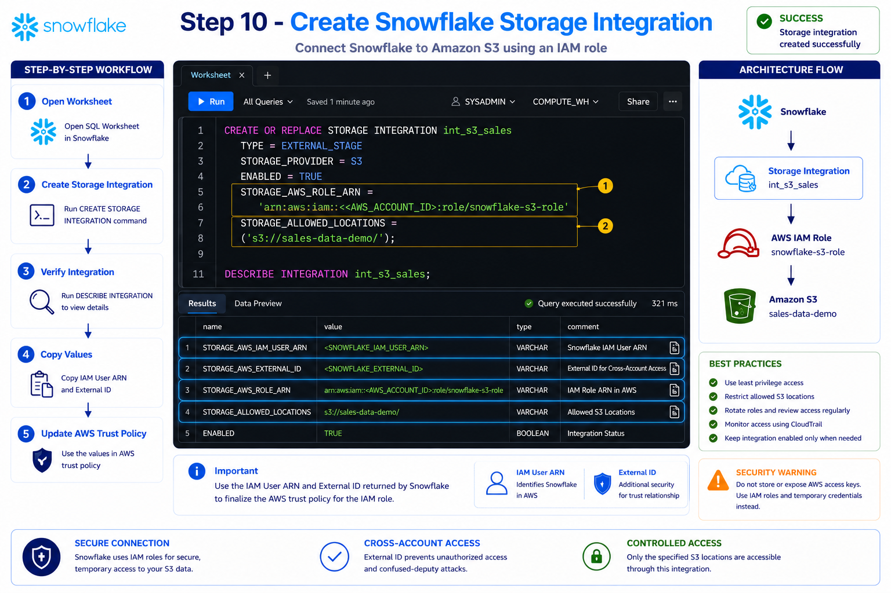

---

# 🔄 Step 11 - Update IAM Trust Policy

Snowflake provides IAM values that are required to finalize the AWS trust relationship.

The important values are:

```text
<SNOWFLAKE_IAM_USER_ARN>
<SNOWFLAKE_EXTERNAL_ID>
```

### 📜 Trust Policy

```json
{
  "Version": "2012-10-17",
  "Statement": [
    {
      "Effect": "Allow",
      "Principal": {
        "AWS": "<SNOWFLAKE_IAM_USER_ARN>"
      },
      "Action": "sts:AssumeRole",
      "Condition": {
        "StringEquals": {
          "sts:ExternalId": "<SNOWFLAKE_EXTERNAL_ID>"
        }
      }
    }
  ]
}
```

### 🔐 Trust Relationship

```text
Snowflake
    │
    │ IAM User ARN
    │
    │ External ID
    ▼
AWS IAM Trust Policy
    │
    ▼
snowflake-s3-role
```

### 🛡️ Security Benefits

* 🔐 Restricts access to the Snowflake IAM identity.
* 🔑 Uses an External ID.
* 🛡️ Helps prevent confused-deputy attacks.
* 🔄 Enables secure cross-account access.
* 🎯 Supports least-privilege design.

### 🖼️ Step Image

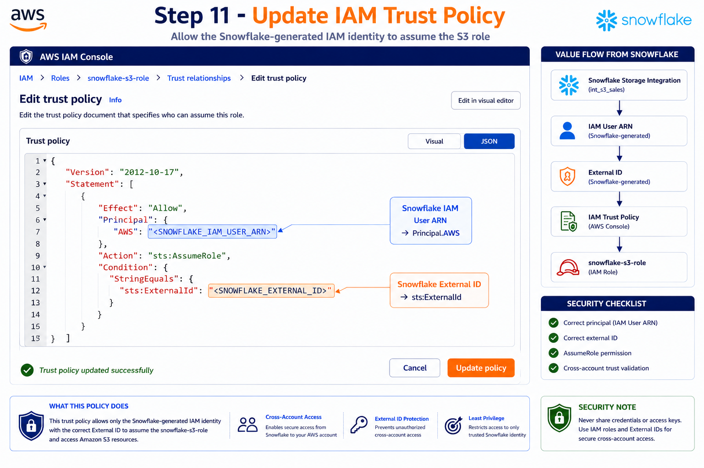

---

# 📦 Step 12 - Create External Stage and Test S3 Access

The final step creates the Snowflake External Stage pointing to Amazon S3.

### 📜 Create External Stage

```sql
CREATE OR REPLACE STAGE
    SALES_DB.RAW_SCHEMA.STG_S3_SALES
    URL = 's3://sales-data-demo/'
    STORAGE_INTEGRATION = int_s3_sales
    FILE_FORMAT = (
        TYPE = CSV
        FIELD_DELIMITER = ','
        SKIP_HEADER = 1
    );
```

### 🔎 Test S3 Access

Use the `LIST` command:

```sql
LIST @SALES_DB.RAW_SCHEMA.STG_S3_SALES;
```

If the configuration is correct, Snowflake returns the files available in S3.

### 📊 Example Result

```text
s3://sales-data-demo/orders_2025_10_24.csv
s3://sales-data-demo/orders_2025_10_25.csv
s3://sales-data-demo/orders_2025_10_26.csv
```

### 📥 Data Loading

After successful access verification, the stage can be used with `COPY INTO` to load data into Snowflake.

```sql
COPY INTO SALES_DB.RAW_SCHEMA.ORDERS_RAW
FROM @SALES_DB.RAW_SCHEMA.STG_S3_SALES;
```

### 🔄 Final Stage Flow

```text
Amazon S3
    │
    ▼
Storage Integration
    │
    ▼
External Stage
    │
    ▼
LIST
    │
    ▼
Verify S3 Files
    │
    ▼
COPY INTO
    │
    ▼
Snowflake RAW Table
```

### 🖼️ Step Image

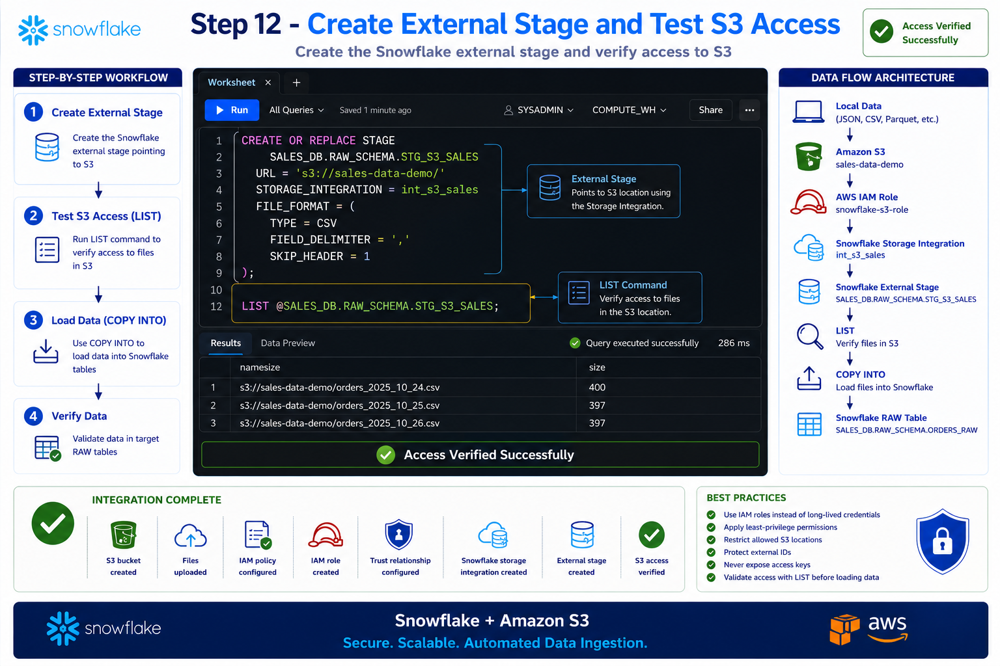

---

# 🔄 End-to-End Data Flow

The complete implementation can be represented as:

```text
┌──────────────────┐
│   Local Data     │
│ CSV / JSON / etc │
└────────┬─────────┘
         │
         ▼
┌──────────────────┐
│    Amazon S3     │
│ sales-data-demo  │
└────────┬─────────┘
         │
         ▼
┌──────────────────┐
│    AWS IAM       │
│                  │
│ snowflake-s3-role│
└────────┬─────────┘
         │
         ▼
┌─────────────────────────┐
│ Snowflake Storage       │
│ Integration             │
│ int_s3_sales            │
└────────┬────────────────┘
         │
         ▼
┌─────────────────────────┐
│ Snowflake External      │
│ Stage                   │
│ STG_S3_SALES            │
└────────┬────────────────┘
         │
         ▼
┌─────────────────────────┐
│ LIST                    │
│ Verify S3 Access        │
└────────┬────────────────┘
         │
         ▼
┌─────────────────────────┐
│ COPY INTO               │
│ Load Data                │
└────────┬────────────────┘
         │
         ▼
┌─────────────────────────┐
│ Snowflake RAW Table     │
│ ORDERS_RAW              │
└─────────────────────────┘
```

---

# 🔐 Security Architecture

The project follows a secure cross-account access model.

```text
                     Snowflake
                         │
                         │ AssumeRole
                         │
                         │ IAM User ARN
                         │ + External ID
                         ▼
                 ┌──────────────────┐
                 │ AWS IAM Trust    │
                 │ Policy           │
                 └────────┬─────────┘
                          │
                          ▼
                 ┌──────────────────┐
                 │ IAM Role         │
                 │ snowflake-s3-role│
                 └────────┬─────────┘
                          │
                          ▼
                 ┌──────────────────┐
                 │ IAM Policy       │
                 │ snowflake-s3-    │
                 │ policy           │
                 └────────┬─────────┘
                          │
                          ▼
                 ┌──────────────────┐
                 │ Amazon S3        │
                 │ sales-data-demo  │
                 └──────────────────┘
```

---

# 🔐 Security Components

## 1. IAM Policy

Controls:

```text
WHAT can be accessed?
```

Example:

```text
List bucket
Get objects
Put objects
Delete objects
```

---

## 2. IAM Role

Controls:

```text
WHICH identity provides temporary access?
```

Role:

```text
snowflake-s3-role
```

---

## 3. Trust Policy

Controls:

```text
WHO can assume the role?
```

The policy trusts the Snowflake-generated IAM identity.

---

## 4. External ID

Provides an additional condition for role assumption.

```text
Snowflake
   +
External ID
   ↓
AWS IAM Role
```

---

## 5. Storage Integration

Defines how Snowflake connects to S3.

```text
Snowflake
     ↓
int_s3_sales
     ↓
snowflake-s3-role
     ↓
sales-data-demo
```

---

# 🧪 Verification

The integration can be validated using the following commands.

## 🔍 Verify Storage Integration

```sql
DESC INTEGRATION int_s3_sales;
```

Check:

```text
STORAGE_AWS_IAM_USER_ARN
STORAGE_AWS_EXTERNAL_ID
STORAGE_AWS_ROLE_ARN
STORAGE_ALLOWED_LOCATIONS
ENABLED
```

---

## 📦 Verify External Stage

```sql
LIST @SALES_DB.RAW_SCHEMA.STG_S3_SALES;
```

Expected result:

```text
s3://sales-data-demo/orders_2025_10_24.csv
s3://sales-data-demo/orders_2025_10_25.csv
s3://sales-data-demo/orders_2025_10_26.csv
```

---

## 📥 Load Data

```sql
COPY INTO SALES_DB.RAW_SCHEMA.ORDERS_RAW
FROM @SALES_DB.RAW_SCHEMA.STG_S3_SALES;
```

---

# 💡 Best Practices

### 🔐 IAM Security

* ✅ Use IAM roles instead of long-lived access keys.
* ✅ Apply the least-privilege principle.
* ✅ Restrict access to specific S3 resources.
* ✅ Use External IDs for cross-account access.
* ✅ Review trust policies regularly.
* ✅ Monitor IAM role activity.

### ☁️ S3 Security

* ✅ Block public access.
* ✅ Enable encryption.
* ✅ Use meaningful bucket names.
* ✅ Organize data using prefixes.
* ✅ Enable versioning when appropriate.
* ✅ Restrict access through IAM policies.

### ❄️ Snowflake Security

* ✅ Use Storage Integration.
* ✅ Restrict `STORAGE_ALLOWED_LOCATIONS`.
* ✅ Use External Stages for external data.
* ✅ Verify access using `LIST`.
* ✅ Avoid storing AWS access keys in Snowflake.

---

# ⚠️ Troubleshooting

## ❌ `LIST` Returns Access Denied

Check the following:

```text
☐ IAM Role ARN
☐ IAM Policy
☐ Trust Policy
☐ Snowflake IAM User ARN
☐ External ID
☐ S3 Bucket ARN
☐ S3 Object ARN
☐ STORAGE_ALLOWED_LOCATIONS
```

---

## ❌ Incorrect IAM Role ARN

Verify:

```sql
DESC INTEGRATION int_s3_sales;
```

Compare:

```text
STORAGE_AWS_ROLE_ARN
```

with:

```text
arn:aws:iam::<AWS_ACCOUNT_ID>:role/snowflake-s3-role
```

---

## ❌ Incorrect External ID

The External ID must match the value generated by Snowflake and configured in the AWS IAM trust policy.

---

## ❌ S3 Location Not Allowed

The External Stage URL must be included within the Storage Integration's allowed locations.

Example:

```sql
STORAGE_ALLOWED_LOCATIONS =
    ('s3://sales-data-demo/');
```

Stage:

```sql
URL = 's3://sales-data-demo/'
```

---

# 🛡️ Security Warning

> ⚠️ **Never store or commit AWS access keys, secret keys, passwords, or other sensitive credentials in GitHub.**

Use placeholders such as:

```text
<AWS_ACCOUNT_ID>
<SNOWFLAKE_AWS_ACCOUNT_ID>
<SNOWFLAKE_IAM_USER_ARN>
<SNOWFLAKE_EXTERNAL_ID>
```

---

# 🎯 Learning Outcomes

After completing this project, you should understand:

* ☁️ How Amazon S3 is used as a cloud data lake.
* 📂 How files are uploaded and organized in S3.
* 🔐 How IAM policies define permissions.
* 👤 How IAM roles provide temporary credentials.
* 🤝 How trust relationships enable cross-account access.
* 🔑 Why External IDs are used.
* ❄️ How Snowflake Storage Integration works.
* 📦 How Snowflake External Stages connect to S3.
* 🔎 How `LIST` verifies S3 access.
* 📥 How `COPY INTO` loads data into Snowflake.
* 🛡️ How least-privilege access improves security.

---

# 🎤 Interview Questions

### 1. Why use an IAM Role instead of an AWS Access Key?

IAM roles provide temporary credentials and avoid embedding long-lived AWS access keys in Snowflake configurations.

---

### 2. What is the purpose of the IAM Trust Policy?

The trust policy defines which identities are allowed to assume an IAM role.

---

### 3. What is an External ID?

An External ID is an additional security condition used during cross-account role assumption.

---

### 4. What is the difference between an IAM Policy and Trust Policy?

| Policy                 | Purpose                         |
| ---------------------- | ------------------------------- |
| IAM Permissions Policy | Defines what the role can do    |
| Trust Policy           | Defines who can assume the role |

---

### 5. What is Snowflake Storage Integration?

A Snowflake Storage Integration is a Snowflake object used to securely connect Snowflake to external cloud storage such as Amazon S3.

---

### 6. What is an External Stage?

An External Stage is a Snowflake object that references files stored in an external storage location such as Amazon S3.

---

### 7. How do you test S3 connectivity from Snowflake?

Use:

```sql
LIST @SALES_DB.RAW_SCHEMA.STG_S3_SALES;
```

---

### 8. How do you load S3 files into Snowflake?

Use:

```sql
COPY INTO SALES_DB.RAW_SCHEMA.ORDERS_RAW
FROM @SALES_DB.RAW_SCHEMA.STG_S3_SALES;
```

---

### 9. Why is `STORAGE_ALLOWED_LOCATIONS` important?

It restricts the S3 locations that can be accessed through the Snowflake Storage Integration.

---

### 10. What is the role of the IAM Role ARN in Snowflake?

The IAM Role ARN tells Snowflake which AWS IAM role should be assumed to access the configured S3 location.

---

# 📊 Project Components

| Component                | Name / Value              |
| ------------------------ | ------------------------- |
| ☁️ S3 Bucket           | `sales-data-demo`       |
| 📜 IAM Policy            | `snowflake-s3-policy`   |
| 👤 IAM Role              | `snowflake-s3-role`     |
| ❄️ Storage Integration | `int_s3_sales`          |
| 📦 External Stage        | `STG_S3_SALES`          |
| 📍 S3 Location           | `s3://sales-data-demo/` |
| 📄 File Type             | CSV                       |
| 🔎 Validation            | `LIST`                  |
| 📥 Loading               | `COPY INTO`             |

---

# 🏆 Final Result

The completed architecture establishes a secure connection between Snowflake and Amazon S3:

```text
                 ☁️ AMAZON S3
              sales-data-demo
                     │
                     ▼
              🔐 AWS IAM Policy
            snowflake-s3-policy
                     │
                     ▼
                👤 IAM Role
             snowflake-s3-role
                     │
                     │ AssumeRole
                     │ + External ID
                     ▼
             ❄️ SNOWFLAKE
                     │
                     ▼
          Storage Integration
              int_s3_sales
                     │
                     ▼
             External Stage
              STG_S3_SALES
                     │
                     ▼
                  🔎 LIST
                     │
                     ▼
                📥 COPY INTO
                     │
                     ▼
             Snowflake RAW Table
```
