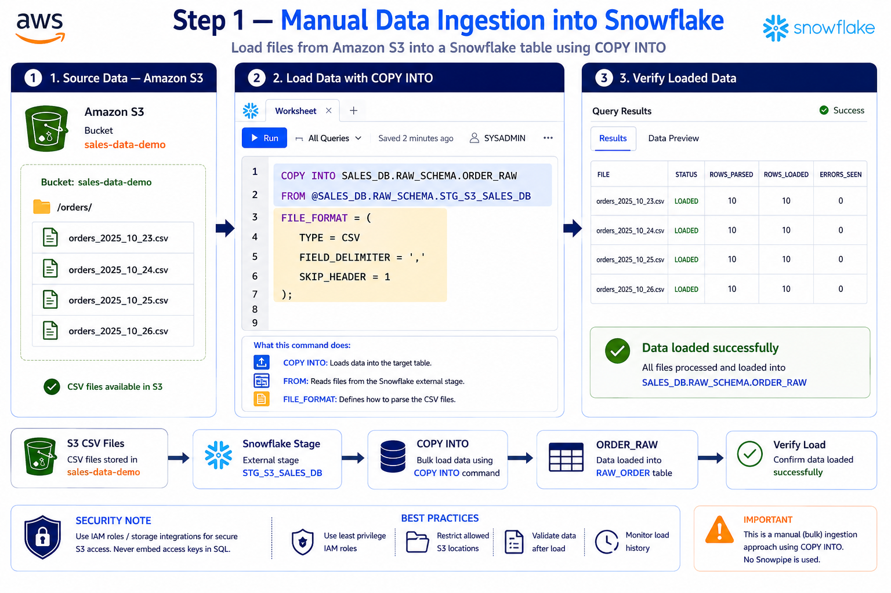
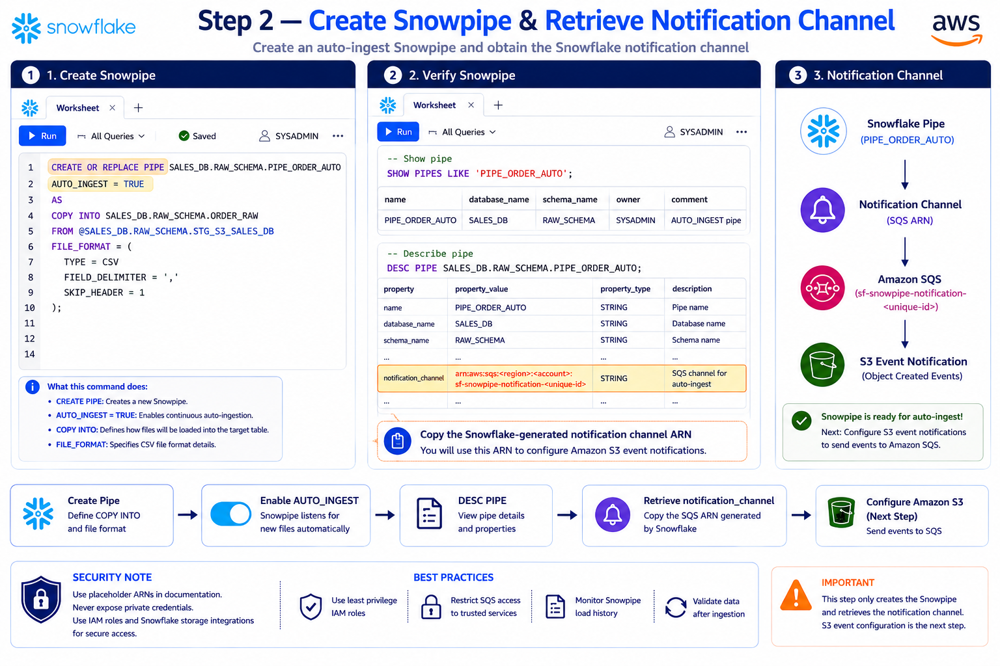
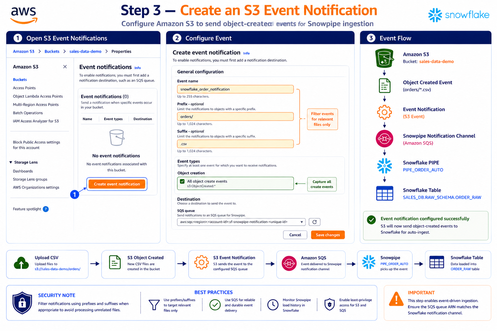
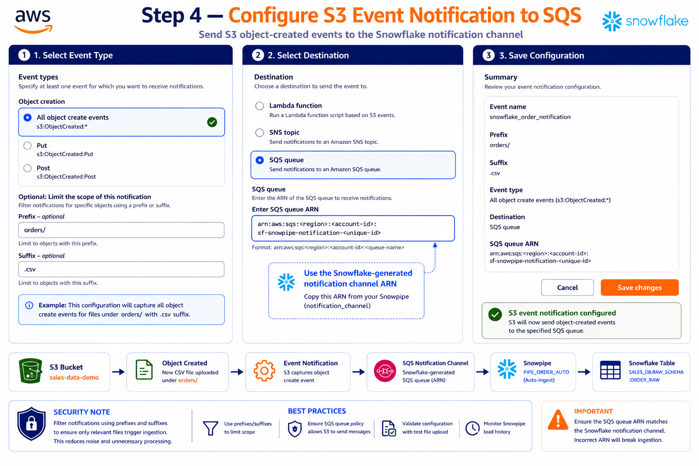
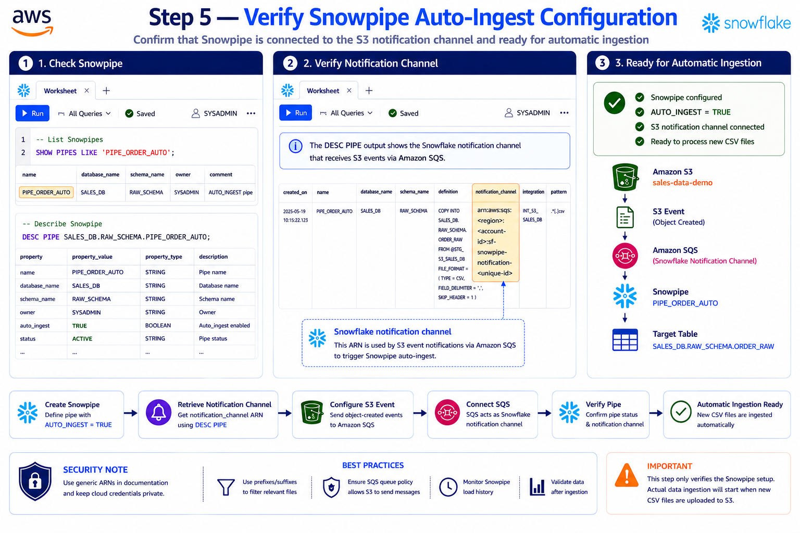

# 📥 Snowflake Data Loading — Manual Ingestion & Snowpipe Auto-Ingest


> 📥 A practical Snowflake data-ingestion module covering **manual/bulk ingestion with `COPY INTO`** and **automatic continuous ingestion with Snowpipe**, using Amazon S3 Event Notifications and Amazon SQS.

---

## 📌 Table of Contents

* 📖 Overview
* 🎯 Objectives
* 🏗️ Architecture
* 🛠️ Technologies Used
* 🔄 Data Ingestion Approaches
* 📦 Manual Data Ingestion
* 🔄 Automatic Data Ingestion
* 🚀 Step 1 — Manual Data Ingestion
* 🔔 Step 2 — Create Snowpipe
* ☁️ Step 3 — Create S3 Event Notification
* 📨 Step 4 — Configure S3 Event Notification to SQS
* ✅ Step 5 — Verify Snowpipe Auto-Ingest
* 🔄 End-to-End Flow
* ⚖️ COPY INTO vs Snowpipe
* 🔎 Monitoring & Verification
* 💡 Best Practices
* ⚠️ Troubleshooting
* 🎯 Learning Outcomes
* 🎤 Interview Questions
* 📊 Project Components
* 🖼️ Tutorial Images
* ✅ Completion Checklist
* 🏆 Final Result

---

# 📖 Overview

Snowflake supports different approaches for loading files from external cloud storage into Snowflake tables.

This module demonstrates two approaches:

```text
                    ❄️ Snowflake Data Ingestion
                              │
                 ┌────────────┴────────────┐
                 │                         │
                 ▼                         ▼
          📦 Manual / Bulk          🔄 Automatic
             Ingestion                Ingestion
                 │                         │
                 ▼                         ▼
             COPY INTO                 Snowpipe
                 │                         │
                 └────────────┬────────────┘
                              ▼
                     📊 Snowflake Table
```

### 📦 Manual / Bulk Ingestion

`COPY INTO` is explicitly executed to load files from a stage into a Snowflake table. It is useful for batch, historical, and controlled loads.

### 🔄 Automatic Ingestion

Snowpipe is a serverless, continuous data-ingestion service. In this S3 implementation, a new object-created event is delivered through Amazon SQS to the Snowflake notification channel, allowing Snowpipe to process the new file.

---

# 🎯 Objectives

- 📦 Load CSV files manually using `COPY INTO`.
- 🔄 Create a Snowpipe with `AUTO_INGEST = TRUE`.
- 🔔 Retrieve the Snowflake-generated notification channel.
- ☁️ Configure an Amazon S3 Event Notification.
- 📨 Send S3 object-created events to Amazon SQS.
- 🔗 Connect S3 events to Snowpipe auto-ingest.
- 🔎 Verify Snowpipe configuration and status.
- 📊 Review ingestion history.
- ⚖️ Understand when to use `COPY INTO` versus Snowpipe.
- 🛡️ Apply secure ingestion practices.

---

# 🏗️ Architecture

## 📦 Manual Ingestion

```text
┌──────────────────────┐
│      ☁️ Amazon S3    │
│   sales-data-demo    │
│      CSV Files       │
└──────────┬───────────┘
           │
           ▼
┌──────────────────────┐
│ 📦 External Stage    │
│ STG_S3_SALES_DB      │
└──────────┬───────────┘
           │
           │ COPY INTO
           ▼
┌──────────────────────┐
│ 📊 ORDER_RAW         │
│ SALES_DB.RAW_SCHEMA  │
└──────────────────────┘
```

## 🔄 Automatic Ingestion

```text
┌──────────────────────┐
│      ☁️ Amazon S3    │
│   sales-data-demo    │
└──────────┬───────────┘
           │ Object Created
           ▼
┌──────────────────────┐
│ 🔔 S3 Event          │
│ Notification         │
└──────────┬───────────┘
           │
           ▼
┌──────────────────────┐
│ 📨 Amazon SQS        │
│ Snowflake Channel    │
└──────────┬───────────┘
           │
           ▼
┌──────────────────────┐
│ 🔄 Snowpipe          │
│ PIPE_ORDER_AUTO      │
└──────────┬───────────┘
           │
           ▼
┌──────────────────────┐
│ 📊 ORDER_RAW         │
│ SALES_DB.RAW_SCHEMA  │
└──────────────────────┘
```

---

# 🛠️ Technologies Used

| Technology               | Purpose                                 |
| ------------------------ | --------------------------------------- |
| ❄️ Snowflake           | Cloud data platform                     |
| ☁️ Amazon S3           | Source file storage                     |
| 🔄 Snowpipe              | Serverless continuous ingestion         |
| 📨 Amazon SQS            | Notification channel for S3 events      |
| 🔔 S3 Event Notification | Detects object-created events           |
| 📦 External Stage        | Provides Snowflake access to S3         |
| 📥`COPY INTO`          | Manual/bulk loading                     |
| 📄 CSV                   | Source data format                      |
| 💻 Snowflake SQL         | Pipeline configuration and verification |

---

# 🔄 Data Ingestion Approaches

| Approach         | Technology    | Trigger        | Best Use                     |
| ---------------- | ------------- | -------------- | ---------------------------- |
| 📦 Manual / Bulk | `COPY INTO` | SQL execution  | Historical and batch loads   |
| 🔄 Automatic     | Snowpipe      | New file event | Continuous incremental loads |

### 📦 Manual

```text
S3
 ↓
External Stage
 ↓
COPY INTO
 ↓
ORDER_RAW
```

### 🔄 Automatic

```text
New S3 File
 ↓
Object Created Event
 ↓
Amazon SQS
 ↓
Snowpipe
 ↓
ORDER_RAW
```

---

# 📦 Manual Data Ingestion

Manual ingestion is a controlled batch-loading approach. The source files are already available through the external stage created in the previous Snowflake + S3 integration module.

### Source Stage

```text
@SALES_DB.RAW_SCHEMA.STG_S3_SALES_DB
```

### Target Table

```text
SALES_DB.RAW_SCHEMA.ORDER_RAW
```

---

# 🚀 Step 1 — Manual Data Ingestion

## 📥 Load Data with COPY INTO

```sql
COPY INTO SALES_DB.RAW_SCHEMA.ORDER_RAW
FROM @SALES_DB.RAW_SCHEMA.STG_S3_SALES_DB
FILE_FORMAT = (
    TYPE = CSV
    FIELD_DELIMITER = ','
    SKIP_HEADER = 1
);
```

### 🔍 Command Breakdown

| Clause                    | Purpose                             |
| ------------------------- | ----------------------------------- |
| `COPY INTO`             | Loads data into the target table    |
| `ORDER_RAW`             | Target Snowflake table              |
| `FROM @STG_S3_SALES_DB` | Reads files from the external stage |
| `TYPE = CSV`            | Defines source file format          |
| `FIELD_DELIMITER = ','` | Defines comma-separated columns     |
| `SKIP_HEADER = 1`       | Skips the CSV header                |

### 🔄 Manual Flow

```text
☁️ S3 CSV Files
      ↓
📦 STG_S3_SALES_DB
      ↓
📥 COPY INTO
      ↓
📊 ORDER_RAW
      ↓
✅ Verify Loaded Data
```

### 🖼️ Step Image



> 💡 This is the **manual/bulk ingestion** approach. No Snowpipe is used for this step.

---

# 🔄 Automatic Data Ingestion

## 🚀 What is Snowpipe?

Snowpipe is a **serverless, continuous data ingestion service** in Snowflake.

It automatically loads new files from a stage into a Snowflake table when new files arrive and the auto-ingest event flow is correctly configured.

For this project:

```text
Amazon S3
    ↓
S3 Object Created Event
    ↓
Amazon SQS
    ↓
Snowflake Notification Channel
    ↓
Snowpipe
    ↓
ORDER_RAW
```

---

# 🔔 Step 2 — Create Snowpipe & Retrieve Notification Channel

Create the Snowpipe with `AUTO_INGEST = TRUE`.

```sql
CREATE OR REPLACE PIPE SALES_DB.RAW_SCHEMA.PIPE_ORDER_AUTO
AUTO_INGEST = TRUE
AS
COPY INTO SALES_DB.RAW_SCHEMA.ORDER_RAW
FROM @SALES_DB.RAW_SCHEMA.STG_S3_SALES_DB
FILE_FORMAT = (
    TYPE = CSV
    FIELD_DELIMITER = ','
    SKIP_HEADER = 1
);
```

## 🔎 Verify Snowpipe

```sql
SHOW PIPES LIKE 'PIPE_ORDER_AUTO';
```

Then describe the pipe:

```sql
DESC PIPE SALES_DB.RAW_SCHEMA.PIPE_ORDER_AUTO;
```

The `DESC PIPE` output contains the Snowflake-generated `notification_channel` value.

Example placeholder:

```text
arn:aws:sqs:<region>:<account-id>:sf-snowpipe-notification-<unique-id>
```

Use the generated notification-channel ARN when configuring the S3 Event Notification.

### 🔄 Step Flow

```text
Create Snowpipe
      ↓
AUTO_INGEST = TRUE
      ↓
DESC PIPE
      ↓
Retrieve notification_channel
      ↓
Configure S3 Event Notification
```

### 🖼️ Step Image



> ⚠️ This step creates the Snowpipe and retrieves the notification channel. S3 event configuration is performed in the following steps.

---

# ☁️ Step 3 — Create S3 Event Notification

Amazon S3 needs to send an event when a new matching object is created.

Open:

```text
Amazon S3
   ↓
Buckets
   ↓
sales-data-demo
   ↓
Properties
   ↓
Event notifications
```

Create an event notification.

### 📌 Example Configuration

```text
Event Name : snowflake_order_notification
Prefix     : orders/
Suffix     : .csv
Event Type : Object Created
Destination: SQS Queue
```

### 🔎 Why Use Prefix and Suffix?

Filters can restrict the event to relevant files.

```text
orders/
   ├── orders_2025_10_23.csv   ✅
   ├── orders_2025_10_24.csv   ✅
   └── customers_2025_10_24.csv ❌
```

### 🖼️ Step Image



---

# 📨 Step 4 — Configure S3 Event Notification to SQS

Configure Amazon S3 to send object-created events to the **Snowflake-generated notification channel**.

## 📌 Event Type

The example uses:

```text
All object create events
s3:ObjectCreated:*
```

## 📌 Optional Filters

```text
Prefix: orders/
Suffix: .csv
```

## 📌 Destination

```text
SQS Queue
```

Use the notification-channel ARN obtained from:

```sql
DESC PIPE SALES_DB.RAW_SCHEMA.PIPE_ORDER_AUTO;
```

Example placeholder:

```text
arn:aws:sqs:<region>:<account-id>:sf-snowpipe-notification-<unique-id>
```

### 🔄 Complete Event Chain

```text
📁 New CSV File
       ↓
☁️ Amazon S3
       ↓
🔔 Object Created Event
       ↓
📨 S3 Event Notification
       ↓
📨 Amazon SQS
       ↓
❄️ Snowflake Notification Channel
       ↓
🔄 Snowpipe
       ↓
📊 ORDER_RAW
```

### 🖼️ Step Image



> ⚠️ The SQS destination must match the Snowflake notification channel generated for the Snowpipe.

---

# ✅ Step 5 — Verify Snowpipe Auto-Ingest

After configuring the S3 event notification, verify the Snowpipe configuration.

## 🔎 Check Snowpipe

```sql
SHOW PIPES LIKE 'PIPE_ORDER_AUTO';
```

## 📜 Describe Snowpipe

```sql
DESC PIPE SALES_DB.RAW_SCHEMA.PIPE_ORDER_AUTO;
```

Verify properties such as:

```text
name
AUTO_INGEST
status
notification_channel
integration
pattern
```

The expected setup includes:

```text
AUTO_INGEST = TRUE
```

and a configured Snowflake notification channel.

### 🔄 Verification Flow

```text
Create Snowpipe
       ↓
Retrieve Notification Channel
       ↓
Configure S3 Event
       ↓
Connect SQS
       ↓
Verify Pipe
       ↓
Automatic Ingestion Ready
```

### 🖼️ Step Image



> 💡 This step verifies the configuration. Actual automatic ingestion starts when a new matching file is uploaded to the configured S3 location.

---

# 🔄 End-to-End Flow

## 📦 Manual Flow

```text
┌──────────────────┐
│ ☁️ Amazon S3     │
│ CSV Files        │
└────────┬─────────┘
         ↓
┌──────────────────┐
│ 📦 External Stage│
│ STG_S3_SALES_DB  │
└────────┬─────────┘
         ↓
┌──────────────────┐
│ 📥 COPY INTO     │
└────────┬─────────┘
         ↓
┌──────────────────┐
│ 📊 ORDER_RAW     │
└──────────────────┘
```

## 🔄 Automatic Flow

```text
┌──────────────────┐
│ ☁️ Amazon S3     │
│ sales-data-demo  │
└────────┬─────────┘
         │ Object Created
         ↓
┌──────────────────┐
│ 🔔 S3 Event      │
│ Notification     │
└────────┬─────────┘
         ↓
┌──────────────────┐
│ 📨 Amazon SQS    │
└────────┬─────────┘
         ↓
┌──────────────────┐
│ 🔄 Snowpipe      │
│ PIPE_ORDER_AUTO  │
└────────┬─────────┘
         ↓
┌──────────────────┐
│ 📊 ORDER_RAW     │
└──────────────────┘
```

---

# ⚖️ COPY INTO vs Snowpipe

| Feature                  | 📦 COPY INTO                 | 🔄 Snowpipe                         |
| ------------------------ | ---------------------------- | ----------------------------------- |
| Ingestion type           | Manual / Bulk                | Automatic / Continuous              |
| Trigger                  | SQL execution                | New file event                      |
| Processing               | Batch                        | Continuous                          |
| Source                   | Stage                        | Stage                               |
| Target                   | Snowflake table              | Snowflake table                     |
| S3 event notification    | Not required for the load    | Required for this auto-ingest setup |
| Best suited for          | Historical and batch loads   | Incremental new files               |
| Serverless ingestion     | No separate Snowpipe service | Yes                                 |
| Configuration complexity | Lower                        | Higher                              |
| Continuous ingestion     | ❌                           | ✅                                  |

---

# 🔎 Monitoring & Verification

## 📋 Show Pipes

```sql
SHOW PIPES LIKE 'PIPE_ORDER_AUTO';
```

## 📜 Describe Pipe

```sql
DESC PIPE SALES_DB.RAW_SCHEMA.PIPE_ORDER_AUTO;
```

Use the output to inspect the pipe definition and notification channel.

## 📊 Check Pipe Status

```sql
SELECT SYSTEM$PIPE_STATUS(
    'SALES_DB.RAW_SCHEMA.PIPE_ORDER_AUTO'
);
```

## 📜 View Copy History

```sql
SELECT *
FROM TABLE(
    SALES_DB.INFORMATION_SCHEMA.COPY_HISTORY(
        TABLE_NAME => 'SALES_DB.RAW_SCHEMA.ORDER_RAW',
        START_TIME => DATEADD(
            hours,
            -1,
            CURRENT_TIMESTAMP()
        )
    )
);
```

Use copy history to review recent load activity and troubleshoot ingestion.

---

# ⏸️ Pause Snowpipe

To temporarily pause pipe execution:

```sql
ALTER PIPE SALES_DB.RAW_SCHEMA.PIPE_ORDER_AUTO
SET PIPE_EXECUTION_PAUSED = TRUE;
```

```text
New File
   ↓
S3
   ↓
S3 Event
   ↓
SQS
   ↓
Snowpipe
   ↓
⏸️ PAUSED
```

---

# 🗑️ Drop Snowpipe

When the pipe is no longer required:

```sql
DROP PIPE SALES_DB.RAW_SCHEMA.PIPE_ORDER_AUTO;
```

> ⚠️ Dropping the pipe removes the Snowpipe object. It does not delete the S3 source files or the target Snowflake table.

---

# 💡 Best Practices

## 🔐 Security

- ✅ Use Snowflake Storage Integration for S3 access.
- ✅ Use IAM roles instead of long-lived AWS access keys.
- ✅ Never expose AWS credentials in SQL or GitHub.
- ✅ Apply least-privilege permissions.
- ✅ Restrict S3 access to required locations.
- ✅ Restrict SQS access to trusted services.

## 📦 Manual Loading

- ✅ Use `COPY INTO` for bulk or historical loads.
- ✅ Validate the stage before loading.
- ✅ Validate loaded data after the load.
- ✅ Monitor load history.
- ✅ Use an appropriate file format.

## 🔄 Snowpipe

- ✅ Use Snowpipe for continuous incremental ingestion.
- ✅ Use prefixes and suffixes to filter relevant files.
- ✅ Ensure the SQS ARN matches the Snowflake notification channel.
- ✅ Monitor Snowpipe status and load history.
- ✅ Test with a sample file before production use.

---

# ⚠️ Troubleshooting

## ❌ Snowpipe Does Not Ingest New Files

Check:

```text
☐ AUTO_INGEST = TRUE
☐ Snowpipe status
☐ notification_channel
☐ S3 Event Notification
☐ SQS destination
☐ S3 prefix
☐ S3 suffix
☐ S3 file location
☐ IAM permissions
☐ Snowflake Storage Integration
```

## ❌ Notification Channel Does Not Match

Run:

```sql
DESC PIPE SALES_DB.RAW_SCHEMA.PIPE_ORDER_AUTO;
```

Find:

```text
notification_channel
```

Compare this value with the SQS destination configured in Amazon S3.

## ❌ File Is Not Being Processed

Check the configured filters:

```text
Prefix : orders/
Suffix : .csv
```

Example matching file:

```text
s3://sales-data-demo/orders/orders_2025_10_24.csv
```

## ❌ Manual COPY INTO Fails

Verify:

```text
☐ External stage exists
☐ Storage Integration is enabled
☐ IAM role is configured
☐ S3 permissions are correct
☐ CSV format is correct
☐ Header configuration is correct
☐ Target table columns match source data
```

---

# 🎯 Learning Outcomes

After completing this module, you should understand:

- 📦 How `COPY INTO` performs bulk data loading.
- 🔄 How Snowpipe performs continuous ingestion.
- ☁️ How S3 object-created events trigger automatic ingestion.
- 📨 How Amazon SQS acts as the notification channel.
- 🔔 How the Snowflake notification channel connects S3 events to Snowpipe.
- 🔎 How to verify Snowpipe configuration.
- 📊 How to monitor ingestion history.
- ⚖️ When to choose `COPY INTO` versus Snowpipe.
- 🔐 How secure S3 integration supports automated ingestion.

---

# 🎤 Interview Questions

### 1. What are the two ingestion approaches?

```text
📦 COPY INTO
    ↓
Manual / Bulk Ingestion

🔄 Snowpipe
    ↓
Automatic / Continuous Ingestion
```

### 2. What is `COPY INTO`?

`COPY INTO` is a Snowflake SQL command used to bulk load data from a stage into a Snowflake table.

### 3. What is Snowpipe?

Snowpipe is a serverless, continuous data ingestion service that automatically loads new files from a stage into Snowflake.

### 4. What does `AUTO_INGEST = TRUE` do?

It enables the Snowpipe auto-ingest configuration. For this S3 setup, S3 event notifications must send events to the Snowflake notification channel.

### 5. Why is Amazon SQS used?

Amazon SQS provides the notification channel through which S3 object-created events are delivered for Snowpipe auto-ingest.

### 6. How do you retrieve the Snowflake notification channel?

```sql
DESC PIPE SALES_DB.RAW_SCHEMA.PIPE_ORDER_AUTO;
```

Then retrieve the `notification_channel` value.

### 7. How does S3 trigger Snowpipe?

```text
S3 Object Created
      ↓
S3 Event Notification
      ↓
Amazon SQS
      ↓
Snowflake Notification Channel
      ↓
Snowpipe
      ↓
Snowflake Table
```

### 8. How do you verify Snowpipe?

```sql
SHOW PIPES LIKE 'PIPE_ORDER_AUTO';

DESC PIPE SALES_DB.RAW_SCHEMA.PIPE_ORDER_AUTO;
```

### 9. How do you check Snowpipe status?

```sql
SELECT SYSTEM$PIPE_STATUS(
    'SALES_DB.RAW_SCHEMA.PIPE_ORDER_AUTO'
);
```

### 10. When would you use COPY INTO instead of Snowpipe?

Use `COPY INTO` when you need controlled batch or bulk loading, such as initial or historical data loads.

---

# 📊 Project Components

| Component         | Name / Value                                 |
| ----------------- | -------------------------------------------- |
| ☁️ S3 Bucket    | `sales-data-demo`                          |
| 📦 External Stage | `STG_S3_SALES_DB`                          |
| 📊 Target Table   | `SALES_DB.RAW_SCHEMA.ORDER_RAW`            |
| 📥 Manual Loading | `COPY INTO`                                |
| 🔄 Snowpipe       | `PIPE_ORDER_AUTO`                          |
| 📨 Notification   | Snowflake-generated SQS notification channel |
| 🔔 S3 Event       | Object Created                               |
| 📁 Prefix         | `orders/`                                  |
| 📄 Suffix         | `.csv`                                     |
| 📄 File Format    | CSV                                          |
| 🔎 Verification   | `SHOW PIPES` / `DESC PIPE`               |
| 📊 Monitoring     | `SYSTEM$PIPE_STATUS()`                     |
| 📜 Load History   | `COPY_HISTORY()`                           |

---

# 🛡️ Security Notes

> ⚠️ **Never commit AWS access keys, secret keys, passwords, private credentials, or sensitive identifiers to GitHub.**

Use placeholders in documentation:

```text
<AWS_ACCOUNT_ID>
<SNOWFLAKE_AWS_ACCOUNT_ID>
<SQS_NOTIFICATION_CHANNEL_ARN>
```

The tutorial diagrams use placeholder values where sensitive identifiers would otherwise appear.

---

# 📋 Complete SQL Reference

## 📦 Manual Loading

```sql
COPY INTO SALES_DB.RAW_SCHEMA.ORDER_RAW
FROM @SALES_DB.RAW_SCHEMA.STG_S3_SALES_DB
FILE_FORMAT = (
    TYPE = CSV
    FIELD_DELIMITER = ','
    SKIP_HEADER = 1
);
```

## 🔄 Create Snowpipe

```sql
CREATE OR REPLACE PIPE SALES_DB.RAW_SCHEMA.PIPE_ORDER_AUTO
AUTO_INGEST = TRUE
AS
COPY INTO SALES_DB.RAW_SCHEMA.ORDER_RAW
FROM @SALES_DB.RAW_SCHEMA.STG_S3_SALES_DB
FILE_FORMAT = (
    TYPE = CSV
    FIELD_DELIMITER = ','
    SKIP_HEADER = 1
);
```

## 🔎 Show Pipe

```sql
SHOW PIPES LIKE 'PIPE_ORDER_AUTO';
```

## 📜 Describe Pipe

```sql
DESC PIPE SALES_DB.RAW_SCHEMA.PIPE_ORDER_AUTO;
```

## 📊 Pipe Status

```sql
SELECT SYSTEM$PIPE_STATUS(
    'SALES_DB.RAW_SCHEMA.PIPE_ORDER_AUTO'
);
```

## 📜 Copy History

```sql
SELECT *
FROM TABLE(
    SALES_DB.INFORMATION_SCHEMA.COPY_HISTORY(
        TABLE_NAME => 'SALES_DB.RAW_SCHEMA.ORDER_RAW',
        START_TIME => DATEADD(
            hours,
            -1,
            CURRENT_TIMESTAMP()
        )
    )
);
```

## ⏸️ Pause Pipe

```sql
ALTER PIPE SALES_DB.RAW_SCHEMA.PIPE_ORDER_AUTO
SET PIPE_EXECUTION_PAUSED = TRUE;
```

## 🗑️ Drop Pipe

```sql
DROP PIPE SALES_DB.RAW_SCHEMA.PIPE_ORDER_AUTO;
```

---

# 🏆 Final Result

The completed module provides both **controlled batch ingestion** and **event-driven automatic ingestion**.

```text
                         ❄️ SNOWFLAKE DATA INGESTION
                                    │
                    ┌───────────────┴───────────────┐
                    │                               │
                    ▼                               ▼
              📦 MANUAL                       🔄 AUTOMATIC
              COPY INTO                        SNOWPIPE
                    │                               │
                    │                       S3 Object Created
                    │                               │
                    │                         S3 Event
                    │                               │
                    │                              SQS
                    │                               │
                    │                     Snowflake Notification
                    │                            Channel
                    │                               │
                    └───────────────┬───────────────┘
                                    ▼
                              📊 ORDER_RAW
```
