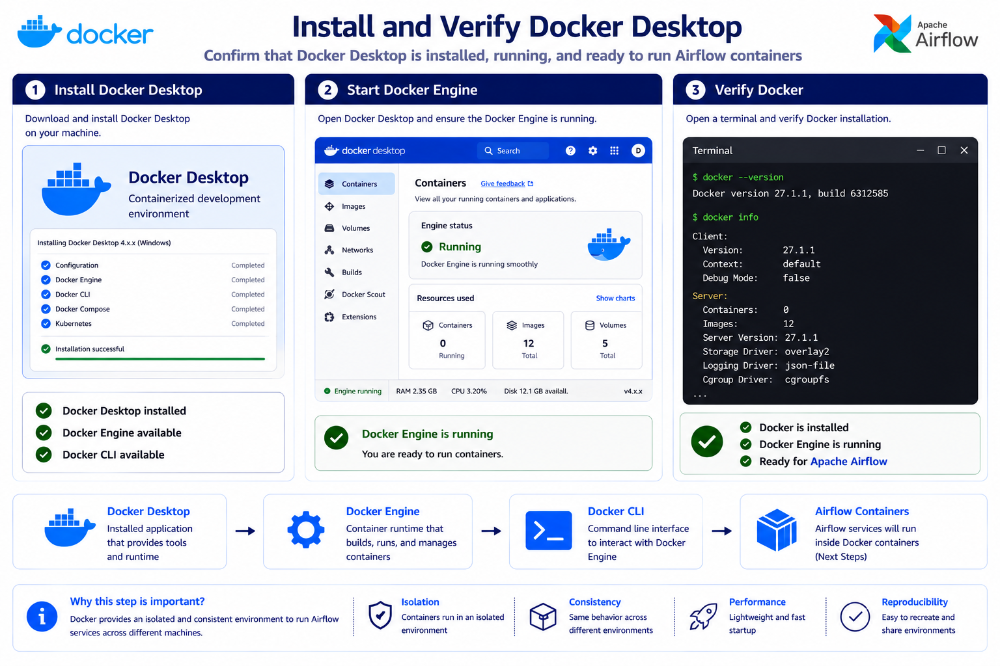
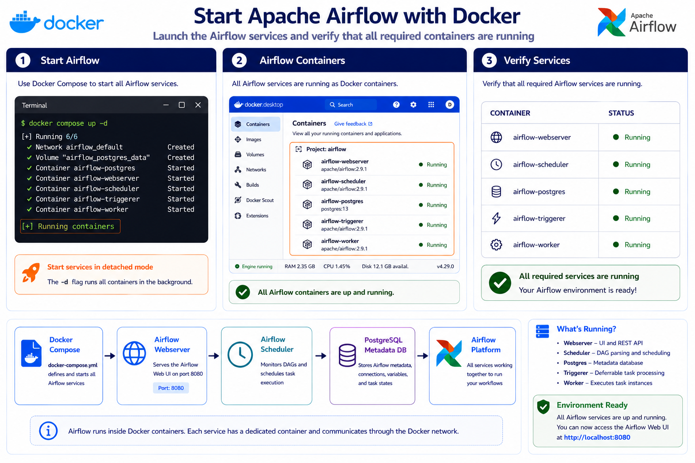
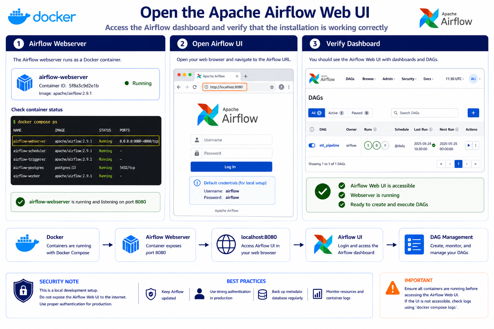
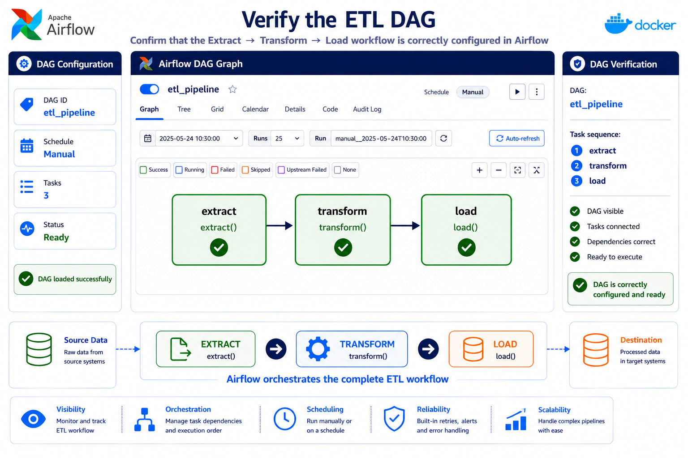
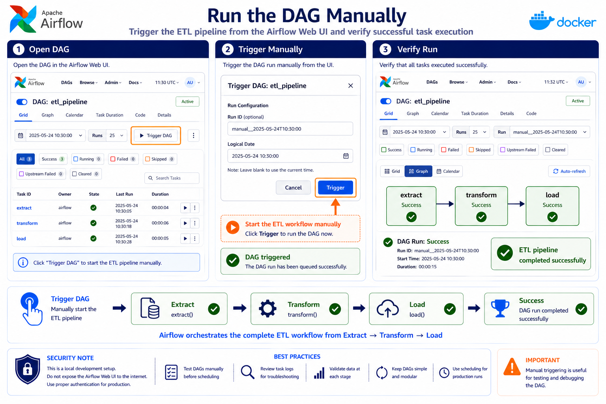
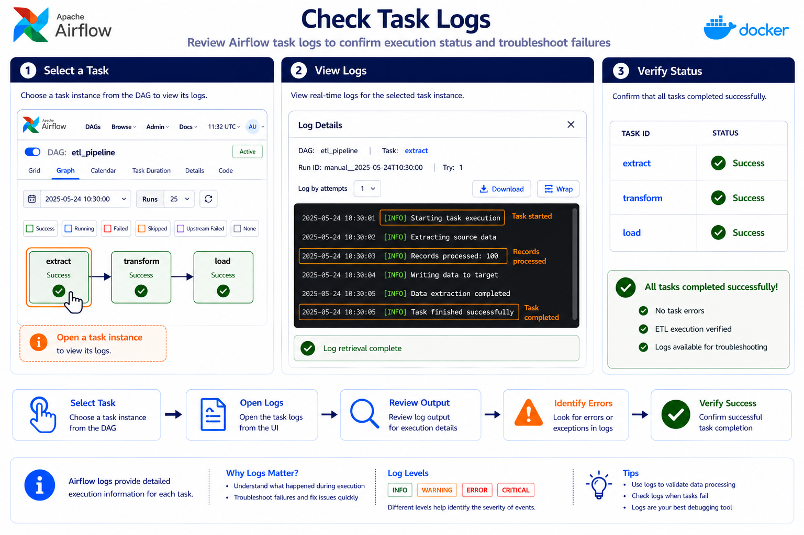

# 🌬️ Apache Airflow — Setup & Create Your First ETL DAG


> 🚀 Complete hands-on guide to install **Apache Airflow on Windows using Docker**, start the Airflow environment, create an ETL DAG, run it manually, and monitor task execution.

---

# 📚 Table of Contents

* 🎯 Objective
* 🧠 What is Apache Airflow?
* 📊 What is a DAG?
* 🏗️ Architecture
* 💻 Prerequisites
* 🐳 Step 1 — Install Docker Desktop
* 🐧 Step 2 — Enable WSL 2
* 📁 Step 3 — Create Airflow Project
* 📥 Step 4 — Download Airflow Docker Compose
* 📂 Step 5 — Create Required Directories
* ⚙️ Step 6 — Configure Airflow Environment
* 🗄️ Step 7 — Initialize Airflow
* 🌐 Step 9 — Open Airflow UI
* 🐍 Step 10 — Create ETL DAG
* 🔗 Step 11 — Configure Task Dependencies
* 🛑 Step 12 — Restart Airflow
* 🔍 Step 13 — Verify DAG
* ▶️ Step 14 — Run DAG Manually
* 📜 Step 15 — Check Logs
* ⏱️ Step 16 — Check Execution Time
* 📋 Useful Commands
* 🐛 Troubleshooting
* 🗂️ Final Project Structure
* 🔄 Complete Workflow
* 🎤 Interview Questions
* ✅ Completion Checklist
* 🏆 Key Takeaways


---

# 🎯 Objective

The objective of this module is to learn how to:

- Install Apache Airflow locally on Windows.
- Run Airflow using Docker Desktop.
- Configure Airflow using Docker Compose.
- Create an Airflow DAG.
- Create Python-based ETL tasks.
- Configure task dependencies.
- Schedule DAG execution.
- Configure retries.
- Trigger a DAG manually.
- Monitor task execution.
- Check Airflow logs.

The final workflow will be:

```text
Docker Desktop
      ↓
Apache Airflow
      ↓
Create DAG
      ↓
Extract
      ↓
Transform
      ↓
Load
      ↓
Monitor Logs
````

---

# 🧠 What is Apache Airflow?

Apache Airflow is a platform used to **author, schedule, and monitor workflows**.

In Data Engineering, Airflow is commonly used to orchestrate:

* ETL pipelines
* ELT pipelines
* Data ingestion
* Data transformation
* Data warehouse loading
* Batch processing
* Data quality workflows

Example:

```text
Source Database
       ↓
    Extract
       ↓
   Transform
       ↓
      Load
       ↓
Data Warehouse
```

Airflow manages the execution and dependencies between these tasks.

---

# 📊 What is a DAG?

DAG stands for:

> **Directed Acyclic Graph**

A DAG represents a workflow consisting of tasks and dependencies.

Example:

```text
Extract
   ↓
Transform
   ↓
Load
```

### Directed

Tasks execute in a defined direction.

```text
A → B → C
```

### Acyclic

The workflow should not contain a circular dependency.

### Graph

Tasks are represented as nodes and dependencies as relationships.

```text
Task A
  │
  ▼
Task B
  │
  ▼
Task C
```

---

# 🏗️ Architecture

The local setup uses Docker on Windows.

```text
                    🪟 Windows
                        │
                        ▼
                  🐳 Docker Desktop
                        │
                        ▼
                     🐧 WSL 2
                        │
                        ▼
              📄 Docker Compose
                        │
                        ▼
                🌬️ Apache Airflow
                        │
                        ▼
                  🌐 Airflow UI
                        │
                        ▼
                       DAG
                        │
            ┌───────────┼───────────┐
            ▼           ▼           ▼
         Extract     Transform      Load
```

---

# 💻 Prerequisites

Before starting, make sure you have:

* 🪟 Windows
* 🐳 Docker Desktop
* 🐧 WSL 2
* 💻 PowerShell or Command Prompt
* 🌐 Web browser

---

# 🐳 Step 1 — Install Docker Desktop



Download Docker Desktop for Windows:

[Docker Desktop](https://www.docker.com/products/docker-desktop/)

Install Docker Desktop and follow the setup wizard.

After installation:

1. Launch Docker Desktop.
2. Make sure Docker is running.
3. Restart the computer if required.

### Verify Docker

Open PowerShell:

```powershell
docker --version
```

Verify Docker Compose:

```powershell
docker compose version
```

Expected:

```text
Docker version ...
Docker Compose version ...
```

---

# 🐧 Step 2 — Enable WSL 2

Docker Desktop on Windows uses **WSL 2** for its Linux-based container environment.

If WSL 2 is not already enabled:

1. Open Docker Desktop.
2. Follow the WSL 2 setup prompt.
3. Complete the installation.
4. Restart Windows if required.

Architecture:

```text
Windows
   │
   ▼
WSL 2
   │
   ▼
Docker Desktop
   │
   ▼
Airflow Containers
```

---

# 📁 Step 3 — Create Airflow Project

Open PowerShell.

Create a project directory:

```powershell
mkdir airflow-docker
cd airflow-docker
```

Project:

```text
airflow-docker/
```

---

# 📥 Step 4 — Download Airflow Docker Compose

Download the official Airflow Docker Compose configuration:

```powershell
curl -LfO "https://airflow.apache.org/docs/apache-airflow/stable/docker-compose.yaml"
```

Verify:

```powershell
dir
```

You should see:

```text
docker-compose.yaml
```

---

# 📂 Step 5 — Create Required Directories

Create the required Airflow directories:

```powershell
mkdir dags
mkdir logs
mkdir plugins
mkdir config
```

Your structure should now be:

```text
airflow-docker/
│
├── docker-compose.yaml
├── dags/
├── logs/
├── plugins/
└── config/
```

### Directory Purpose

| Directory             | Purpose                  |
| --------------------- | ------------------------ |
| `dags/`               | 📊 Airflow DAG files     |
| `logs/`               | 📜 Task execution logs   |
| `plugins/`            | 🧩 Airflow plugins       |
| `config/`             | ⚙️ Airflow configuration |
| `docker-compose.yaml` | 🐳 Docker configuration  |

---

# ⚙️ Step 6 — Configure Airflow Environment

Create a `.env` file:

```text
airflow-docker/
│
├── .env
├── docker-compose.yaml
├── dags/
├── logs/
├── plugins/
└── config/
```

Add:

```env
AIRFLOW_UID=50000
```

This configures the Airflow user ID used by the Docker environment.

---

# 🗄️ Step 7 — Initialize Airflow

Run:

```powershell
docker compose up airflow-init
```

Wait for the initialization process to finish.

Expected result:

```text
airflow-init exited with code 0
```

### Initialization Flow

```text
airflow-init
     ↓
Initialize Database
     ↓
Prepare Airflow
     ↓
Exit Code 0
     ↓
Ready to Start
```

---

# 🚀 Step 8 — Start Airflow



Start Airflow:

```powershell
docker compose up -d
```

The `-d` option starts Airflow in detached/background mode.

Check running containers:

```powershell
docker compose ps
```

You should see the Airflow services running.

---

# 🌐 Step 9 — Open Airflow UI



Open:

```text
http://localhost:8080
```

Use the credentials configured by your Docker Compose setup.

For the standard setup described here:

```text
Username: airflow
Password: airflow
```

### Access Flow

```text
Browser
   ↓
localhost:8080
   ↓
Airflow Web UI
   ↓
DAGs
```

---

# 🐍 Step 10 — Create ETL DAG

Create a Python file inside:

```text
dags/
```

File name:

```text
dags/etl_pipeline.py
```

Add:

```python
from airflow import DAG
from airflow.providers.standard.operators.python import PythonOperator
from datetime import datetime, timedelta


def extract():
    pass


def transform():
    pass


def load():
    pass


with DAG(
    "etl_pipeline",
    start_date=datetime(2025, 10, 20),
    schedule="0 2 * * *",
) as dag:

    t1 = PythonOperator(
        task_id="extract",
        python_callable=extract,
        retries=3,
        retry_delay=timedelta(minutes=5),
    )

    t2 = PythonOperator(
        task_id="transform",
        python_callable=transform,
    )

    t3 = PythonOperator(
        task_id="load",
        python_callable=load,
    )

    t1 >> t2 >> t3
```

---

## 📥 Extract Task

```python
def extract():
    pass
```

The Extract task represents retrieving data from a source.

Possible sources:

```text
Database
API
CSV
S3
ADLS
Application
```

Example architecture:

```text
Source
  ↓
Extract
  ↓
Raw Data
```

---

## 🔄 Transform Task

```python
def transform():
    pass
```

The Transform task represents data processing.

Examples:

```text
Remove duplicates
Handle NULL values
Apply business rules
Convert data types
Aggregate data
```

---

## 📤 Load Task

```python
def load():
    pass
```

The Load task represents writing processed data into a destination.

Example:

```text
Transformed Data
      ↓
Snowflake
      ↓
Databricks
      ↓
Redshift
```

---

## ⏰ DAG Schedule

The DAG uses:

```python
schedule="0 2 * * *"
```

This represents:

```text
Every day
at
02:00 AM
```

Cron structure:

```text
┌──────── Minute
│ ┌────── Hour
│ │ ┌──── Day
│ │ │ ┌── Month
│ │ │ │ ┌ Weekday
│ │ │ │ │
0 2 * * *
```

---

## 🔁 Retry Configuration

The Extract task has:

```python
retries=3
```

and:

```python
retry_delay=timedelta(minutes=5)
```

If Extract fails:

```text
Extract
   │
   ❌ Failed
   │
   ▼
Wait 5 minutes
   │
   ▼
Retry
   │
   ▼
Retry again if required
```

This provides basic failure recovery.

---

# 🔗 Step 11 — Configure Task Dependencies

The following line defines the workflow:

```python
t1 >> t2 >> t3
```

Where:

```text
t1 = extract
t2 = transform
t3 = load
```

Therefore:

```text
Extract
   ↓
Transform
   ↓
Load
```

Airflow understands that Transform depends on Extract, and Load depends on Transform.

---

# 🛑 Step 12 — Restart Airflow

After adding the DAG, restart the Docker environment.

Stop Airflow:

```powershell
docker compose down
```

Start Airflow again:

```powershell
docker compose up -d
```

Check:

```powershell
docker compose ps
```

---

# 🔍 Step 13 — Verify DAG



Open:

```text
http://localhost:8080
```

Navigate to the DAG list.

Search for:

```text
etl_pipeline
```

Open the DAG.

You should see:

```text
extract
   ↓
transform
   ↓
load
```

---

# ▶️ Step 14 — Run DAG Manually



Although the DAG is scheduled for 2 AM daily, you can manually trigger it.

### Procedure

1. Open Airflow UI.
2. Find `etl_pipeline`.
3. Open the DAG.
4. Click **Trigger DAG**.
5. Confirm the trigger.

Execution:

```text
Trigger DAG
    ↓
Extract
    ↓
Transform
    ↓
Load
```

---

# 📜 Step 15 — Check Logs

After triggering the DAG, open each task:

```text
extract
transform
load
```

Open the task logs.

Example:

```text
etl_pipeline
     │
     ├── extract
     │      └── Logs
     │
     ├── transform
     │      └── Logs
     │
     └── load
            └── Logs
```

Because the functions currently contain:

```python
pass
```

there is no actual ETL processing yet.

The purpose of this exercise is to understand the Airflow workflow and execution model.

---

# ⏱️ Step 16 — Check Execution Time



Airflow provides information about DAG and task execution.

Check:

* Start time
* End time
* Duration
* Task status
* Retry attempts
* Logs

Workflow:

```text
DAG
 ↓
DAG Run
 ↓
Task
 ↓
Duration
 ↓
Logs
```

---

# 📋 Useful Commands

### 🐳 Check Docker

```powershell
docker --version
```

### 📦 Check Docker Compose

```powershell
docker compose version
```

### 🚀 Start Airflow

```powershell
docker compose up -d
```

### 🛑 Stop Airflow

```powershell
docker compose down
```

### 📊 Check Services

```powershell
docker compose ps
```

### 📜 View Logs

```powershell
docker compose logs
```

### 📜 Follow Logs

```powershell
docker compose logs -f
```

### 🧹 Clean Reset

```powershell
docker compose down --volumes --remove-orphans
```

> ⚠️ Use the clean-reset command only when you intentionally want to remove the Docker volumes associated with the environment.

---

# 🐛 Troubleshooting

## ❌ DAG Not Appearing

Check:

```text
1. File is inside dags/
2. Python syntax is correct
3. Airflow containers are running
4. DAG is not paused
5. Wait for Airflow to detect the file
```

---

## ❌ Docker Not Running

Make sure:

```text
Docker Desktop
      ↓
Running
```

Then:

```powershell
docker compose ps
```

---

## ❌ Port 8080 Already Used

If port `8080` is already being used, modify the port mapping in:

```text
docker-compose.yaml
```

Then restart:

```powershell
docker compose down
docker compose up -d
```

---

## ❌ DAG Has Python Errors

Check the DAG file:

```text
dags/etl_pipeline.py
```

Verify:

* Imports
* Indentation
* DAG definition
* Task IDs
* Python syntax

---

# 🔄 Complete Workflow

```text
                🪟 Windows
                    │
                    ▼
             🐳 Docker Desktop
                    │
                    ▼
                 🐧 WSL2
                    │
                    ▼
           📦 Airflow Docker
                    │
                    ▼
             🌬️ Airflow UI
                    │
                    ▼
             📄 etl_pipeline.py
                    │
                    ▼
                📊 DAG
                    │
          ┌─────────┼─────────┐
          ▼         ▼         ▼
       Extract   Transform    Load
          │         │         │
          └─────────┼─────────┘
                    ▼
              📜 Logs
                    │
                    ▼
              ⏱️ Monitoring
```

---

# 🎤 Interview Questions

### 1. What is Apache Airflow?

Apache Airflow is a platform used to author, schedule, and monitor workflows.

### 2. What is a DAG?

A DAG is a Directed Acyclic Graph representing tasks and their dependencies.

### 3. What are the tasks in this DAG?

```text
Extract
Transform
Load
```

### 4. What is PythonOperator?

`PythonOperator` executes a Python function as an Airflow task.

### 5. What does this mean?

```python
t1 >> t2 >> t3
```

It defines:

```text
Extract → Transform → Load
```

### 6. What does `retries=3` mean?

It configures the task to retry when it fails.

### 7. What does `retry_delay` do?

It defines the waiting period between retry attempts.

### 8. What does this schedule mean?

```python
schedule="0 2 * * *"
```

The DAG is scheduled to run daily at 2 AM.

### 9. Can you manually trigger a scheduled DAG?

Yes. A DAG can be manually triggered from the Airflow UI.

### 10. Where are DAG files stored?

Inside:

```text
dags/
```

---

# 🏆 Key Takeaways

```text
🐳 Docker
   ↓
🌬️ Airflow
   ↓
📊 DAG
   ↓
📥 Extract
   ↓
🔄 Transform
   ↓
📤 Load
   ↓
📜 Logs
   ↓
⏱️ Monitoring
```

* 🌬️ Apache Airflow orchestrates workflows.
* 📊 DAGs define workflows and dependencies.
* 🐍 `PythonOperator` executes Python functions.
* 📥 Extract, 🔄 Transform, and 📤 Load represent the ETL stages.
* 🔗 `t1 >> t2 >> t3` defines task dependencies.
* 🔁 Retries provide failure handling.
* ⏰ Cron expressions define schedules.
* ▶️ DAGs can be triggered manually.
* 📜 Airflow provides task logs and monitoring.
